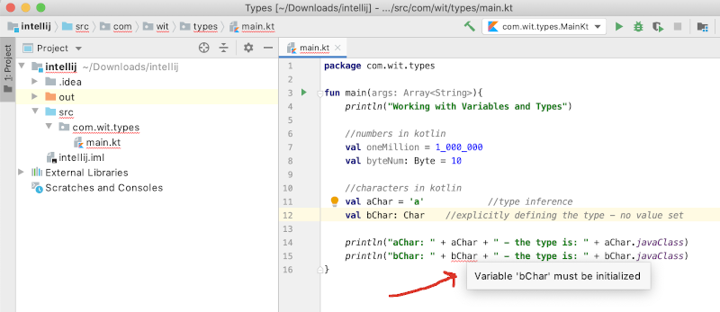
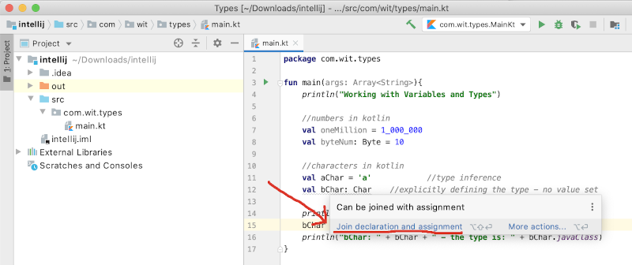
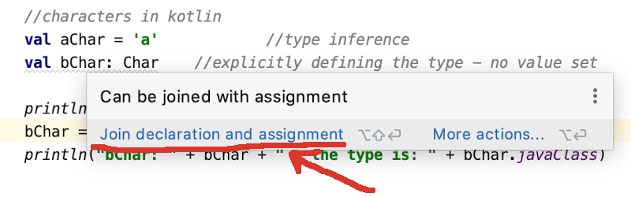
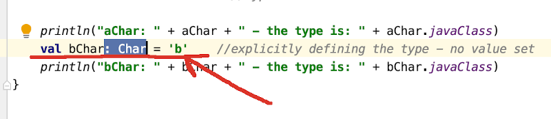
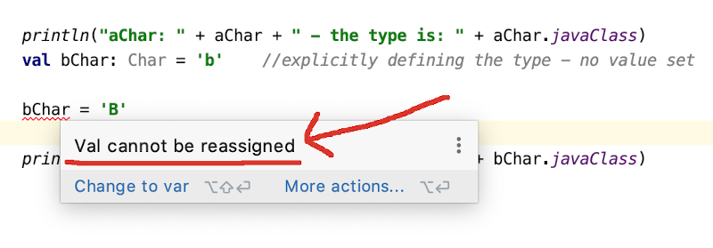

# val Vs var

In the previous steps, we used *val* to create our variables.  In this step, we will look at *var* and uncover the difference between the two.

We will continue working in the *types* project from the previous steps.

# val - deferred initialisation

So far, we have only used *val* to declare our variables.  For example:

~~~java
    //numbers in kotlin
    val oneMillion = 1_000_000
    val byteNum: Byte = 10              

    //characters in kotlin
    val aChar = 'a'			//type inference
    val bChar: Char = 'b'   //explicitly defining the type

    //booleans in kotlin
    val aFlag = true
    val bFlag: Boolean = false
~~~

These variables are immutable i.e. once they are assigned a value, the value cannot be changed (similar to *final* variables in java).

In all the examples above, we assigned a value immediately.  Lets update our code to defer the assignment of a value until later in the code.  To do this, change the following character variable declaration in your code from:

~~~java
    val bChar: Char = 'b'   //explicitly defining the type and setting the value
~~~

to be:

~~~java
    val bChar: Char      //explicitly defining the type - no value set
~~~

We have generated a syntax error:

Fix this error by inserting this initialisation between the two print statements:

~~~java
    println("aChar: " + aChar + " - the type is: " + aChar.javaClass)
    bChar = 'b'
    println("bChar: " + bChar + " - the type is: " + bChar.javaClass)
~~~

Our code now compiles, but did you notice that IntelliJ is still not happy...the variable *bChar* is still underlined...it's not a syntax error this time, but a helpful message.  Hover your mouse pointer over the variable and you should see the following message appear:

Click on the *more* link to read the full message.  IntelliJ provides a lot of helpful messages like this and an even easier way to accept their suggestions.  Click on the light bulb and the click the option *Join declaration and assignment*:

The code should be refactored for you and the warning message should be gone.  

The above demonstrated that you can defer the initialisation of a *val* variable until later, but it may not be the best style depending on the situation.  An example where it is good style...if you were reading in the value from the user, you wouldn't get this warning message displayed.

# val - cannot change value

Staying with the same variable we were updating above (bChar), add this line of code just before printing out the value:

~~~java
   bChar = 'B'
~~~

Your code should now look like this, inclusive of the syntax error:

*bChar* is an immutable variable and cannot be reassigned.  
Delete this line of code we just added.

# var - mutable variables

At the end of the main function, declare a mutable variable:

~~~java
    //mutable variable
    var number = 5   //Int type is inferred
~~~

As the value is allowed to change in *var* variables, you can do mathematical operations:

~~~java
    number ++       //mathematical operations are allowed
    println("number: " + number)
~~~

and reassignment

~~~java
    number = 3       //Allowed to reassign a var too
    println("number: " + number)
~~~

Save your work and keep the project open.
