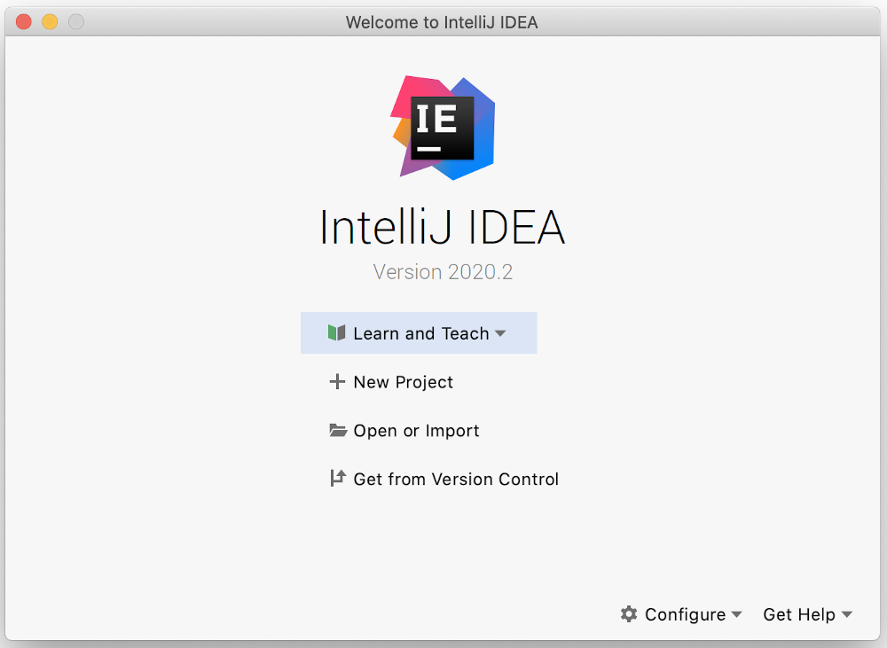
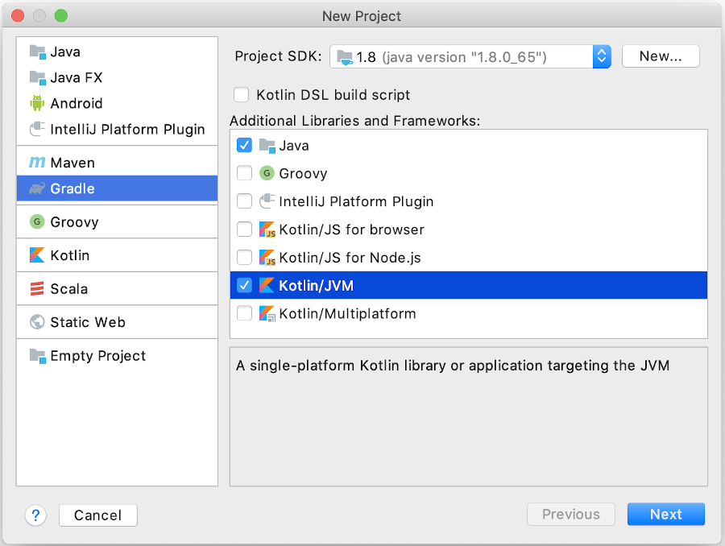
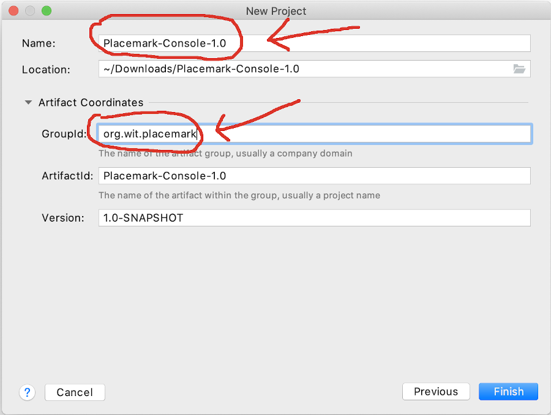
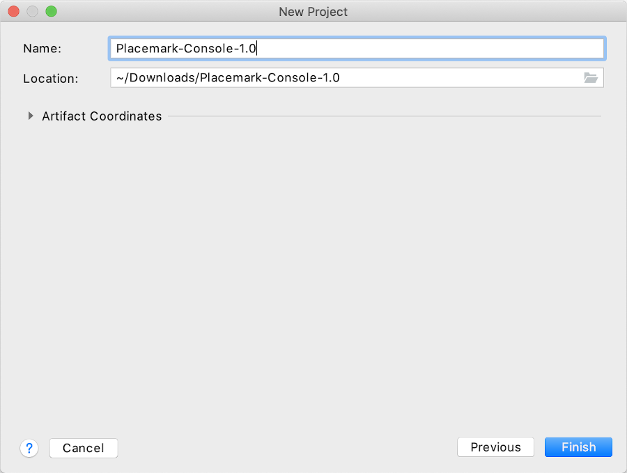
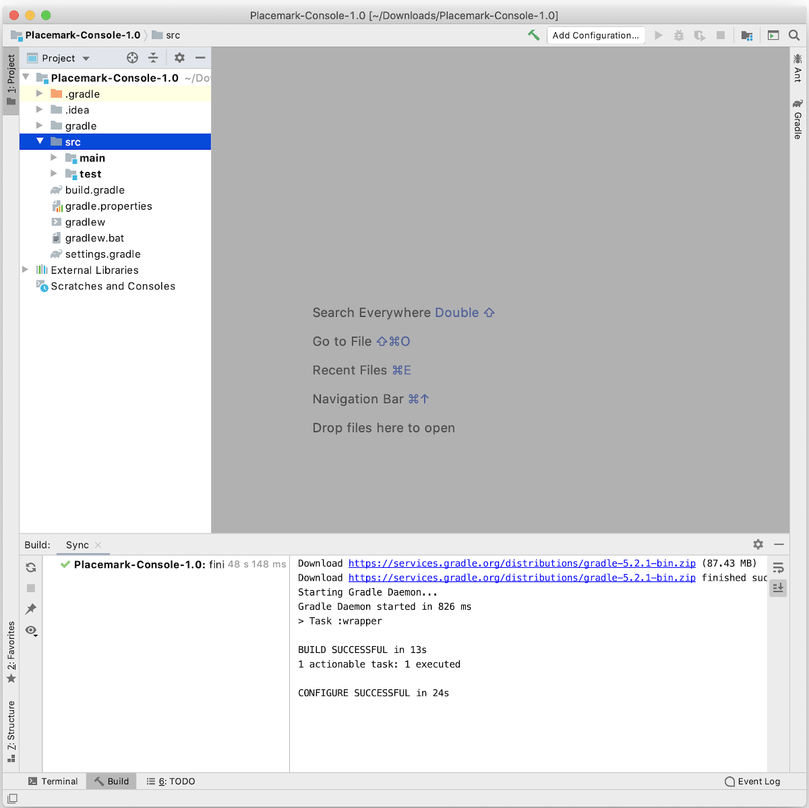
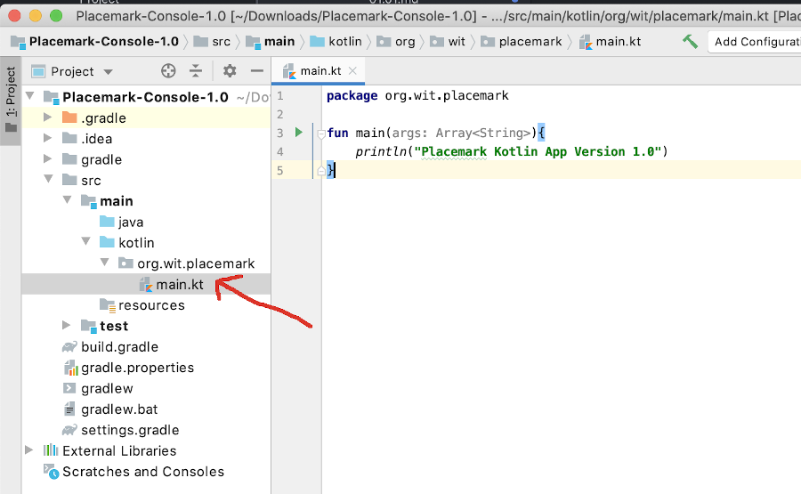
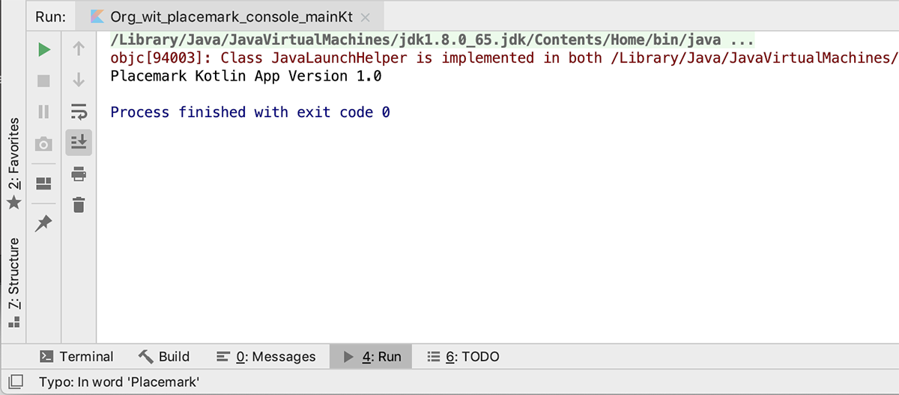

# Placemark-Console 1.0

## New Project in IntelliJ

Open IntelliJ and from the Welcome to IntelliJ IDE screen, choose `+ New Project`.

On the **New Project** screen, unlike previous labs, choose **Gradle** in the left column (don't select Kotlin or Java) and under *Additional Libraries and Frameworks*, check both **Java** and **Kotlin/JVM**.  

Click the *Next* button.

Name the Project `Placemark-Console-1.0` and enter the following details for the GroupId `org.wit.placemark` and click the *Finish* button:

You may need to expand the 'Artifacts Coordinates' tab if your screen looks like this

Gradle will start downloading required dependencies.  When this is finished, you should have the following project structure:

Note that all of our Kotlin files will be kept in a kotlin directory and, likewise, the Java files will be kept in the Java directory.

## Kotlin `main` Function

Similar to previous labs, create a new package `org.wit.placemark` inside the `Kotlin` folder and add a new `File` called **main** inside that package

Enter the following code into this new `main` file:

~~~java
fun main(args: Array<String>){
    println("Placemark Kotlin App Version 1.0")
}
~~~

Your project should now look something like this

Now Run/Play the app.

You should have the following output:

Save your work.
