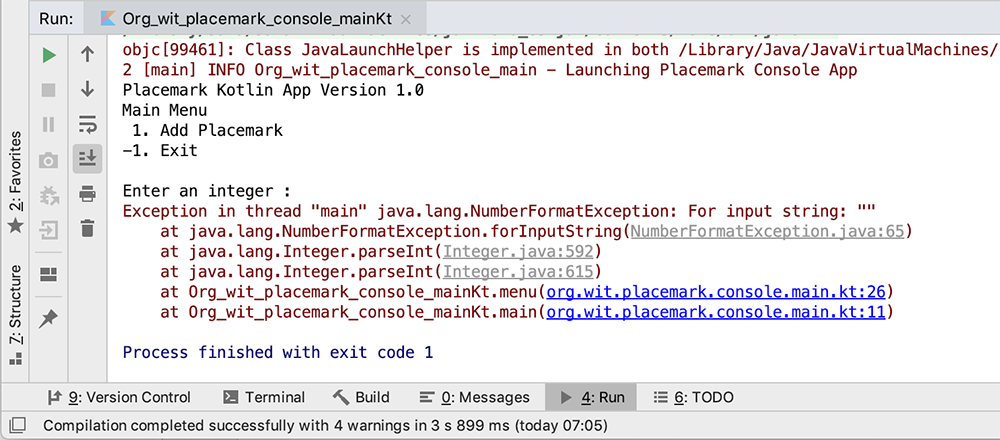
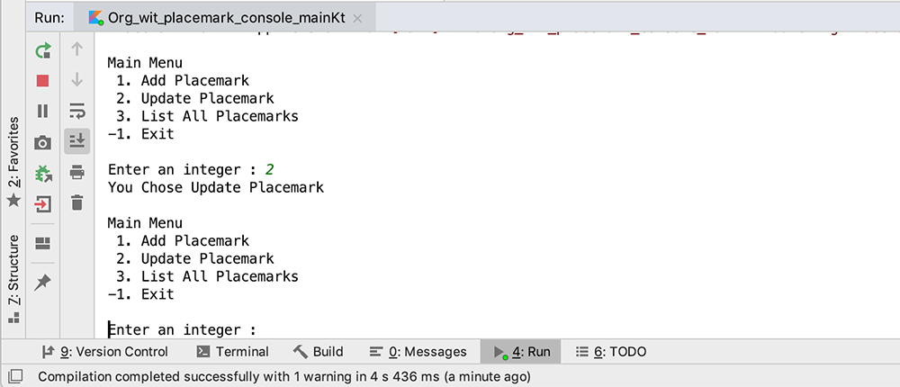

# Adding some Menu Support

We want to give the following options to user while using our 'app'

- Add a Placemark
- Update a Placemark
- List All Placemarks and
- Exit

To begin with, we'll just prompt the user with the above options, accept their choice and simply tell them what they selected. It's not much but we'll build on this over the coming labs and add functionality and complexity along the way.

To achieve this particular step we'll need to make use of a number of the different basic features of Kotlin (akin to Java).

## Menu function

The first thing to do is be able to display our options to the user in a Menu format and we should probably wrap this up in a function as we'll need to use it again and again.

Go ahead and add the following function **after** your ***main*** function

~~~Java
fun menu() : Int {

    var option : Int
    var input: String? = null

    println("Main Menu")
    println(" 1. Add Placemark")
    println("-1. Exit")
    println()
    print("Enter an integer : ")
    input = readLine()!!
    option = input.toInt()

    return option
}
~~~

Notice how we return an `Int` - we will use this back in our ***main*** function. Note also we'll be using a **-1** to exit, we could use any values really just as long as we carry out the correct checks back in ***main***

Now, in your ***main*** function introduce a new `var` called `input` to hold the value returned from a call to `menu()`.

Your function ***main*** should now look something like this

~~~Java
fun main(args: Array<String>) {
    logger.info { "Launching Placemark Console App" }
    println("Placemark Kotlin App Version 1.0")

    var input: Int

    input = menu()

}
~~~

Run you app to confirm a menu is displayed to the user and then complete the necessary options back in your ***menu*** function.

Test it for empty values and non integer values and see what happens?

You'll probably get a number of different types of Exceptions thrown (like below) because we've no validation on the input from the user.

Revisit your ***menu*** function and replace it with the following

~~~Java
fun menu() : Int {

    var option : Int
    var input: String? = null

    println("Main Menu")
    println(" 1. Add Placemark")
    println(" 2. Update Placemark")
    println(" 3. List All Placemarks")
    println("-1. Exit")
    println()
    print("Enter an integer : ")
    input = readLine()!!
    option = if (input.toIntOrNull() != null && !input.isEmpty())
            input.toInt()
    else
            -9
    return option
}
~~~

Make a note of how we validate our `input` before we convert it to an integer. Run your app again to confirm the menu now functions as expected, including handling invalid input.

## Displaying (Repeating) the Menu  

The menu and our app isn't of much use if we need to run it every time the user wants to choose an option so we'll now place or menu inside a loop which will continue to display until the user decides to exit **placemark**.

Go ahead and replace your ***main*** function with the following

~~~Java
fun main(args: Array<String>) {
    logger.info { "Launching Placemark Console App" }
    println("Placemark Kotlin App Version 1.0")

    var input: Int

    do {
        input = menu()
        when(input) {
            1 -> println("You Chose Add Placemark")
           -1 -> println("Exiting App")
            else -> println("Invalid Option")
        }
        println()
    } while (input != -1)
    logger.info { "Shutting Down Placemark Console App" }
}
~~~

Note we're using a `do-while` instead of a `while` so we're guaranteed to have our menu displayed at least the once.

Run your app again to confirm we now have a menu system in operation and then complete the step by refactoring your `main` function to manage all options (Updating & Listing Placemarks).

Once finished, you should be seeing something like this

