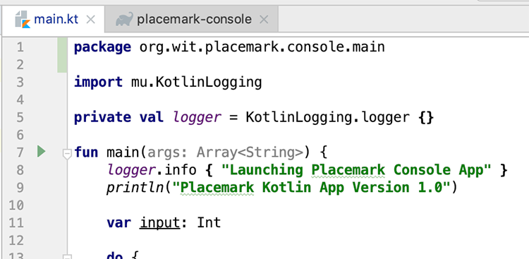

# Exercises

Here's our console app source code so far

~~~java
package org.wit.placemark

import mu.KotlinLogging

private val logger = KotlinLogging.logger {}

fun main(args: Array<String>) {
    logger.info { "Launching Placemark Console App" }
    println("Placemark Kotlin App Version 1.0")

    var input: Int

    do {
        input = menu()
        when(input) {
            1 -> println("You Chose Add Placemark")
            -1 -> println("Exiting App")
            else -> println("Invalid Option")
        }
        println()
    } while (input != -1)
    logger.info { "Shutting Down Placemark Console App" }
}

fun menu() : Int {

    var option : Int
    var input: String? = null

    println("Main Menu")
    println(" 1. Add Placemark")
    println(" 2. Update Placemark")
    println(" 3. List All Placemarks")
    println("-1. Exit")
    println()
    print("Enter an integer : ")
    input = readLine()!!
    option = if (input.toIntOrNull() != null && !input.isEmpty())
        input.toInt()
    else
        -9
    return option
}
~~~

## Exercise 1 - Introduce Functions
As a precursor to the next lab, have a go at adding **functions** to carry out our menu options such as

- addPlacemark()
- updatePlacemark()
- listAllPlacemarks()

and replace the simple print statements with the functions above, but still just prompt the user with the option they chose.

## Exercise 2 - Package Refactor

To make our project a bit more coherent (and prepare us for a possible switch to Android Development) we should probably using seperate `packages` to manage our classes and files. So go ahead and have a go at refactoring the project like so

 1. Create a new package

 

 and name it as follows

 

 2. 'Drag' your existing `main.kt` into this `package` - you'll get the following 'Move' option so just choose ok

 

 If all goes well you should have a project structure like so

 

 Note the modified `package` statement in your `main.kt`

 ~~~java
 package org.wit.placemark.console.main
 ~~~

 

If you have time to spare, try adding more functions and experiment with the constructs we covered in this lab and/or experiment with this kotlin learning resource:

<https://kotlinlang.org/docs/tutorials/koans.html>
