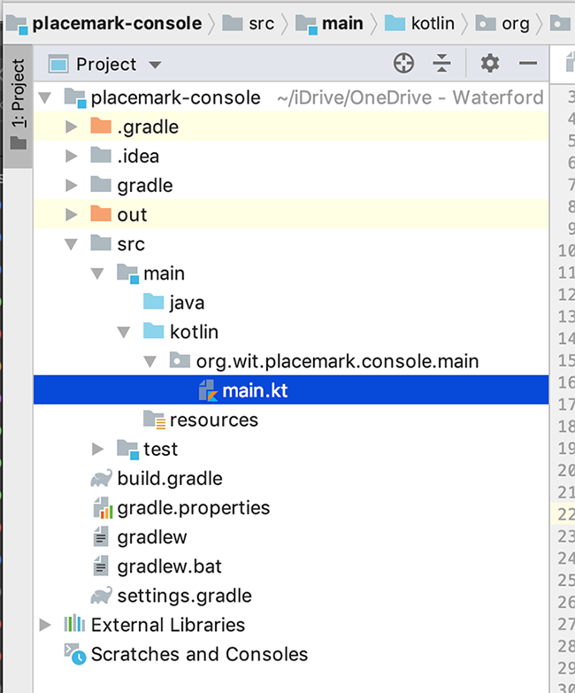

# Exercise Solutions

## Exercise 1 - Introduce Functions

Here's a solution to the previous lab, with the addition of Functions, replacing the basic `println()` calls inside our loop.

~~~kotlin
package org.wit.placemark

import mu.KotlinLogging

private val logger = KotlinLogging.logger {}

fun main(args: Array<String>) {
    logger.info { "Launching Placemark Console App" }
    println("Placemark Kotlin App Version 1.0")

    var input: Int

    do {
        input = menu()
        when(input) {
            1 -> addPlacemark()
            2 -> updatePlacemark()
            3 -> listPlacemarks()
            -1 -> println("Exiting App")
            else -> println("Invalid Option")
        }
        println()
    } while (input != -1)
    logger.info { "Shutting Down Placemark Console App" }
}

fun menu() : Int {

    var option : Int
    var input: String? = null

    println("MAIN MENU")
    println(" 1. Add Placemark")
    println(" 2. Update Placemark")
    println(" 3. List All Placemarks")
    println("-1. Exit")
    println()
    print("Enter an integer : ")
    input = readLine()!!
    option = if (input.toIntOrNull() != null && !input.isEmpty())
        input.toInt()
    else
        -9
    return option
}

fun addPlacemark(){
    println("You Chose Add Placemark")
}

fun updatePlacemark() {
    println("You Chose Update Placemark")
}

fun listPlacemarks() {
    println("You Chose List All Placemarks")
}
~~~

## Exercise 2 - Package Refactor

Here's the solution including the `package` refactoring

~~~kotlin
package org.wit.placemark.console.main

import mu.KotlinLogging

private val logger = KotlinLogging.logger {}

fun main(args: Array<String>) {
    logger.info { "Launching Placemark Console App" }
    println("Placemark Kotlin App Version 1.0")

    var input: Int

    do {
        input = menu()
        when(input) {
            1 -> addPlacemark()
            2 -> updatePlacemark()
            3 -> listPlacemarks()
            -1 -> println("Exiting App")
            else -> println("Invalid Option")
        }
        println()
    } while (input != -1)
    logger.info { "Shutting Down Placemark Console App" }
}

fun menu() : Int {

    var option : Int
    var input: String? = null

    println("MAIN MENU")
    println(" 1. Add Placemark")
    println(" 2. Update Placemark")
    println(" 3. List All Placemarks")
    println("-1. Exit")
    println()
    print("Enter an integer : ")
    input = readLine()!!
    option = if (input.toIntOrNull() != null && !input.isEmpty())
        input.toInt()
    else
        -9
    return option
}

fun addPlacemark(){
    println("You Chose Add Placemark")
}

fun updatePlacemark() {
    println("You Chose Update Placemark")
}

fun listPlacemarks() {
    println("You Chose List All Placemarks")
}
~~~

Make sure your project structure matches the following before proceeding

