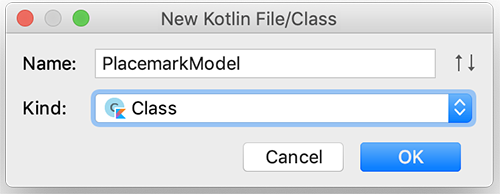
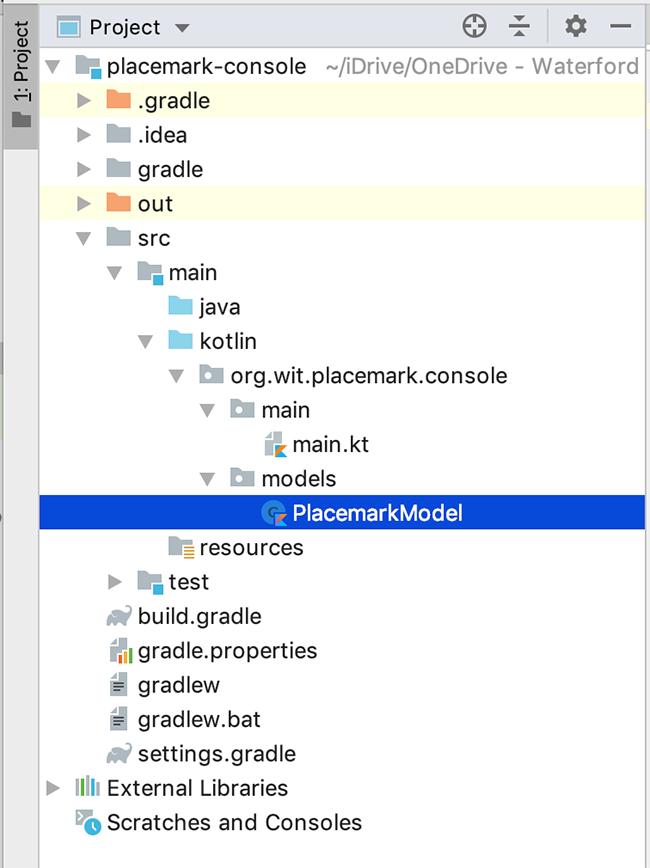

# Adding a Placemark Model

We could keep retrieving the users input as separate `title`'s and `description`'s and ultimately store these in some kind of data structure but this would quickly become unmanageable.

What we should do is use a `class` and store `Placemark` objects to manage the user data so first go ahead and create a new `models` **package** in your `kotlin` folder called

 ~~~kotlin
 org.wit.placemark.console.models
 ~~~

Inside this `models` package create a new `Class` called `PlacemarkModel`

Your project should now look like this

Replace the current class with the following

~~~kotlin
data class PlacemarkModel(var title: String = "",
                          var description: String = "")
~~~

Notice we're using a `data` class here - this is recommended for classes which has the sole responsibility of holding only data (in our case a `title` and a `description` for the moment)

Open your `main.kt` and introduce a new `PlacemarkModel` property called **placemark** outside your `main` function like so

~~~kotlin
var placemark = PlacemarkModel()
~~~

Now, refactor your `addPlacemark()` to create a new `PlacemarkModel` object, set it's properties, and display them to the user (same as before)

Once you have that implemented, go ahead and refactor your `updatePlacemark()` using the previously created `placemark` object.

As a final bit of house keeping, remove (if you haven't done so already) the global `title` and `description` properties, as they are no longer needed. If you get any errors fix them now.

For reference, here's the current `main.kt`

~~~kotlin
package org.wit.placemark.console.main

import mu.KotlinLogging
import org.wit.placemark.console.models.PlacemarkModel

private val logger = KotlinLogging.logger {}

var placemark = PlacemarkModel()

fun main(args: Array<String>) {
    logger.info { "Launching Placemark Console App" }
    println("Placemark Kotlin App Version 1.0")

    var input: Int

    do {
        input = menu()
        when(input) {
            1 -> addPlacemark()
            2 -> updatePlacemark()
            3 -> listPlacemarks()
            -1 -> println("Exiting App")
            else -> println("Invalid Option")
        }
        println()
    } while (input != -1)
    logger.info { "Shutting Down Placemark Console App" }
}

fun menu() : Int {
    var option : Int
    var input: String?

    println("MAIN MENU")
    println(" 1. Add Placemark")
    println(" 2. Update Placemark")
    println(" 3. List All Placemarks")
    println("-1. Exit")
    println()
    print("Enter Option : ")
    input = readLine()!!
    option = if (input.toIntOrNull() != null && !input.isEmpty())
        input.toInt()
    else
        -9
    return option
}

fun addPlacemark(){
    println("Add Placemark")
    println()
    print("Enter a Title : ")
    placemark.title = readLine()!!
    print("Enter a Description : ")
    placemark.description = readLine()!!
    println("You entered [ " + placemark.title + " ] for title " +
            "and [ " + placemark.description + " ] for description")
}

fun updatePlacemark() {
    println("Update Placemark")
    println()
    print("Enter a new Title for [ " + placemark.title + " ] : ")
    placemark.title = readLine()!!
    print("Enter a new Description for [ " + placemark.description + " ] : ")
    placemark.description = readLine()!!
    println("You updated [ " + placemark.title + " ] for title " +
            "and [ " + placemark.description + " ] for description")
}

fun listPlacemarks() {
    println("You Chose List All Placemarks")
}
~~~

The user can still only work with a single `Placemark` so the next step will involve working with multiple objects and a `Collection` class.
