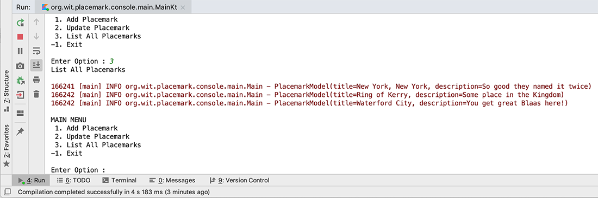

# Working with Collection Classes - Part 1

For our app to be of any use, the user should be able to manage multiple `Placemark` objects (of our type `PlacemarkModel`), so now we will introduce a `Collection` Class to allow the user to store one or more **placemarks** and be able to search and update them.

## Adding & Listing Multiple Placemarks

First, add the following to your `main.kt` as a global property

~~~kotlin
val placemarks = ArrayList<PlacemarkModel>()
~~~

Next, add the following to where it is most appropriate

~~~kotlin
placemarks.add(placemark.copy())
~~~

**Note we're passing a 'copy' of the placemark object to the add function to ensure a separate copy of the object is stored in the list**

Replace your `listPlacemarks()` function with this

~~~kotlin
fun listPlacemarks() {
    println("List All Placemarks")
    println()
    placemarks.forEach { logger.info("${it}") }
}
~~~

and run your app again to confirm you get something like the following:

Here we've added 3 'Placemarks' when we chose the 'List All Placemarks' option.

Currently we can still add empty values, which isn't ideal, so go ahead and replace your `addPlacemark()` function with this to add some basic validation

~~~kotlin
fun addPlacemark(){
    println("Add Placemark")
    println()
    print("Enter a Title : ")
    placemark.title = readLine()!!
    print("Enter a Description : ")
    placemark.description = readLine()!!

    if (placemark.title.isNotEmpty() && placemark.description.isNotEmpty()) {
        placemarks.add(placemark.copy())
        logger.info("Placemark Added : [ $placemark ]")
    }
    else
        logger.info("Placemark Not Added")
}
~~~

Run your app again to confirm.

Again, for reference

~~~kotlin
package org.wit.placemark.console.main

import mu.KotlinLogging
import org.wit.placemark.console.models.PlacemarkModel

private val logger = KotlinLogging.logger {}

var placemark = PlacemarkModel()
val placemarks = ArrayList<PlacemarkModel>()

fun main(args: Array<String>) {
    logger.info { "Launching Placemark Console App" }
    println("Placemark Kotlin App Version 1.0")

    var input: Int

    do {
        input = menu()
        when(input) {
            1 -> addPlacemark()
            2 -> updatePlacemark()
            3 -> listPlacemarks()
            -1 -> println("Exiting App")
            else -> println("Invalid Option")
        }
        println()
    } while (input != -1)
    logger.info { "Shutting Down Placemark Console App" }
}

fun menu() : Int {

    var option : Int
    var input: String?

    println("MAIN MENU")
    println(" 1. Add Placemark")
    println(" 2. Update Placemark")
    println(" 3. List All Placemarks")
    println("-1. Exit")
    println()
    print("Enter Option : ")
    input = readLine()!!
    option = if (input.toIntOrNull() != null && !input.isEmpty())
        input.toInt()
    else
        -9
    return option
}

fun addPlacemark(){
    println("Add Placemark")
    println()
    print("Enter a Title : ")
    placemark.title = readLine()!!
    print("Enter a Description : ")
    placemark.description = readLine()!!

    if (placemark.title.isNotEmpty() && placemark.description.isNotEmpty()) {
        placemarks.add(placemark.copy())
        logger.info("Placemark Added : [ $placemark ]")
    }
    else
        logger.info("Placemark Not Added")
}

fun updatePlacemark() {
    println("Update Placemark")
    println()
    print("Enter a new Title for [ " + placemark.title + " ] : ")
    placemark.title = readLine()!!
    print("Enter a new Description for [ " + placemark.description + " ] : ")
    placemark.description = readLine()!!
    println("You updated [ " + placemark.title + " ] for title " +
            "and [ " + placemark.description + " ] for description")
}

fun listPlacemarks() {
    println("List All Placemarks")
    println()
    placemarks.forEach { logger.info("${it}") }
}
~~~
