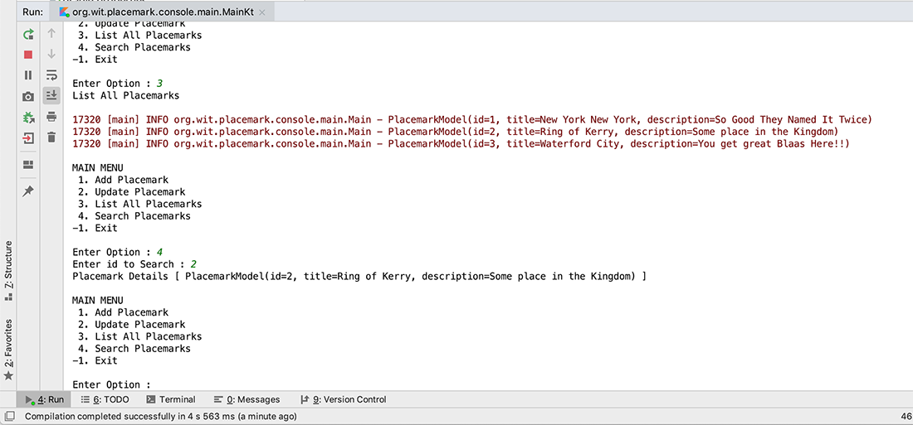
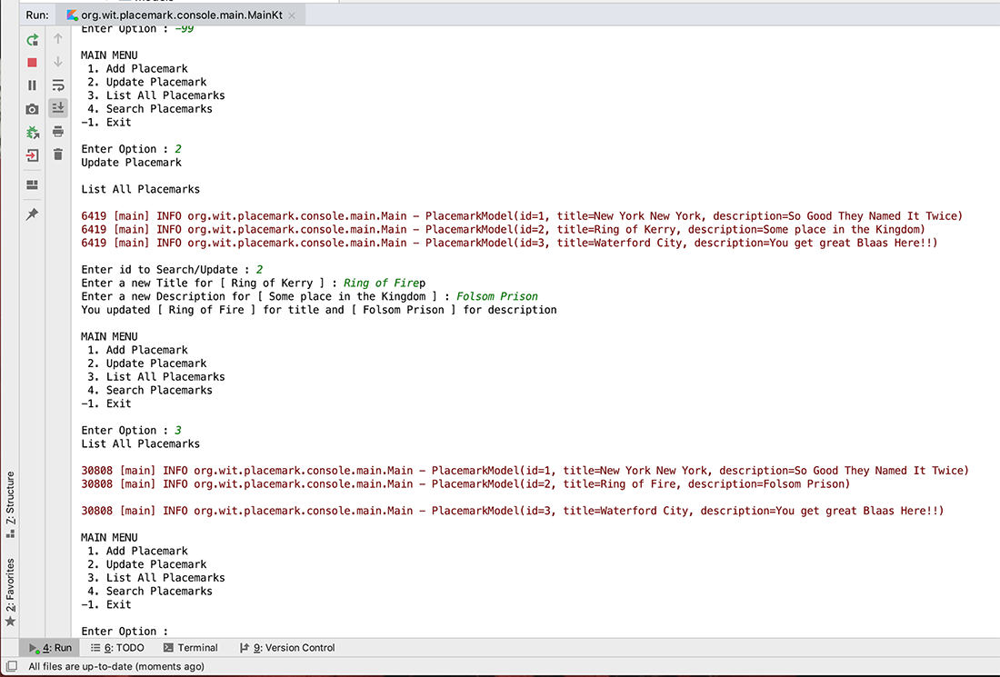

# Working with Collection Classes - Part 2

Now that we can add and list our 'Placemarks' we will now go about updating an existing 'Placemark', but first we need to find the one the user wants to update.

## Finding a Placemark

To achieve this, we need to be able to uniquely identify a 'Placemark' within the list. we will do this by refactoring our `PlacemarkModel` like so

~~~kotlin
data class PlacemarkModel(var id: Long = 0,
                          var title: String = "",
                          var description: String = "")
~~~

Go ahead and replace your current model with this one.

For the moment, and to keep things simple, every time the user adds a 'Placemark', we'll increment this `id` by 1

~~~kotlin
placemark.id++
~~~

so see can you identify the best place to add this code.

Once, we know the `id` we can then 'look up' the 'Placemark' so introduce 2 new functions `getId()` and `search(id)`, which will do just that

~~~kotlin
fun getId() : Long {
    var strId : String? // String to hold user input
    var searchId : Long // Long to hold converted id
    print("Enter id to Search/Update : ")
    strId = readLine()!!
    searchId = if (strId.toLongOrNull() != null && !strId.isEmpty())
        strId.toLong()
    else
        -9
    return searchId
}
~~~

and

~~~kotlin
fun search(id: Long) : PlacemarkModel? {
    var foundPlacemark: PlacemarkModel? = placemarks.find { p -> p.id == id }
        return foundPlacemark
}
~~~

Note the use of the ArrayList `find` function which returns the found object or `null`

Now, see if you can add your own `searchPlacemarks()` function to the existing menu which accepts an id from the user and displays the 'Placemark' details back to the user like so

Here's a partial solution to get you started

~~~kotlin
fun searchPlacemark() {
    var searchId = getId()

  // create Placemark object here and assign,
  // based on 'searchId' value passed to 'search()'

  // Then display details to user
}
~~~

Don't forget to also add the option to your display Menu.

## Updating a Placemark

Now that we can find a 'Placemark' we can leverage most of our existing `updatePlacemark()` function to search for and update a particular 'Placemark'.

Just for demonstration purposes, we'll first display all the 'Placemarks' to the user and then ask them to choose the relevant 'Placemark' to update, like so

Again, here's a start on our refactored `updatePlacemark()` function

~~~kotlin
fun updatePlacemark() {
    println("Update Placemark")
    println()
    listPlacemarks()
    var searchId = getId()
    val aPlacemark = search(searchId)

    if(aPlacemark != null) {
    // Ask the user for new details here
    }
    else
        println("Placemark Not Updated...")
}
~~~

so see if you can use what you already have to complete the above.

We could probably remove our global `placemark` object now and carry out a minor refactoring of our `addPlacemark()` to keep our functions consistent, like so

~~~kotlin
fun addPlacemark(){
    var aPlacemark = PlacemarkModel()
    println("Add Placemark")
    println()
    print("Enter a Title : ")
    aPlacemark.title = readLine()!!
    print("Enter a Description : ")
    aPlacemark.description = readLine()!!

    if (aPlacemark.title.isNotEmpty() && aPlacemark.description.isNotEmpty()) {
        aPlacemark.id = placemarks.size.toLong()
        placemarks.add(aPlacemark.copy())
        logger.info("Placemark Added : [ $aPlacemark ]")
    }
    else
        logger.info("Placemark Not Added")
}
~~~

For reference

Note, there's a `-99` option in there, is it useful do you think?

~~~kotlin
package org.wit.placemark.console.main

import mu.KotlinLogging
import org.wit.placemark.console.models.PlacemarkModel

private val logger = KotlinLogging.logger {}

val placemarks = ArrayList<PlacemarkModel>()

fun main(args: Array<String>) {
    logger.info { "Launching Placemark Console App" }
    println("Placemark Kotlin App Version 1.0")

    var input: Int

    do {
        input = menu()
        when(input) {
            1 -> addPlacemark()
            2 -> updatePlacemark()
            3 -> listPlacemarks()
            4 -> searchPlacemark()
            -99 -> dummyData()
            -1 -> println("Exiting App")
            else -> println("Invalid Option")
        }
        println()
    } while (input != -1)
    logger.info { "Shutting Down Placemark Console App" }
}

fun menu() : Int {

    var option : Int
    var input: String?

    println("MAIN MENU")
    println(" 1. Add Placemark")
    println(" 2. Update Placemark")
    println(" 3. List All Placemarks")
    println(" 4. Search Placemarks")
    println("-1. Exit")
    println()
    print("Enter Option : ")
    input = readLine()!!
    option = if (input.toIntOrNull() != null && !input.isEmpty())
        input.toInt()
    else
        -9
    return option
}

fun addPlacemark(){
    var aPlacemark = PlacemarkModel()
    println("Add Placemark")
    println()
    print("Enter a Title : ")
    aPlacemark.title = readLine()!!
    print("Enter a Description : ")
    aPlacemark.description = readLine()!!

    if (aPlacemark.title.isNotEmpty() && aPlacemark.description.isNotEmpty()) {
        aPlacemark.id = placemarks.size.toLong()
        placemarks.add(aPlacemark.copy())
        logger.info("Placemark Added : [ $aPlacemark ]")
    }
    else
        logger.info("Placemark Not Added")
}

fun updatePlacemark() {
    println("Update Placemark")
    println()
    listPlacemarks()
    var searchId = getId()
    val aPlacemark = search(searchId)

    if(aPlacemark != null) {
        print("Enter a new Title for [ " + aPlacemark.title + " ] : ")
        aPlacemark.title = readLine()!!
        print("Enter a new Description for [ " + aPlacemark.description + " ] : ")
        aPlacemark.description = readLine()!!
        println(
            "You updated [ " + aPlacemark.title + " ] for title " +
                    "and [ " + aPlacemark.description + " ] for description"
        )
    }
    else
        println("Placemark Not Updated...")
}

fun listPlacemarks() {
    println("List All Placemarks")
    println()
    placemarks.forEach { logger.info("${it}") }
    println()
}

fun searchPlacemark() {

    var searchId = getId()
    val aPlacemark = search(searchId)

    if(aPlacemark != null)
        println("Placemark Details [ $aPlacemark ]")
    else
        println("Placemark Not Found...")
}

fun getId() : Long {
    var strId : String? // String to hold user input
    var searchId : Long // Long to hold converted id
    print("Enter id to Search/Update : ")
    strId = readLine()!!
    searchId = if (strId.toLongOrNull() != null && !strId.isEmpty())
        strId.toLong()
    else
        -9
    return searchId
}

fun search(id: Long) : PlacemarkModel? {
    var foundPlacemark: PlacemarkModel? = placemarks.find { p -> p.id == id }
        return foundPlacemark
}

fun dummyData() {
    placemarks.add(PlacemarkModel(1, "New York New York", "So Good They Named It Twice"))
    placemarks.add(PlacemarkModel(2, "Ring of Kerry", "Some place in the Kingdom"))
    placemarks.add(PlacemarkModel(3, "Waterford City", "You get great Blaas Here!!"))
}
~~~
