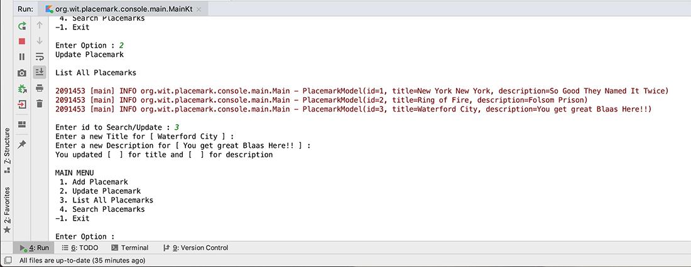
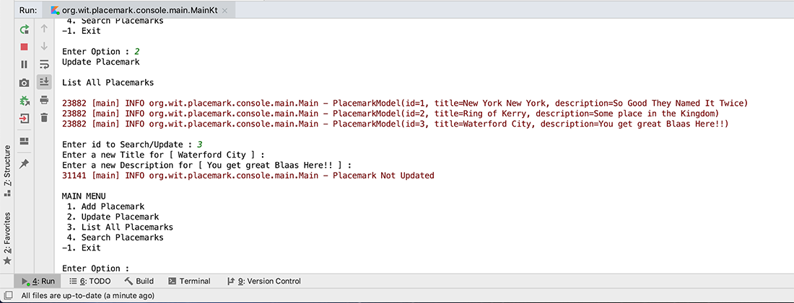

# Exercises

## Exercise 1 - Basic Validation

If you carry out any testing on the current `updatePlacemark()` function you'll see that the user can enter, and more importantly update, empty values.

This obviously is not ideal, so have a go and implementing some basic validation where the current values remain unchanged (and maybe log the event in the console?) if the user simply presses the return/enter key, like so

If you have time to spare, try adding more functions and experiment with the constructs we covered in this lab and/or experiment with this kotlin learning resource:

<https://kotlinlang.org/docs/tutorials/koans.html>
