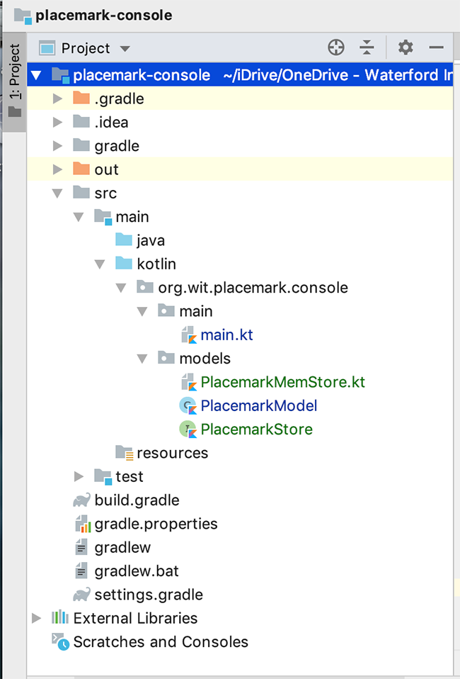

# Placemark-Console 3.0 - Model-View-Controller (MVC)

To make our application structure a bit more coherent (and potentially get us ready for using Kotlin in Android Development) we will now restructure/refactor our app to make it more manageable by trying to apply the MVC pattern and SoC (Separation of Concerns) Design principles.

## Refactoring the Model

Create a new **interface** called `PlacemarkStore` in your existing `models` package and replace it with the following

~~~kotlin
interface PlacemarkStore {
  fun findAll(): List<PlacemarkModel>
  fun findOne(id: Long): PlacemarkModel?
  fun create(placemark: PlacemarkModel)
  fun update(placemark: PlacemarkModel)
}
~~~

Next, also in your `models` package, create a new class `PlacemarkMemStore` and replace that with the following and fix any import errors

~~~kotlin
private val logger = KotlinLogging.logger {}
var lastId = 0L

internal fun getId(): Long {
  return lastId++
}

class PlacemarkMemStore : PlacemarkStore {

  val placemarks = ArrayList<PlacemarkModel>()

  override fun findAll(): List<PlacemarkModel> {
    return placemarks
  }

  override fun findOne(id: Long) : PlacemarkModel? {
        var foundPlacemark: PlacemarkModel? = placemarks.find { p -> p.id == id }
        return foundPlacemark
    }

  override fun create(placemark: PlacemarkModel) {
    placemark.id = getId()
    placemarks.add(placemark)
    logAll()
  }

  override fun update(placemark: PlacemarkModel) {
    var foundPlacemark = findOne(placemark.id!!)
    if (foundPlacemark != null) {
      foundPlacemark.title = placemark.title
      foundPlacemark.description = placemark.description
    }
  }

  internal fun logAll() {
    placemarks.forEach { logger.info("${it}") }
  }
}
~~~

Take some time to investigate this class and the functions we will be using.

Your Project should now look like so

Now, open your `main.kt` and replace your current `placemarks` with this one

~~~kotlin
val placemarks = PlacemarkMemStore()
~~~

You'll get a number of errors so see if you can fix these before moving on?

Note, you may need to remove code as well as replace it (e.g. we don't need to set an `id` directly anymore)
