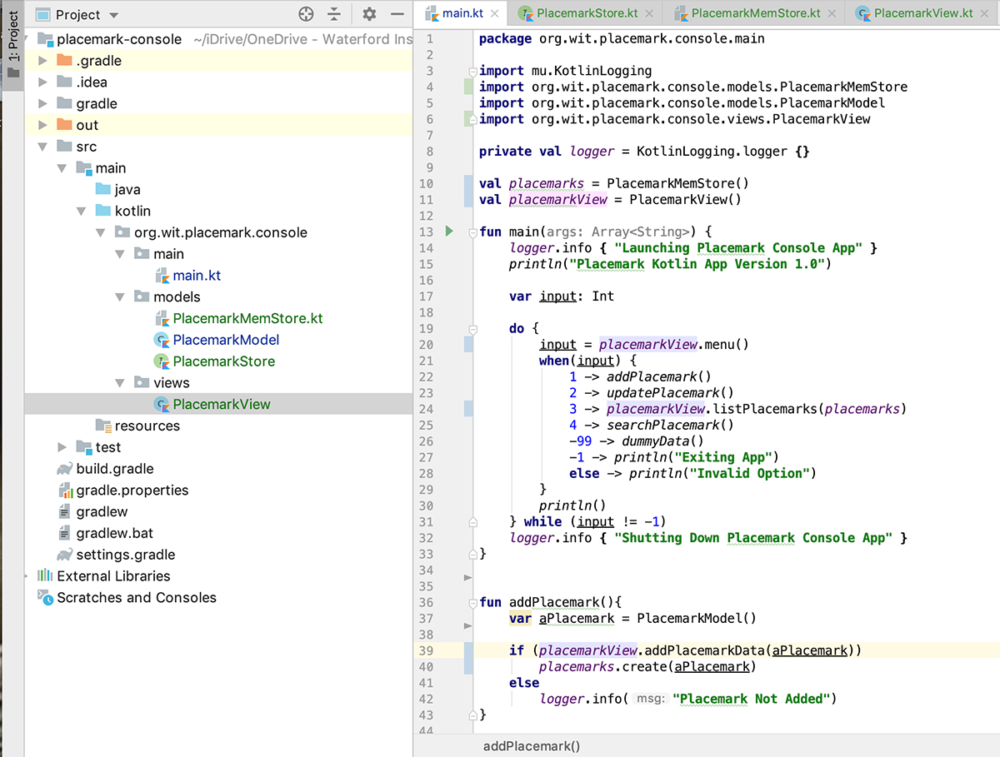

# Placemark-Console 3.0 - Model-View-Controller (MVC)

Currently, we're mixing User input/output with object functionality and our model. It makes more sense to keep these things separate so here we'll do just that - separate the view from the model.

## Refactoring the View

First, create the following:

- a new package `views`, inside `org.wit.placemark.console`
- a new class within it `PlacemarkView` and
- replace your new `PlacemarkView` class with this one below

~~~kotlin
package org.wit.placemark.console.views

import org.wit.placemark.console.main.placemarkView
import org.wit.placemark.console.main.placemarks
import org.wit.placemark.console.models.PlacemarkMemStore
import org.wit.placemark.console.models.PlacemarkModel

class PlacemarkView {

    fun menu() : Int {

        var option : Int
        var input: String?

        println("MAIN MENU")
        println(" 1. Add Placemark")
        println(" 2. Update Placemark")
        println(" 3. List All Placemarks")
        println(" 4. Search Placemarks")
        println("-1. Exit")
        println()
        print("Enter Option : ")
        input = readLine()!!
        option = if (input.toIntOrNull() != null && !input.isEmpty())
            input.toInt()
        else
            -9
        return option
    }

    fun listPlacemarks(placemarks : PlacemarkMemStore) {
        println("List All Placemarks")
        println()
        placemarks.logAll()
        println()
    }

    fun showPlacemark(placemark : PlacemarkModel) {
        if(placemark != null)
            println("Placemark Details [ $placemark ]")
        else
            println("Placemark Not Found...")
    }

    fun addPlacemarkData(placemark : PlacemarkModel) : Boolean {

        println()
        print("Enter a Title : ")
        placemark.title = readLine()!!
        print("Enter a Description : ")
        placemark.description = readLine()!!

        return placemark.title.isNotEmpty() && placemark.description.isNotEmpty()
    }

    fun updatePlacemarkData(placemark : PlacemarkModel) : Boolean {

        var tempTitle: String?
        var tempDescription: String?

        if (placemark != null) {
            print("Enter a new Title for [ " + placemark.title + " ] : ")
            tempTitle = readLine()!!
            print("Enter a new Description for [ " + placemark.description + " ] : ")
            tempDescription = readLine()!!

            if (!tempTitle.isNullOrEmpty() && !tempDescription.isNullOrEmpty()) {
                placemark.title = tempTitle
                placemark.description = tempDescription
                return true
            }
        }
        return false
    }

    fun getId() : Long {
        var strId : String? // String to hold user input
        var searchId : Long // Long to hold converted id
        print("Enter id to Search/Update : ")
        strId = readLine()!!
        searchId = if (strId.toLongOrNull() != null && !strId.isEmpty())
            strId.toLong()
        else
            -9
        return searchId
    }
}
~~~

We're trying to encapsulate all of our I/O within this class, so take some time to investigate `PlacemarkView` before proceeding.

As you can probably see, we've moved a lot of the user I/O which was in `main.kt` into this class, and wrapped it up in functions, so see if you can refactor your 'main' function to make use of this new class `PlacemarkView`

To get you started here's a screenshot of the current project structure and part of `main.kt` (including function `main()` and `addPlacemark()`)

And if you get stuck you can always find the complete `main.kt` on the next step, but have a go yourself first.
