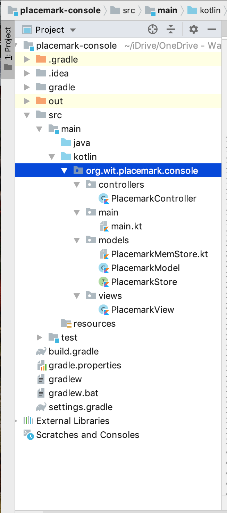

# Placemark-Console 3.0 - Model-View-Controller (MVC)

For reference, here's the current version of `main.kt`

~~~kotlin
package org.wit.placemark.console.main

import mu.KotlinLogging
import org.wit.placemark.console.models.PlacemarkMemStore
import org.wit.placemark.console.models.PlacemarkModel
import org.wit.placemark.console.views.PlacemarkView

private val logger = KotlinLogging.logger {}

val placemarks = PlacemarkMemStore()
val placemarkView = PlacemarkView()

fun main(args: Array<String>) {
    logger.info { "Launching Placemark Console App" }
    println("Placemark Kotlin App Version 1.0")

    var input: Int

    do {
        input = placemarkView.menu()
        when(input) {
            1 -> addPlacemark()
            2 -> updatePlacemark()
            3 -> placemarkView.listPlacemarks(placemarks)
            4 -> searchPlacemark()
            -99 -> dummyData()
            -1 -> println("Exiting App")
            else -> println("Invalid Option")
        }
        println()
    } while (input != -1)
    logger.info { "Shutting Down Placemark Console App" }
}

fun addPlacemark(){
    var aPlacemark = PlacemarkModel()

    if (placemarkView.addPlacemarkData(aPlacemark))
        placemarks.create(aPlacemark)
    else
        logger.info("Placemark Not Added")
}

fun updatePlacemark() {

    placemarkView.listPlacemarks(placemarks)
    var searchId = placemarkView.getId()
    val aPlacemark = search(searchId)

    if(aPlacemark != null) {
        if(placemarkView.updatePlacemarkData(aPlacemark)) {
            placemarks.update(aPlacemark)
            placemarkView.showPlacemark(aPlacemark)
            logger.info("Placemark Updated : [ $aPlacemark ]")
        }
        else
            logger.info("Placemark Not Updated")
    }
    else
        println("Placemark Not Updated...")
}

fun searchPlacemark() {
    val aPlacemark = search(placemarkView.getId())!!
    placemarkView.showPlacemark(aPlacemark)
}

fun search(id: Long) : PlacemarkModel? {
    var foundPlacemark = placemarks.findOne(id)
        return foundPlacemark
}

fun dummyData() {
        placemarks.create(PlacemarkModel(title = "New York New York", description = "So Good They Named It Twice"))
        placemarks.create(PlacemarkModel(title= "Ring of Kerry", description = "Some place in the Kingdom"))
        placemarks.create(PlacemarkModel(title = "Waterford City", description = "You get great Blaas Here!!"))
    }
~~~

## Introducing a Controller Class

To try and maintain (or give the illusion of at least!) the MVC Pattern, we'll now introduce a class to 'manage' the main functionality within our app with a new `PlacemarkController` inside a new `controllers` package, so create that now.

Replace your newly created `PlacemarkController` with this

~~~kotlin
package org.wit.placemark.console.controllers

import mu.KotlinLogging
import org.wit.placemark.console.models.PlacemarkMemStore
import org.wit.placemark.console.models.PlacemarkModel
import org.wit.placemark.console.views.PlacemarkView

class PlacemarkController {

    val placemarks = PlacemarkMemStore()
    val placemarkView = PlacemarkView()
    val logger = KotlinLogging.logger {}

    init {
        logger.info { "Launching Placemark Console App" }
        println("Placemark Kotlin App Version 1.0")
    }

    fun menu() :Int { return placemarkView.menu() }

    fun add(){
        var aPlacemark = PlacemarkModel()

        if (placemarkView.addPlacemarkData(aPlacemark))
            placemarks.create(aPlacemark)
        else
            logger.info("Placemark Not Added")
    }

    fun list() {
        placemarkView.listPlacemarks(placemarks)
    }

    fun update() {

        placemarkView.listPlacemarks(placemarks)
        var searchId = placemarkView.getId()
        val aPlacemark = search(searchId)

        if(aPlacemark != null) {
            if(placemarkView.updatePlacemarkData(aPlacemark)) {
                placemarks.update(aPlacemark)
                placemarkView.showPlacemark(aPlacemark)
                logger.info("Placemark Updated : [ $aPlacemark ]")
            }
            else
                logger.info("Placemark Not Updated")
        }
        else
            println("Placemark Not Updated...")
    }

    fun search() {
        val aPlacemark = search(placemarkView.getId())!!
        placemarkView.showPlacemark(aPlacemark)
    }

    fun search(id: Long) : PlacemarkModel? {
        var foundPlacemark = placemarks.findOne(id)
        return foundPlacemark
    }

    fun dummyData() {
          placemarks.create(PlacemarkModel(title = "New York New York", description = "So Good They Named It Twice"))
          placemarks.create(PlacemarkModel(title= "Ring of Kerry", description = "Some place in the Kingdom"))
          placemarks.create(PlacemarkModel(title = "Waterford City", description = "You get great Blaas Here!!"))
      }
}
~~~

and see can you refactor your `main()` function to use only and instance of `PlacemarkController`, like so

~~~kotlin
val controller = PlacemarkController()
~~~

inside `main()`

Your current project structure should now look like this

