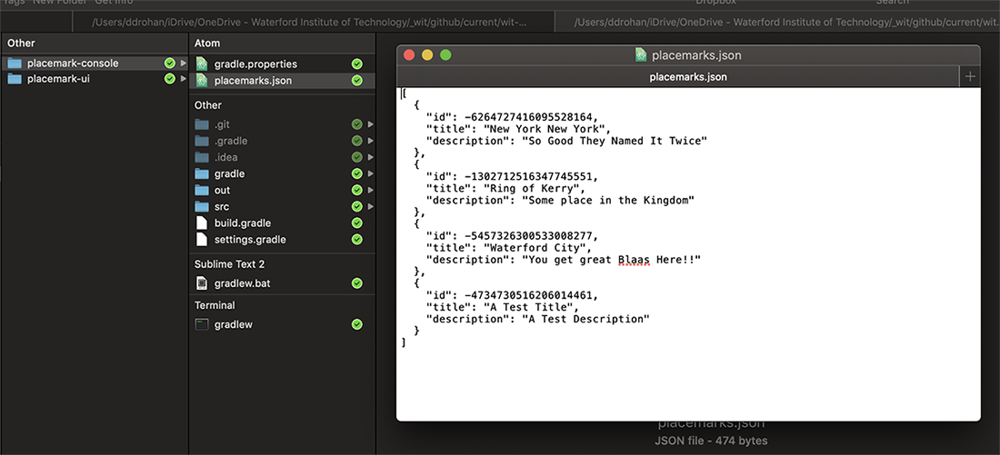

# Placemark-Console 4.0 - Placemark Persistence

To use the new store, we just need to switch it in the Controller:

## PlacemarkController

~~~kotlin
class PlacemarkController {

    // val placemarks = PlacemarkMemStore()

    val placemarks = PlacemarkJSONStore()

    val placemarkView = PlacemarkView()
    val logger = KotlinLogging.logger {}

    . . .
}
~~~

**No other changes should be necessary!**

Run the app now - and verify that you can create placemarks. Terminate the app, and see if the placemarks are still there when you relaunch the app.

Finally, locate the actual file in your local storage (I'm on a Mac here):

