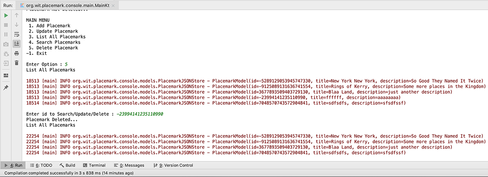

# Exercises

## Exercise 1: Switching Stores
Change back to using the PlacemarkMemStore instead of PlacemarkJSONStore. The only change you need to make should be in `PlacemarkController`.

Try some experiments to make sure the persistence is working as expected:

Using `MemStore` - create some placemarks and then kill the app. Relaunch, and verify that all placemarks are gone

Using `JsonStore` - try the same experiment. This time the placemarks should persist between application terminations.

## Exercise 2
Currently we have no way of deleting placemarks. To support delete, you will need to extend the `PlacemarkStore` to support removal of placemarks, and then implement this in `PlacemarkMemStore` and `PlacemarkJSONStore`

These are the implementations you will need:

**PlacemarkStore**
~~~kotlin
  fun delete(placemark: PlacemarkModel)
~~~
Introduce this to `PlacemarkStore` now - and write implementations in `PlacemarkMemStore` and `PlacemarkJSONStore` classes :

**PlacemarkMemStore**
~~~kotlin
  override fun delete(placemark: PlacemarkModel) {
    placemarks.remove(placemark)
  }
~~~

**PlacemaekJSONStore**
~~~kotlin
  override fun delete(placemark: PlacemarkModel) {
    placemarks.remove(placemark)
    serialize()
  }
~~~
To trigger the deletion introduce a new **delete** option in the menu like so

and add the following to `PlacemarkController` to actually delete the placemark from the list (or file)

~~~kotlin
fun delete() {
        placemarkView.listPlacemarks(placemarks)
        var searchId = placemarkView.getId()
        val aPlacemark = search(searchId)

        if(aPlacemark != null) {
            placemarks.delete(aPlacemark)
            println("Placemark Deleted...")
            placemarkView.listPlacemarks(placemarks)
        }
        else
            println("Placemark Not Deleted...")
    }
~~~

## Optional Exercise :)

Before you decide to delve into the world of Android Development, download the following and run this [TornadoFX](http://tornadofx.io) version of Placemark - [placemark-console](archives/placemark-console.zip) it demonstrates Kotlin can also be used for a range of UI based applications, not just mobile :)

**NOTE** - You'll need to have the **TornadoFX** Plugin installed for IntelliJ:

and the following dependency

~~~kotlin
implementation 'no.tornado:tornadofx:1.7.18'
~~~

The existing json file has the folowing 'records'

And when you launch the application you should get something like this

and

and finally

You can find links to all the versions of **Placemark-Console** [here](https://github.com/ddrohan/placemark-console/releases)
