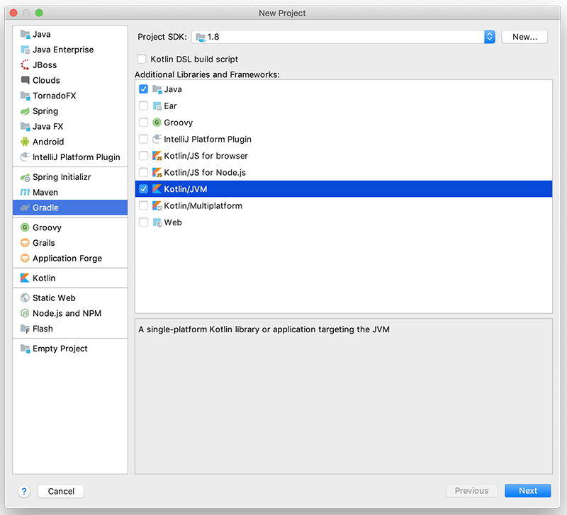
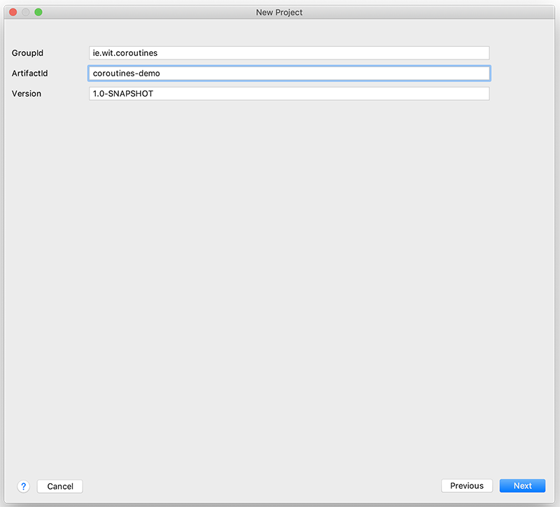
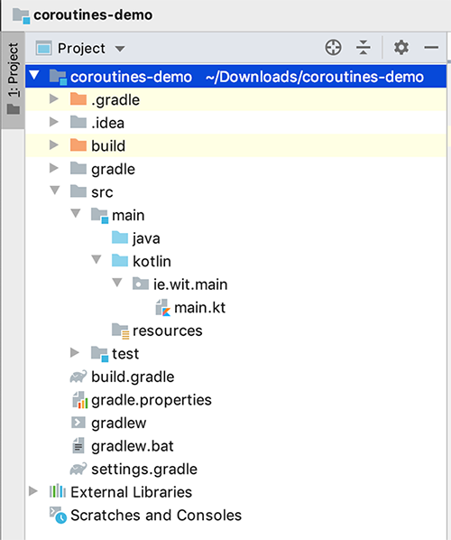

# Setup

Go ahead and create a new **IntelliJ project** with the following settings:

Next, create a new package in the kotlin folder

~~~kotlin
ie.wit.main
~~~

and a new **Kotlin FILE**

~~~
main.kt
~~~

Your project should now look like this:

Add the following code snippet

~~~kotlin
fun main() {
    println("Kotlin Coroutines Demo App")
}
~~~

and run it to confirm the project is setup correctly.
