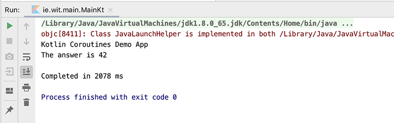
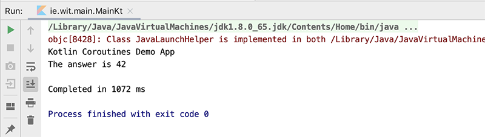

# Testing Concurrency 1

First, create a new package

~~~kotlin
ie.wit.utils
~~~

and inside it, a new FILE

~~~
utils.kt
~~~

Now, replace your **main()** with the following

~~~kotlin
fun main() {
    println("Kotlin Coroutines Demo App")

    val time = measureTimeMillis {
        println("\nHello World...")
    }
    println("\nCompleted in $time ms")
}
~~~

You'll probably get an error on **measureTimeMillis** so go ahead and add the following dependencies in your gradle file

~~~kotlin
implementation 'org.jetbrains.kotlinx:kotlinx-coroutines-core:1.3.1'
~~~

and fix any import errors.

Run your app to confirm (Completed in 0 ms) :)

Next, place the following functions in your **utils** file

~~~kotlin
suspend fun doSomethingUsefulOne(): Int {
    delay(1000L) // pretend we are doing something useful here
    return 13
}

suspend fun doSomethingUsefulTwo(): Int {
    delay(1000L) // pretend we are doing something useful here, too
    return 29
}
~~~

Create a new package **ie.wit.tests** and a new file **test1** inside that package

and add the following:

~~~kotlin
fun test1() {
    runBlocking {
            val one = doSomethingUsefulOne()
            val two = doSomethingUsefulTwo()
            println("The answer is ${one + two}")
        }
}
~~~

Fix any import errors and finally replace your **main()** with this:

~~~kotlin
fun main() {
    println("Kotlin Coroutines Demo App")

    val time = measureTimeMillis {
        test1()
    }
    println("\nCompleted in $time ms")
}
~~~

Notice how we're calling our test **test1()** inside main() - we'll use this approach for all our tests.

Run your app and you should get something like this:

Make a note of how long it takes to complete (2078 ms here) as our functions are executed **Sequentially**.

Now, write a new test **test2** similar to what we just did and add the following:

~~~kotlin
fun test2() {
    runBlocking {
        val one = async { doSomethingUsefulOne() }
        val two = async { doSomethingUsefulTwo() }
        println("The answer is ${one.await() + two.await()}")
    }
}
~~~

and run that (call it inside main()). Can you explain why this test runs faster (over 1 second faster in this case)?

As a final test of this kind, create and run a new test **test3** with the following:

~~~kotlin
fun test3() {
    runBlocking {
        val one = async(start = CoroutineStart.LAZY) { doSomethingUsefulOne() }
        val two = async(start = CoroutineStart.LAZY) { doSomethingUsefulTwo() }
        // some computation
        one.start() // start the first one
        two.start() // start the second one
        println("The answer is ${one.await() + two.await()}")
    }
}
~~~

Notice how we *manually* start the couroutines. As a comparison, comment out the start() calls

~~~kotlin
//one.start() // start the first one
//two.start() // start the second one
~~~

run the program and see what results you get?
