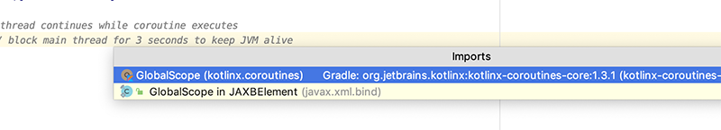
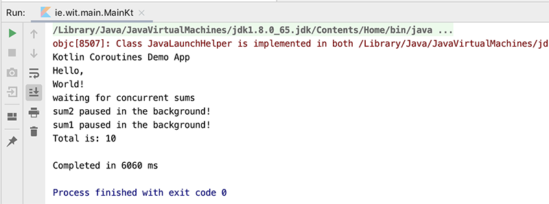
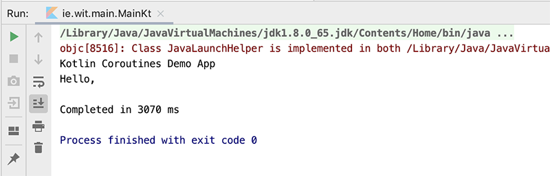
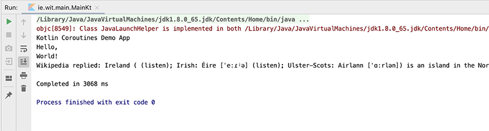
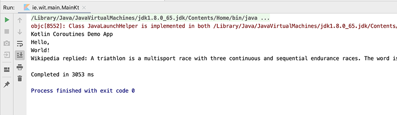

# Testing Concurrency 2

In this step we'll run some couroutines in the background and **NOT** block the main thread.

First, create a new test, **test4** and add the following:

~~~kotlin
GlobalScope.launch {  // launch new coroutine in background and continue

        delay(3000L) // non-blocking delay for 3 seconds (default time unit is ms)
        println("World!") // print after delay
        val sum1 = async { // non blocking sum1
            delay(2000L)
            println("sum1 paused in the background!")
            2 + 2
        }
        val sum2 = async { // non blocking sum2
            delay(1000L)
            println("sum2 paused in the background!")
            3 + 3
        }
        println("waiting for concurrent sums")
        val total = sum1.await() + sum2.await() // execution stops until both sums are calculated
        println("Total is: $total")
    }
    println("Hello,")     // main thread continues while coroutine executes
    Thread.sleep(6000L)   // block main thread for 6 seconds to keep JVM alive
~~~

and fix any import errors - be sure to import the correct **GlobalScope** if prompted

Run the test and pay particular attention to the **order** in which the statements are printed to the console.

You'll get something like this:

As another small experiment, can you work out how long the Thread should sleep for (less than 6 seconds) to get something like this (there's a clue in the output!)

and can you explain why?

In this next test we'll make an actual network call, which would be a very common use-case, and see how our coroutines handle it.

First, add the following dependency

~~~kotlin
implementation "com.google.code.gson:gson:2.8.5"
~~~

Open your **utils.kt** and add the following:

~~~kotlin
fun wikipedia(keyword: String): String {
    val url = "https://en.wikipedia.org/w/api.php" +
            "?action=query&format=json&prop=extracts" +
            "&exsectionformat=plain&exsentences=2&explaintext=1" +
            "&titles=$keyword"
    val json = java.net.URL(url).readText()
    val jsonObject = Gson().fromJson<JsonObject>(json, JsonObject::class.java)
    val pages = jsonObject["query"].asJsonObject["pages"].asJsonObject
    val extract = pages[pages.keySet().first()].asJsonObject["extract"]
    return extract.asString
}
~~~

and fix any import errors.

We won't be too concerned about this function at the moment. All we need to know is that it will take a String as a parameter and return the Search results from wikipedia in a json string, which it then formats and returns to the calling program.

Next create another test **test5** and add this:

~~~kotlin
    val keyword = "Ireland"
    GlobalScope.launch {  // launch new coroutine in background and continue
        delay(2000L) // non-blocking delay for 2 seconds (default time unit is ms)
        println("World!") // print after delay
        val wResult = async { wikipedia(keyword) }
        println("Wikipedia replied: ${wResult.await()}")
    }
    println("Hello,")     // main thread continues while coroutine executes
    Thread.sleep(3000L)   // block main thread for 3 seconds to keep JVM alive
~~~

Run the program again and pay particular attention to the order and time the statements are printed to the console.

Try out some other keywords just for fun if you like

# Source Code

source code for all the tests

- [coroutines-demo.zip](archives/coroutines-demo.zip)
