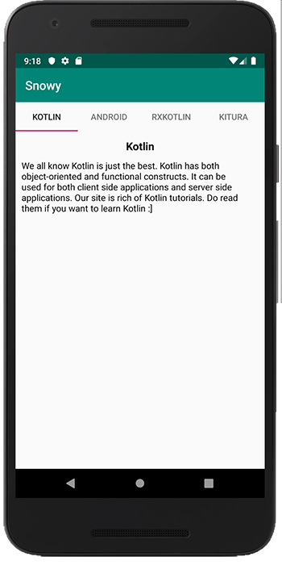

# Kotlin Coroutines in Android

First of all, download the starter code here

- [snowy-starter.zip](archives/snowy-starter.zip)

extract, configure and run.

You should be seeing something like this:

Viewing the Project you should see:

- The **model** package with the **Tutorial** model, which has three properties: the tutorial’s name, the description and the image url.
- The **utils** package with the **SnowFilter**, which has a function called **applySnowEffect()**. applySnowEffect() takes a *Bitmap* as an argument and returns a *Bitmap* with a snow filter.
- **MainActivity**, which hosts four tabs: Kotlin, Android, RxKotlin and Kitura.
- **TutorialFragment**, which shows details of different tutorials.
- **TutorialPagerAdapter**: A **FragmentPagerAdapter** to set up the tabs and **ViewPager**.

Take some time to review these classes, especially the **TutorialFragment** as this is where most of the additional code will be placed.

Next, add the following dependencies to your app/build.gradle

~~~kotlin
implementation 'org.jetbrains.kotlinx:kotlinx-coroutines-core:1.3.0'
implementation 'org.jetbrains.kotlinx:kotlinx-coroutines-android:1.3.0'
~~~

These dependencies are important for integrating the different components of coroutines in your project. They and also provide Android support of coroutines for your project, like the main thread dispatcher.

Inside your **TutorialFragment** (just after the companion object) place the following:

~~~kotlin
private val parentJob = Job()
~~~

Now, to define the scope when the coroutine runs, you’ll use a custom **CoroutineScope** to handle the lifecycle of the coroutines.
To do it, declare a property, as shown below, and initialize it under the **parentJob**:

~~~kotlin
private val coroutineScope = CoroutineScope(Dispatchers.Main + parentJob)
~~~

Now, you’ll write a coroutine to download an image from a URL. Add the following snippet at the bottom of **TutorialFragment.kt**:

~~~kotlin
// 1
private fun getOriginalBitmapAsync(tutorial: Tutorial): Deferred<Bitmap> =
  // 2
  coroutineScope.async(Dispatchers.IO) {
    // 3
    URL(tutorial.url).openStream().use {
      return@async BitmapFactory.decodeStream(it)
    }
}
~~~

Here’s what this code does:

- Creates a regular function, **getOriginalBitmapAsync()**, which returns a **Deferred** Bitmap value. This emphasizes that the result may not be immediately available.
- Use the **async()** to create a coroutine in an input-output optimized **Dispatcher**. This will offload work from the main thread, to avoid freezing the UI.
- Opens a stream from the image’s **URL** and uses it to create a Bitmap, finally returning it.

Next, we'll apply the image filters to the result.

We need another function which uses coroutines to apply a filter so go ahead and create a function **loadSnowFilterAsync()** as follows, at the bottom of **TutorialFragment.kt**:

~~~kotlin
private fun loadSnowFilterAsync(originalBitmap: Bitmap): Deferred<Bitmap> =
  coroutineScope.async(Dispatchers.Default) {
    SnowFilter.applySnowEffect(originalBitmap)
  }
~~~

Applying a filter is a heavy task because it has to work pixel-by-pixel, for the entire image. This is usually CPU intensive work, so you can use the Default dispatcher to use a worker thread.

We'll piece it all together in the next step.
