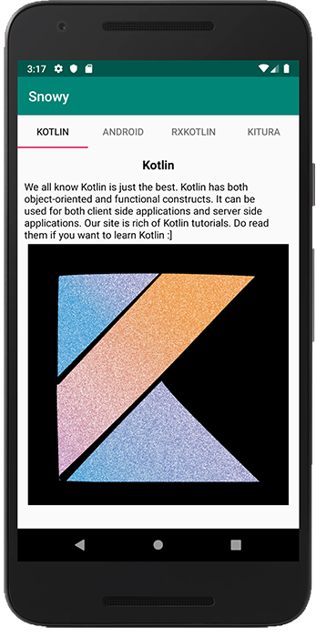

# Handling Exceptions

Exception handling in Kotlin Coroutines behaves differently depending on the CoroutineBuilder you are using. The exception may get propagated automatically or it may get deferred till the consumer consumes the result.

Here’s how to handle exceptions for your Snowy app:
Create a property, **coroutineExceptionHandler**, as follows:

~~~kotlin
// 1
private val coroutineExceptionHandler: CoroutineExceptionHandler =
    CoroutineExceptionHandler { _, throwable ->
      //2
      coroutineScope.launch(Dispatchers.Main) {
        //3
        errorMessage.visibility = View.VISIBLE
        errorMessage.text = getString(R.string.error_message)
      }

      GlobalScope.launch { println("Caught $throwable") }
    }
~~~

This creates a **CoroutineExceptionHandler** to log exceptions. Additionally, it creates a coroutine on the main thread to show error messages on the UI. You also log your exceptions in a separate coroutine, which will live with your app’s lifecycle. This is useful if you need to log your exceptions to tools like Crashlytics.

Since **GlobalScope** won’t be destroyed with the UI, you can log exceptions in it, so you don’t lose the logs.

Now, it’s time to associate this handler with your **CoroutineScope**. Replace the following in the property definition of **coroutineScope**:

~~~kotlin
private val coroutineScope =
    CoroutineScope(Dispatchers.Main + parentJob + coroutineExceptionHandler)
~~~

The last task is to clean up your coroutines, to avoid leaks.

Override **onDestroy** and add the following code to it:

~~~kotlin
override fun onDestroy() {
  super.onDestroy()
  parentJob.cancel()
}
~~~

This will cancel and clear up all the coroutines you launched with the coroutineScope.

And that’s all you need to implement your coroutine. Build and run your app and you’ll see the following:

