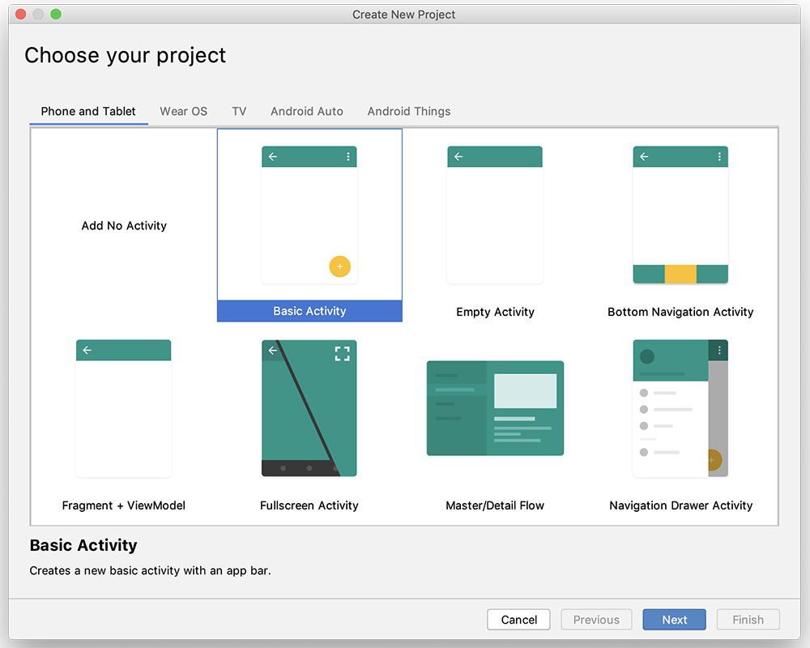
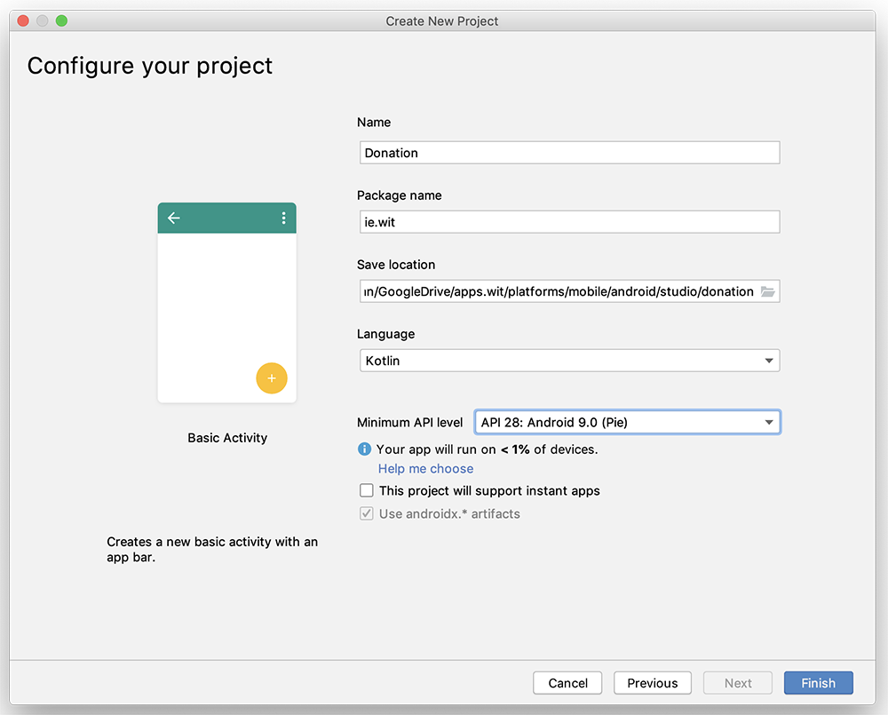
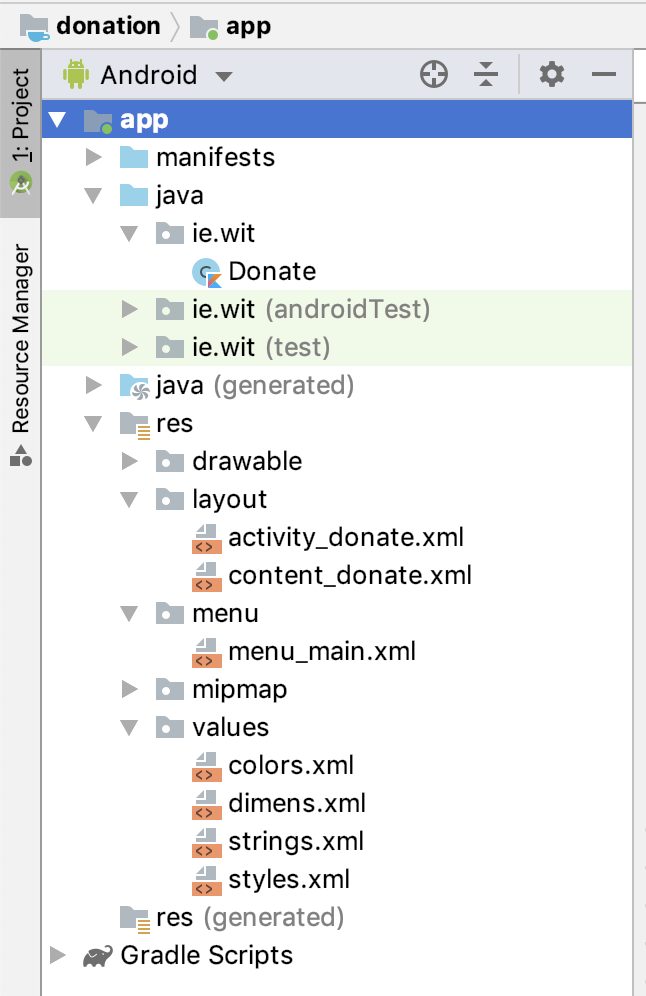

# Setup - Starter Code

You can find the starter code for this lab [here](archives/donation-v0.zip), which I'd recommend you download and extract, otherwise you'll need to create a new project with the following settings

and

You'll also need to rename some resources within the project and once completed it should look as follows:

In this lab, you are required to do the following:

- Implement the 'Donate' Option, which accepts a 'donation' from the user
- Implement the 'Report' Option, which lists the donations made by the user
- Introduce a serialization mechanism to save and restore the donations list to and from a file
- Refactor existing Classes to accommodate the new serialization mechanism

The following steps will guide you through these requirements, so we'll start with the 'Donate' Option.
