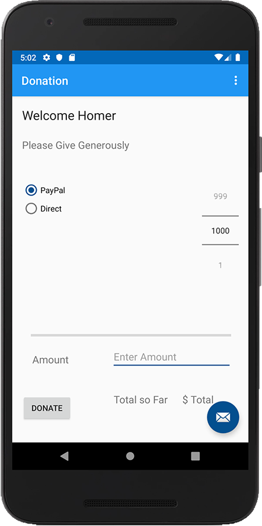

# Making a Donation - Part 1

The first thing to do is add in a number of new resources in your **strings.xml** but be careful not to overwrite the existing ones

~~~xml
   <string name="donateTitle">Welcome Homer</string>
   <string name="donateSubtitle">Please Give Generously</string>
   <string name="donateButton">Donate</string>
   <string name="paypal">PayPal</string>
   <string name="direct">Direct</string>
   <string name="amount">Amount</string>
   <string name="total">Total so Far</string>
   <string name="totalSoFar">$ Total</string>
   <string name="reportTitle">Donations Report</string>
   <string name="defaultAmount">00</string>
   <string name="defaultMethod">N/A</string>
   <string name="enter_amount">Enter Amount</string>
~~~

Next, open your **content_donate.xml** and replace the **TextView** with the following:

~~~xml
<TextView
      android:id="@+id/donateTitle"
      android:layout_width="188dp"
      android:layout_height="30dp"
      android:layout_alignParentEnd="true"
      android:layout_alignParentStart="true"
      android:layout_alignParentTop="true"
      android:layout_marginBottom="8dp"
      android:layout_marginEnd="8dp"
      android:layout_marginStart="8dp"
      android:layout_marginTop="8dp"
      android:text="@string/donateTitle"
      android:textAppearance="?android:attr/textAppearanceLarge"
      app:layout_constraintBottom_toBottomOf="parent"
      app:layout_constraintEnd_toEndOf="parent"
      app:layout_constraintHorizontal_bias="0.044"
      app:layout_constraintStart_toStartOf="parent"
      app:layout_constraintTop_toTopOf="parent"
      app:layout_constraintVertical_bias="0.017" />

  <TextView
      android:id="@+id/donateSubtitle"
      android:layout_width="wrap_content"
      android:layout_height="wrap_content"
      android:layout_alignEnd="@+id/donateTitle"
      android:layout_alignParentStart="true"
      android:layout_below="@+id/donateTitle"
      android:layout_marginBottom="8dp"
      android:layout_marginEnd="8dp"
      android:layout_marginStart="8dp"
      android:layout_marginTop="8dp"
      android:text="@string/donateSubtitle"
      android:textAppearance="?android:attr/textAppearanceMedium"
      app:layout_constraintBottom_toBottomOf="parent"
      app:layout_constraintEnd_toEndOf="parent"
      app:layout_constraintHorizontal_bias="0.044"
      app:layout_constraintStart_toStartOf="parent"
      app:layout_constraintTop_toTopOf="parent"
      app:layout_constraintVertical_bias="0.114" />

  <Button
      android:id="@+id/donateButton"
      android:layout_width="wrap_content"
      android:layout_height="wrap_content"
      android:layout_alignParentBottom="true"
      android:layout_centerHorizontal="true"
      android:layout_marginBottom="8dp"
      android:layout_marginEnd="8dp"
      android:layout_marginStart="8dp"
      android:layout_marginTop="8dp"
      android:text="@string/donateButton"
      app:layout_constraintBottom_toBottomOf="parent"
      app:layout_constraintEnd_toEndOf="parent"
      app:layout_constraintHorizontal_bias="0.028"
      app:layout_constraintStart_toStartOf="parent"
      app:layout_constraintTop_toTopOf="parent"
      app:layout_constraintVertical_bias="0.948" />

  <RadioGroup
      android:id="@+id/paymentMethod"
      android:layout_width="181dp"
      android:layout_height="128dp"
      android:layout_above="@+id/progressBar"
      android:layout_alignParentStart="true"
      android:layout_below="@+id/donateSubtitle"
      android:layout_marginBottom="8dp"
      android:layout_marginEnd="8dp"
      android:layout_marginStart="8dp"
      android:layout_marginTop="8dp"
      android:layout_toStartOf="@+id/amountPicker"
      app:layout_constraintBottom_toBottomOf="parent"
      app:layout_constraintEnd_toEndOf="parent"
      app:layout_constraintHorizontal_bias="0.042"
      app:layout_constraintStart_toStartOf="parent"
      app:layout_constraintTop_toTopOf="@+id/donateTitle"
      app:layout_constraintVertical_bias="0.276">

      <RadioButton
          android:id="@+id/PayPal"
          android:layout_width="97dp"
          android:layout_height="wrap_content"
          android:checked="true"
          android:text="@string/paypal" />

      <RadioButton
          android:id="@+id/Direct"
          android:layout_width="97dp"
          android:layout_height="wrap_content"
          android:checked="false"
          android:text="@string/direct" />
  </RadioGroup>

  <NumberPicker
      android:id="@+id/amountPicker"
      android:layout_width="wrap_content"
      android:layout_height="wrap_content"
      android:layout_alignEnd="@+id/donateSubtitle"
      android:layout_marginBottom="8dp"
      android:layout_marginEnd="8dp"
      android:layout_marginStart="8dp"
      android:layout_marginTop="8dp"
      app:layout_constraintBottom_toBottomOf="parent"
      app:layout_constraintEnd_toEndOf="parent"
      app:layout_constraintHorizontal_bias="0.973"
      app:layout_constraintStart_toStartOf="parent"
      app:layout_constraintTop_toTopOf="parent"
      app:layout_constraintVertical_bias="0.333" />

  <ProgressBar
      android:id="@+id/progressBar"
      style="?android:attr/progressBarStyleHorizontal"
      android:layout_width="349dp"
      android:layout_height="14dp"
      android:layout_above="@+id/donateButton"
      android:layout_alignEnd="@+id/donateSubtitle"
      android:layout_alignParentStart="true"
      android:layout_marginBottom="8dp"
      android:layout_marginEnd="8dp"
      android:layout_marginStart="8dp"
      android:layout_marginTop="8dp"
      android:indeterminate="false"
      app:layout_constraintBottom_toBottomOf="parent"
      app:layout_constraintEnd_toEndOf="parent"
      app:layout_constraintHorizontal_bias="0.526"
      app:layout_constraintStart_toStartOf="parent"
      app:layout_constraintTop_toTopOf="parent"
      app:layout_constraintVertical_bias="0.7" />

  <TextView
      android:id="@+id/amount"
      android:layout_width="wrap_content"
      android:layout_height="wrap_content"
      android:layout_marginBottom="8dp"
      android:layout_marginEnd="8dp"
      android:layout_marginStart="8dp"
      android:layout_marginTop="8dp"
      android:text="@string/amount"
      android:textAppearance="@android:style/TextAppearance.Material.Medium"
      app:layout_constraintBottom_toBottomOf="parent"
      app:layout_constraintEnd_toEndOf="parent"
      app:layout_constraintHorizontal_bias="0.081"
      app:layout_constraintStart_toStartOf="parent"
      app:layout_constraintTop_toTopOf="parent"
      app:layout_constraintVertical_bias="0.778" />

  <TextView
      android:id="@+id/total"
      android:layout_width="wrap_content"
      android:layout_height="wrap_content"
      android:layout_marginBottom="8dp"
      android:layout_marginEnd="8dp"
      android:layout_marginStart="8dp"
      android:layout_marginTop="8dp"
      android:text="@string/total"
      android:textAppearance="@android:style/TextAppearance.Material.Medium"
      app:layout_constraintBottom_toBottomOf="parent"
      app:layout_constraintEnd_toEndOf="parent"
      app:layout_constraintHorizontal_bias="0.56"
      app:layout_constraintStart_toStartOf="parent"
      app:layout_constraintTop_toTopOf="parent"
      app:layout_constraintVertical_bias="0.902" />

  <TextView
      android:id="@+id/totalSoFar"
      android:layout_width="wrap_content"
      android:layout_height="wrap_content"
      android:layout_marginBottom="8dp"
      android:layout_marginEnd="8dp"
      android:layout_marginStart="8dp"
      android:layout_marginTop="8dp"
      android:text="@string/totalSoFar"
      android:textAppearance="@android:style/TextAppearance.Material.Medium"
      app:layout_constraintBottom_toBottomOf="parent"
      app:layout_constraintEnd_toEndOf="parent"
      app:layout_constraintHorizontal_bias="0.846"
      app:layout_constraintStart_toStartOf="parent"
      app:layout_constraintTop_toTopOf="parent"
      app:layout_constraintVertical_bias="0.902" />

  <EditText
      android:id="@+id/paymentAmount"
      android:layout_width="wrap_content"
      android:layout_height="wrap_content"
      android:layout_marginBottom="8dp"
      android:layout_marginEnd="8dp"
      android:layout_marginStart="8dp"
      android:layout_marginTop="8dp"
      android:ems="10"
      android:inputType="number"
      app:layout_constraintBottom_toBottomOf="parent"
      app:layout_constraintEnd_toEndOf="parent"
      app:layout_constraintHorizontal_bias="0.888"
      app:layout_constraintStart_toStartOf="parent"
      app:layout_constraintTop_toTopOf="parent"
      app:layout_constraintVertical_bias="0.781"
      android:autofillHints="Please Enter an Amount"
      android:hint="@string/enter_amount"/>
~~~

It's probably worth running the app just to confirm your 'Donate' screen looks something like this

First, set the **progressBar** max value in your <b>onCreate()</b> function

~~~java
progressBar.max = 10000
~~~

Next, add some functionality to the <b>NumberPicker</b> so go ahead and add the following, also to your <b>onCreate()</b>

~~~java
amountPicker.minValue = 1
amountPicker.maxValue = 1000

amountPicker.setOnValueChangedListener { _, _, newVal ->
      //Display the newly selected number to paymentAmount
      paymentAmount.setText("$newVal")
  }
~~~

Fix any import errors and run the app again. Confirm that the NumberPicker also controls the value in the EditText.

Then, add the following for the **donateButton**

~~~java
var totalDonated = 0

        donateButton.setOnClickListener {
            val amount = if (paymentAmount.text.isNotEmpty())
                 paymentAmount.text.toString().toInt() else amountPicker.value
            if(totalDonated >= progressBar.max)
                Toast.makeText(this,"Donate Amount Exceeded!",Toast.LENGTH_LONG).show()
            else {
                totalDonated += amount
                totalSoFar.text = "$$totalDonated"
                progressBar.progress = totalDonated
            }
        }
~~~

and run the app again, and test accordingly.
