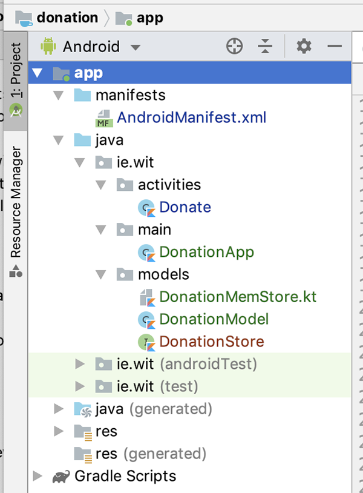
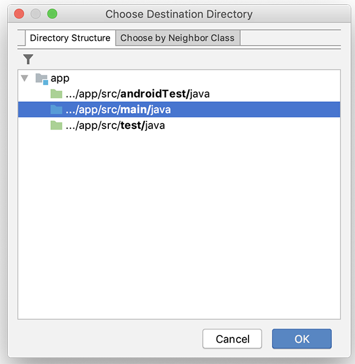
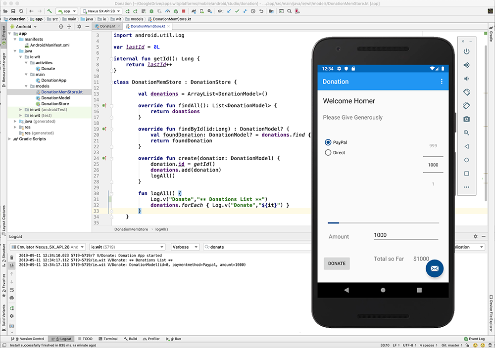
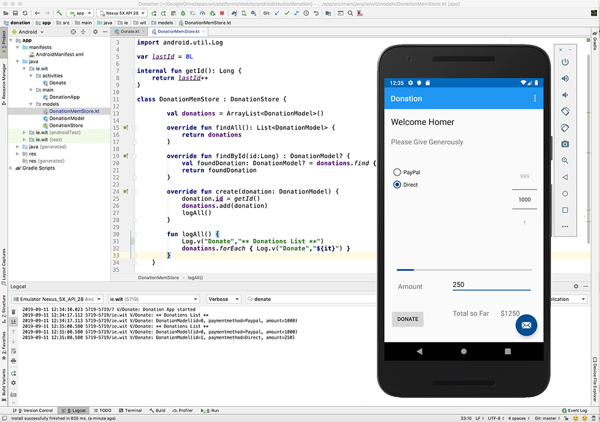

# Data Model & Application Object

Currently, all we're doing is keeping track of a **totalDonated** amount - nothing is being stored and no donation 'model' exists.

First, refactor your project like so

this will allow us to manage our classes in future versions of the app. You'll be familiar with the approach here from earlier 'Placemark' labs (so we may as well use it!)

Remember when creating the packages, choose the **main** directory, like below

Then within the newly created packages, create the relevant classes, as listed above

Now, replace your new classes with the following, respectively

**DonationModel**

~~~
@Parcelize
data class DonationModel(var id: Long = 0,
                         val paymentmethod: String = "N/A",
                         val amount: Int = 0) : Parcelable
~~~

if your getting errors, be sure to add the following to your app/build.gradle file, immediately before your dependencies

~~~
androidExtensions {
 experimental = true
}
~~~

**DonationStore**

~~~
interface DonationStore {
    fun findAll() : List<DonationModel>
    fun findById(id: Long) : DonationModel?
    fun create(donation: DonationModel)
}
~~~

**DonationMemStore**

~~~
var lastId = 0L

internal fun getId(): Long {
    return lastId++
}

class DonationMemStore : DonationStore {

        val donations = ArrayList<DonationModel>()

        override fun findAll(): List<DonationModel> {
            return donations
        }

        override fun findById(id:Long) : DonationModel? {
            val foundDonation: DonationModel? = donations.find { it.id == id }
            return foundDonation
        }

        override fun create(donation: DonationModel) {
            donation.id = getId()
            donations.add(donation)
            logAll()
        }

        fun logAll() {
            Log.v("Donate","** Donations List **")
            donations.forEach { Log.v("Donate","${it}") }
        }
    }
~~~

and finally

**DonationApp**

~~~
class DonationApp : Application() {

    lateinit var donationsStore: DonationStore

    override fun onCreate() {
        super.onCreate()
        donationsStore = DonationMemStore()
        Log.v("Donate","Donation App started")
    }
}
~~~

Also, don't forget to add the following to the 'application' tag in your manifest file

~~~
android:name="ie.wit.main.DonationApp"
~~~

Now, revisit your **Donate** class and add the following

~~~
lateinit var app: DonationApp
~~~

and the following inside your **onCreate()**

~~~
app = this.application as DonationApp
~~~

Next, replace your **donateButton** event listener code with this

~~~
donateButton.setOnClickListener {
            val amount = if (paymentAmount.text.isNotEmpty())
                 paymentAmount.text.toString().toInt() else amountPicker.value
            if(totalDonated >= progressBar.max)
                Toast.makeText(this,"Donate Amount Exceeded!",Toast.LENGTH_LONG).show()
            else {
                val paymentmethod = if(paymentMethod.checkedRadioButtonId == R.id.Direct) "Direct" else "Paypal"
                totalDonated += amount
                totalSoFar.text = "$$totalDonated"
                progressBar.progress = totalDonated
                app.donationsStore.create(DonationModel(paymentmethod = paymentmethod,amount = amount))
            }
        }
~~~

Fix any errors and run your app again and you should be seeing something along the lines of the following (for example) when you make a Donation

**Donating a value of 1000 via PayPal**

and

**Donating a value of 250 via Direct**

The next step will be to display those Donations back to the user via a list.
