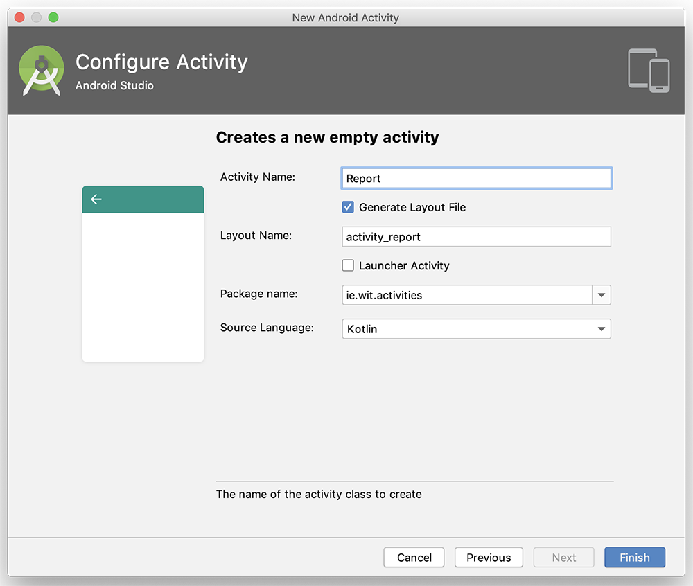
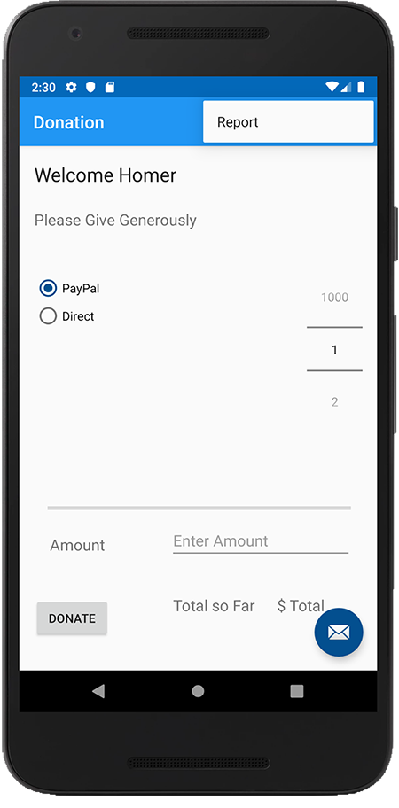
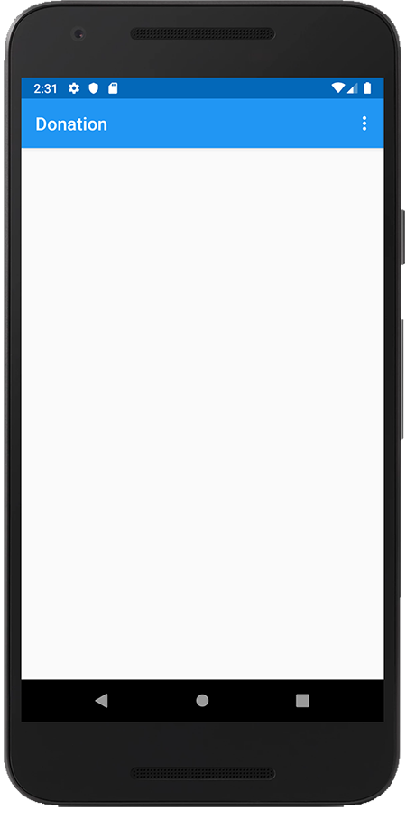
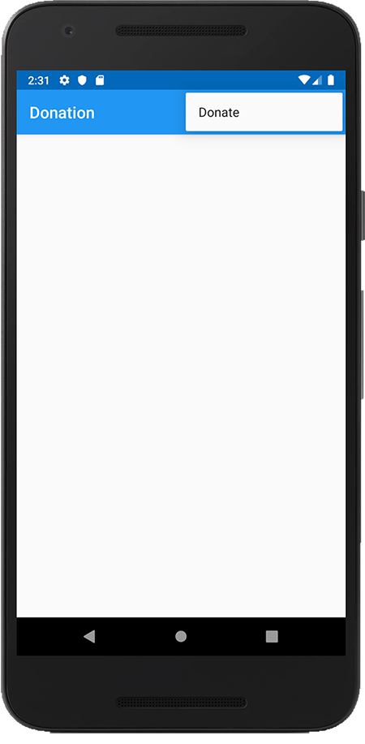

# Switching between Activities

Now that we can save our Donations then next thing to do is be able to display them back to the user.

Before we can do that we will need a new Activity for this and the ability to 'switch' to it, to display the list to th user.

First, go ahead and create a new **Empty Activity** with the following settings

Next, (a small bit of refactoring) rename your

**menu_main.xml**

to  

**menu_donate.xml**

and copy it to

**menu_report.xml**

Update your xml files as follows:

**menu_donate.xml**

~~~
<menu xmlns:android="http://schemas.android.com/apk/res/android"
    xmlns:app="http://schemas.android.com/apk/res-auto"
    xmlns:tools="http://schemas.android.com/tools"
    tools:context="ie.wit.activities.Donate">

    <item
        android:id="@+id/action_report"
        android:orderInCategory="100"
        android:title="@string/action_report"
        app:showAsAction="never" />
</menu>
~~~

**menu_report.xml**

~~~
<menu xmlns:android="http://schemas.android.com/apk/res/android"
    xmlns:app="http://schemas.android.com/apk/res-auto"
    xmlns:tools="http://schemas.android.com/tools"
    tools:context="ie.wit.activities.Report">

    <item
        android:id="@+id/action_donate"
        android:orderInCategory="100"
        android:title="@string/action_donate"
        app:showAsAction="never" />
</menu>
~~~

Now update your **onOptionsItemSelected()** with this

~~~
override fun onOptionsItemSelected(item: MenuItem): Boolean {
        // Handle action bar item clicks here. The action bar will
        // automatically handle clicks on the Home/Up button, so long
        // as you specify a parent activity in AndroidManifest.xml.
        return when (item.itemId) {
            R.id.action_report -> { startActivity(Intent(this, Report::class.java))
                                    true
                                    }
            else -> super.onOptionsItemSelected(item)
        }
    }
~~~

Add the following to your **Report** Activity

~~~
override fun onCreateOptionsMenu(menu: Menu): Boolean {
       // Inflate the menu; this adds items to the action bar if it is present.
       menuInflater.inflate(R.menu.menu_report, menu)
       return true
   }
~~~

and see if you can implement the Report **onOptionsItemSelected()** function (VERY similar to the above!)

Run the app again and confirm you can switch between the Donate and the Report Activities via the Menu, like so

and

and

