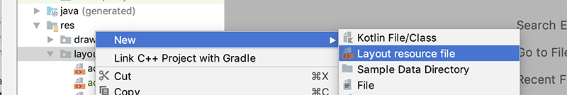
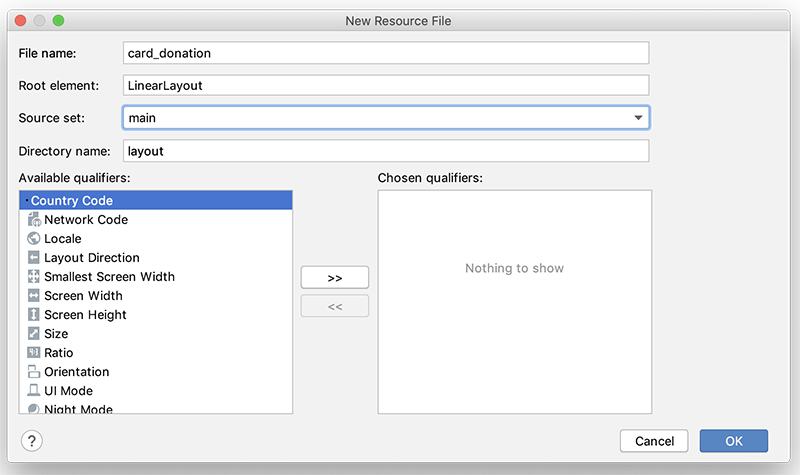
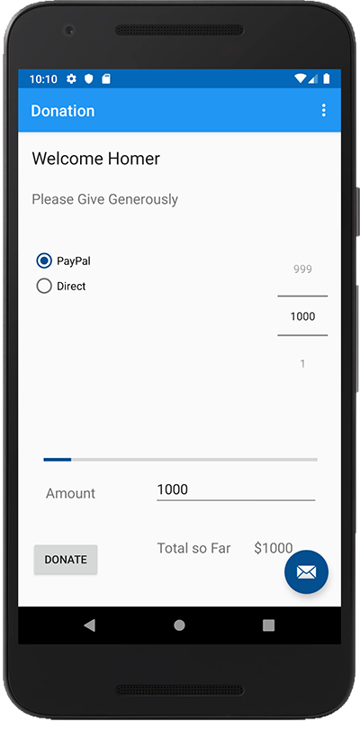
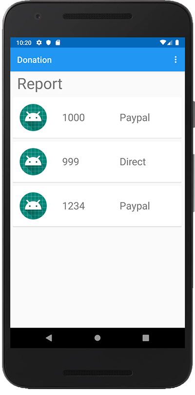

# Displaying our Donations List

We'll continue to follow a similar approach to the Placemark case study, so to begin with, let's add a new card layout and update our existing report layout.

Fist, create a new layout called **card_donation.xml** in your res/layout folder

and

and replace it with the following

~~~
<?xml version="1.0" encoding="utf-8"?>
<androidx.cardview.widget.CardView
xmlns:android="http://schemas.android.com/apk/res/android"
xmlns:app="http://schemas.android.com/apk/res-auto"
    xmlns:tools="http://schemas.android.com/tools"
    android:layout_width="match_parent"
android:layout_height="wrap_content"
android:layout_marginBottom="8dp"
android:elevation="24dp">

<RelativeLayout
    android:layout_width="match_parent"
    android:layout_height="wrap_content"
    android:padding="16dp">

    <ImageView
        android:id="@+id/imageIcon"
        android:layout_width="64dp"
        android:layout_height="64dp"
        android:layout_alignParentLeft="true"
        android:layout_alignParentTop="true"
        android:layout_marginRight="16dp"
        app:srcCompat="@mipmap/ic_launcher_round"/>

    <TextView
        android:id="@+id/paymentamount"
        android:layout_width="121dp"
        android:layout_height="wrap_content"
        android:layout_alignParentTop="true"
        android:layout_marginStart="20dp"
        android:layout_marginTop="15dp"
        android:layout_toEndOf="@+id/imageIcon"
        android:text="TextView"
        android:textSize="24sp"
        tools:text="€1000" />

    <TextView
        android:id="@+id/paymentmethod"
        android:layout_width="wrap_content"
        android:layout_height="wrap_content"
        android:layout_alignParentTop="true"
        android:layout_marginStart="30dp"
        android:layout_marginTop="15dp"
        android:layout_toEndOf="@+id/paymentamount"
        android:text="@string/paypal"
        android:textSize="24sp" />

</RelativeLayout>
</androidx.cardview.widget.CardView>
~~~

Next, open your **activity_report.xml** and replace it with this xml

~~~
<?xml version="1.0" encoding="utf-8"?>
<androidx.constraintlayout.widget.ConstraintLayout xmlns:android="http://schemas.android.com/apk/res/android"
    xmlns:app="http://schemas.android.com/apk/res-auto"
    xmlns:tools="http://schemas.android.com/tools"
    android:layout_width="match_parent"
    android:layout_height="match_parent"
    tools:context=".activities.Report">

    <androidx.recyclerview.widget.RecyclerView
        android:id="@+id/recyclerView"
        android:layout_width="397dp"
        android:layout_height="584dp"
        android:layout_marginTop="116dp"
        app:layout_constraintBottom_toBottomOf="parent"
        app:layout_constraintEnd_toEndOf="parent"
        app:layout_constraintHorizontal_bias="0.428"
        app:layout_constraintStart_toStartOf="parent"
        app:layout_constraintTop_toTopOf="parent"
        app:layout_constraintVertical_bias="0.573" />

    <TextView
        android:id="@+id/reportTitle"
        android:layout_width="wrap_content"
        android:layout_height="wrap_content"
        android:text="@string/action_report"
        android:textSize="36sp"
        app:layout_constraintBottom_toTopOf="@+id/recyclerView"
        app:layout_constraintEnd_toEndOf="parent"
        app:layout_constraintHorizontal_bias="0.052"
        app:layout_constraintStart_toStartOf="parent"
        app:layout_constraintTop_toTopOf="parent"
        app:layout_constraintVertical_bias="0.238" />
</androidx.constraintlayout.widget.ConstraintLayout>
~~~

Next, add a new class **DonationAdapter** to a new **adapters** package and replace it with

~~~
package ie.wit.adapters

import android.view.LayoutInflater
import android.view.View
import android.view.ViewGroup
import androidx.recyclerview.widget.RecyclerView
import ie.wit.R
import ie.wit.models.DonationModel
import kotlinx.android.synthetic.main.card_donation.view.*

class DonationAdapter constructor(private var donations: List<DonationModel>)
    : RecyclerView.Adapter<DonationAdapter.MainHolder>() {

    override fun onCreateViewHolder(parent: ViewGroup, viewType: Int): MainHolder {
        return MainHolder(
            LayoutInflater.from(parent.context).inflate(
                R.layout.card_donation,
                parent,
                false
            )
        )
    }

    override fun onBindViewHolder(holder: MainHolder, position: Int) {
        val donation = donations[holder.adapterPosition]
        holder.bind(donation)
    }

    override fun getItemCount(): Int = donations.size

    class MainHolder constructor(itemView: View) : RecyclerView.ViewHolder(itemView) {

        fun bind(donation: DonationModel) {
            itemView.paymentamount.text = donation.amount.toString()
            itemView.paymentmethod.text = donation.paymentmethod
            itemView.imageIcon.setImageResource(R.mipmap.ic_launcher_round)
        }
    }
}
~~~

Fix any errors and rebuild the project.

The final thing to do is attach our new DonationAdapter to our adapter on our layout and pass in our donations list so first, add the following declaration to your **Report** Activity

~~~
 lateinit var app: DonationApp
~~~

Next, setup your adapter like so (try and work out the best place to put this)

~~~
app = this.application as DonationApp
recyclerView.setLayoutManager(LinearLayoutManager(this))
recyclerView.adapter = DonationAdapter(app.donationsStore.findAll())
~~~

and run your app again, if everything goes to plan, you should see something like the following

**Make a few donations**

and when you select 'Report'

