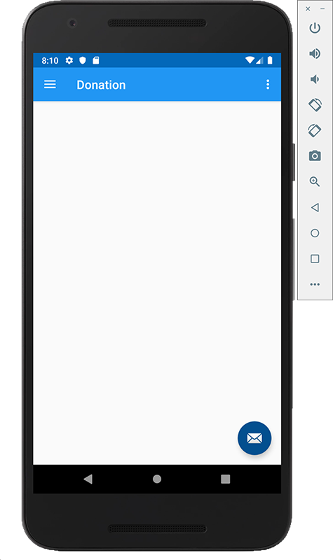
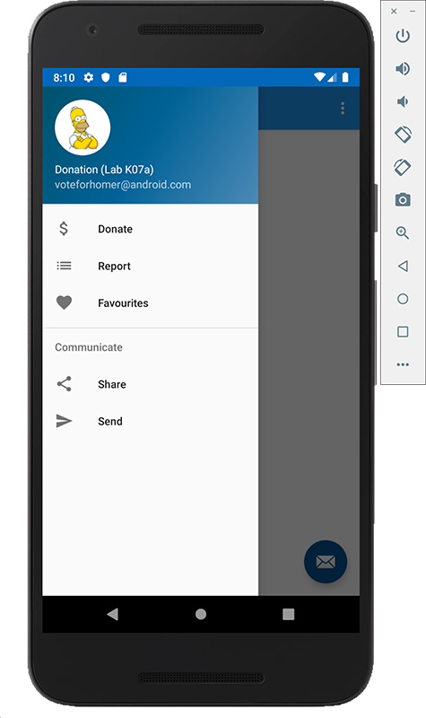
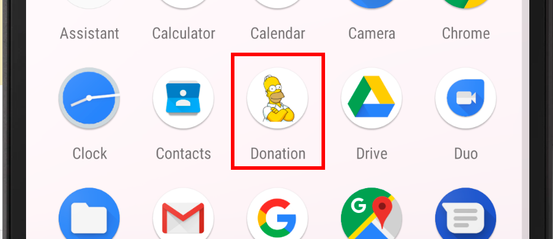
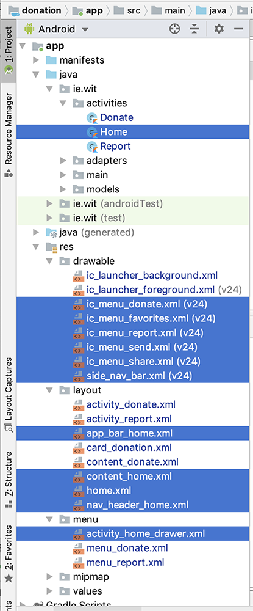

# Setup - Starter Code (Recommended)

Here's the [completed](archives/donation-v1-complete.zip) version 1 app.

You can find the starter code for this lab [here](archives/donation-v2-start.zip), which I'd recommend you download if you haven't completed the exercises from the previous lab, but mainly because it contains a lot of resources required to get started with implementing a Nav Drawer.

In this lab, you are required to do the following:

- Implement a Nav (Navigation) Drawer to improve the UI and Navigation throughout the app
- Implement Fragments to make our app more modular

**NOTE : THIS LAB INVOLVES SETTING UP THE NAV DRAWER MANUALLY AND MANAGES THE FRAGMENTS PROGRAMMATICALLY**

Because this can be quite time consuming, the starter project, when downloaded and run, will give you the following:

**Initial Launch**

**Selecting Hamburger Menu**

where selecting a menu option will give you a simple toast message.

**The Launcher Icon**

The project structure itself is as follows:

Pay particular attention to the highlighted resources as these are what we use to set up the **Nav Drawer**.

The following steps will take you through adding a new option to the Nav Drawer Menu and implementing the existing functionality via Fragments.
