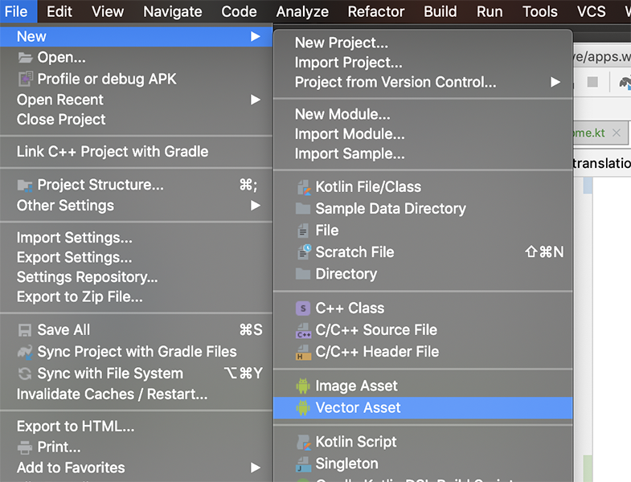
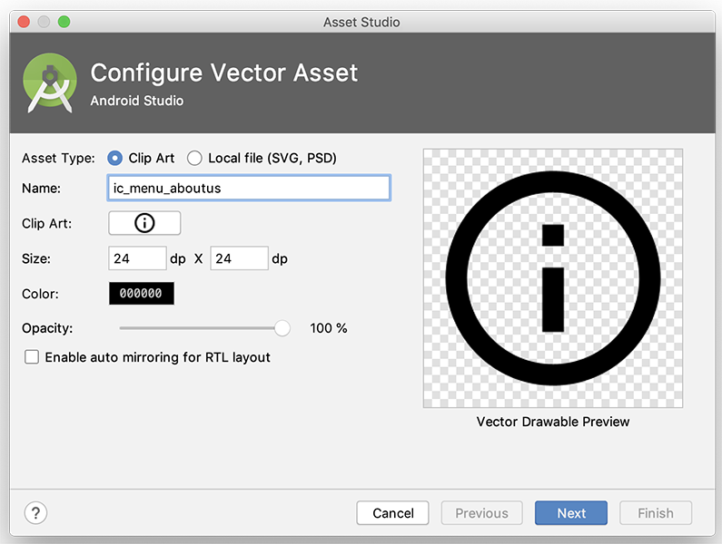
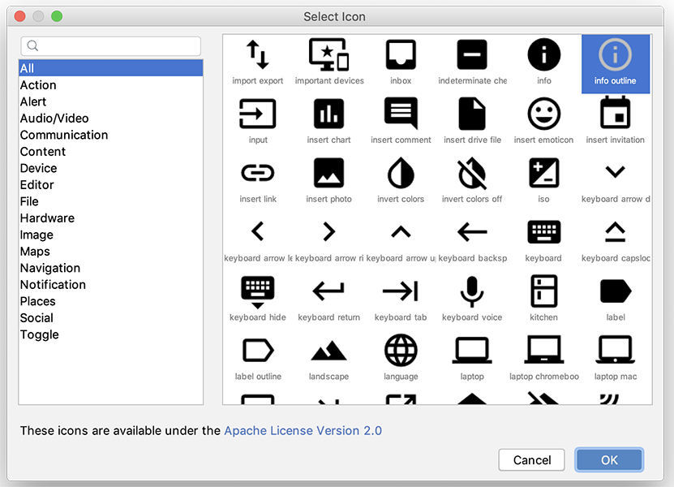
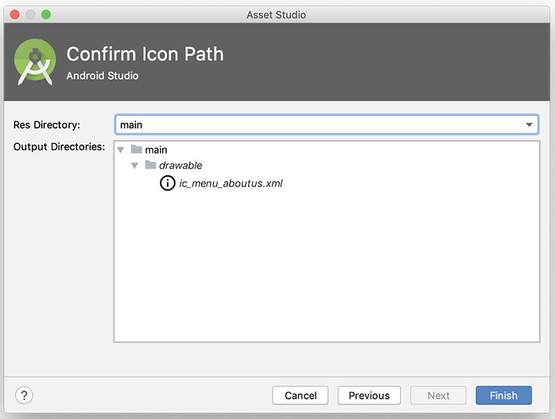

# Adding a New Nav Drawer Menu Option

We'll add a new **About Us** menu option so the first thing to do is add in a number of new resources for that purpose. First confirm you have an appropriate string resource in your **strings.xml**

~~~xml
 <string name="menu_about">About Us</string>
~~~

Next, go ahead and add a new **Vector Asses** as follows:

File->New->Vector Asset

Choose an appropriate asset and menu name

If you click the 'Clip Art' box you get

Confirm the Icon Path and click Finish

Next, open your **activity_home_drawer.xml** menu file and add the following:

~~~xml
<item
    android:id="@+id/nav_aboutus"
    android:icon="@drawable/ic_menu_aboutus"
    android:title="@string/menu_about" />
~~~

Run you app again and you should now have the following:

The rest of the lab will involve bringing in Fragments to implement the existing app functionality.
