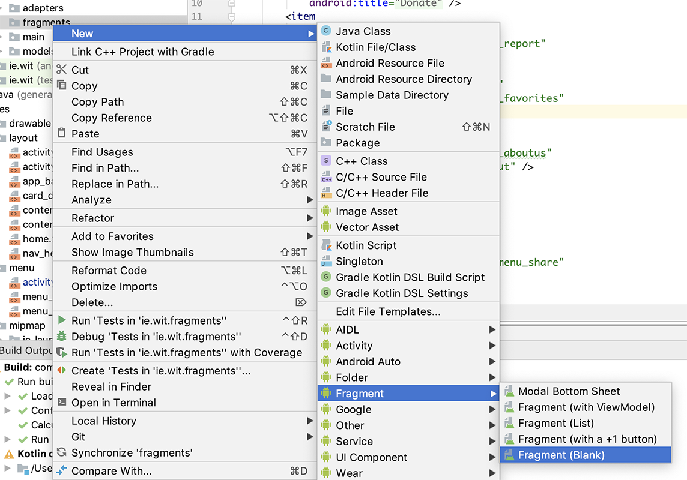
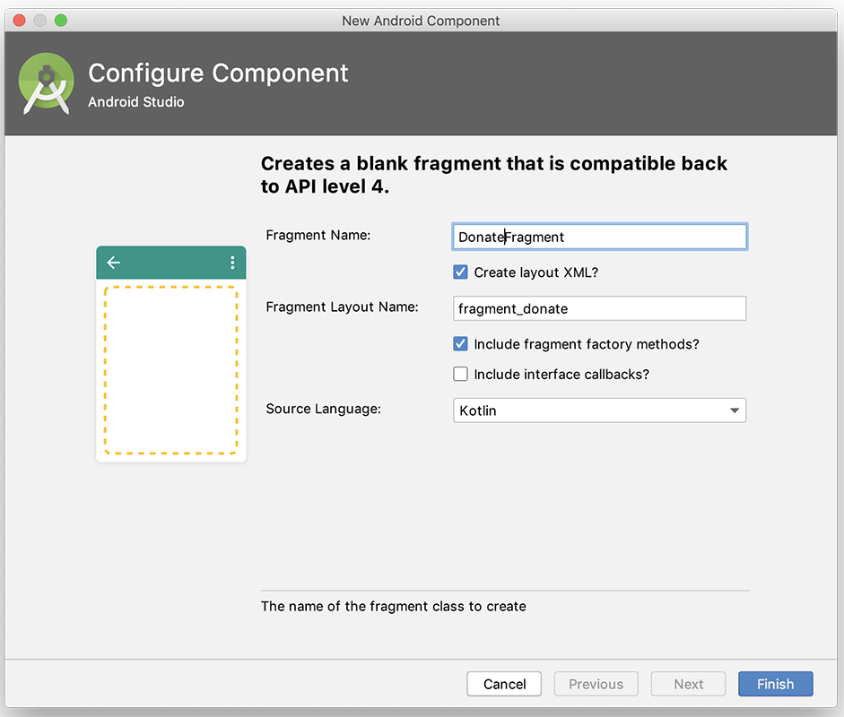
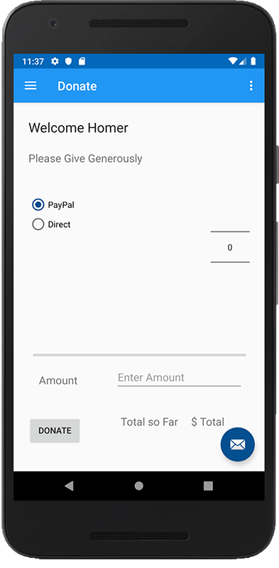

# Refactoring Donate - Part 1

Currently, all of our functionality is wrapped up in separate Activities, so here we'll refactor the Donate option to use a Fragment.

First, create a new package

~~~
ie.wit.fragments
~~~

and within that package a new **Blank Fragment** like so:

and the following settings for **DonateFragment**

**NOTE : We are NOT 'including interface callbacks' at this stage**

Take a quick look at the supplied class

~~~
package ie.wit.fragments

import android.os.Bundle
import androidx.fragment.app.Fragment
import android.view.LayoutInflater
import android.view.View
import android.view.ViewGroup

import ie.wit.R

// TODO: Rename parameter arguments, choose names that match
// the fragment initialization parameters, e.g. ARG_ITEM_NUMBER
private const val ARG_PARAM1 = "param1"
private const val ARG_PARAM2 = "param2"

/**
 * A simple [Fragment] subclass.
 * Use the [DonateFragment.newInstance] factory method to
 * create an instance of this fragment.
 */
class DonateFragment : Fragment() {
    // TODO: Rename and change types of parameters
    private var param1: String? = null
    private var param2: String? = null

    override fun onCreate(savedInstanceState: Bundle?) {
        super.onCreate(savedInstanceState)
        arguments?.let {
            param1 = it.getString(ARG_PARAM1)
            param2 = it.getString(ARG_PARAM2)
        }
    }

    override fun onCreateView(
        inflater: LayoutInflater, container: ViewGroup?,
        savedInstanceState: Bundle?
    ): View? {
        // Inflate the layout for this fragment
        return inflater.inflate(R.layout.fragment_donate, container, false)
    }

    companion object {
        /**
         * Use this factory method to create a new instance of
         * this fragment using the provided parameters.
         *
         * @param param1 Parameter 1.
         * @param param2 Parameter 2.
         * @return A new instance of fragment DonateFragment.
         */
        // TODO: Rename and change types and number of parameters
        @JvmStatic
        fun newInstance(param1: String, param2: String) =
            DonateFragment().apply {
                arguments = Bundle().apply {
                    putString(ARG_PARAM1, param1)
                    putString(ARG_PARAM2, param2)
                }
            }
    }
}
~~~

There's quite a lot here, but initially we only require a subset of this functionality, so go ahead and replace this class with the following

~~~
class DonateFragment : Fragment() {

    override fun onCreate(savedInstanceState: Bundle?) {
        super.onCreate(savedInstanceState)
    }

    override fun onCreateView(
        inflater: LayoutInflater, container: ViewGroup?,
        savedInstanceState: Bundle?
    ): View? {

        val root = inflater.inflate(R.layout.fragment_donate, container, false)
        activity?.title = getString(R.string.action_donate)

        return root;
    }

    companion object {
        @JvmStatic
        fun newInstance() =
            DonateFragment().apply {
                arguments = Bundle().apply {}
            }
    }      
}
~~~

Next, replace your

**fragment_donate.xml**

with the following: (It's basically the layout from the original donate activity 'content_donate.xml')

~~~xml
<?xml version="1.0" encoding="utf-8"?>
<androidx.constraintlayout.widget.ConstraintLayout
    xmlns:android="http://schemas.android.com/apk/res/android"
    xmlns:app="http://schemas.android.com/apk/res-auto"
    xmlns:tools="http://schemas.android.com/tools"
    android:layout_width="match_parent"
    android:layout_height="match_parent"
    tools:context=".fragments.DonateFragment">

    <TextView
        android:id="@+id/donateTitle"
        android:layout_width="188dp"
        android:layout_height="30dp"
        android:layout_alignParentEnd="true"
        android:layout_alignParentStart="true"
        android:layout_alignParentTop="true"
        android:layout_marginBottom="8dp"
        android:layout_marginEnd="8dp"
        android:layout_marginStart="8dp"
        android:layout_marginTop="8dp"
        android:text="@string/donateTitle"
        android:textAppearance="?android:attr/textAppearanceLarge"
        app:layout_constraintBottom_toBottomOf="parent"
        app:layout_constraintEnd_toEndOf="parent"
        app:layout_constraintHorizontal_bias="0.044"
        app:layout_constraintStart_toStartOf="parent"
        app:layout_constraintTop_toTopOf="parent"
        app:layout_constraintVertical_bias="0.017" />

    <TextView
        android:id="@+id/donateSubtitle"
        android:layout_width="wrap_content"
        android:layout_height="wrap_content"
        android:layout_alignEnd="@+id/donateTitle"
        android:layout_alignParentStart="true"
        android:layout_below="@+id/donateTitle"
        android:layout_marginBottom="8dp"
        android:layout_marginEnd="8dp"
        android:layout_marginStart="8dp"
        android:layout_marginTop="8dp"
        android:text="@string/donateSubtitle"
        android:textAppearance="?android:attr/textAppearanceMedium"
        app:layout_constraintBottom_toBottomOf="parent"
        app:layout_constraintEnd_toEndOf="parent"
        app:layout_constraintHorizontal_bias="0.044"
        app:layout_constraintStart_toStartOf="parent"
        app:layout_constraintTop_toTopOf="parent"
        app:layout_constraintVertical_bias="0.114" />

    <Button
        android:id="@+id/donateButton"
        android:layout_width="wrap_content"
        android:layout_height="wrap_content"
        android:layout_alignParentBottom="true"
        android:layout_centerHorizontal="true"
        android:layout_marginBottom="8dp"
        android:layout_marginEnd="8dp"
        android:layout_marginStart="8dp"
        android:layout_marginTop="8dp"
        android:text="@string/donateButton"
        app:layout_constraintBottom_toBottomOf="parent"
        app:layout_constraintEnd_toEndOf="parent"
        app:layout_constraintHorizontal_bias="0.028"
        app:layout_constraintStart_toStartOf="parent"
        app:layout_constraintTop_toTopOf="parent"
        app:layout_constraintVertical_bias="0.948" />

    <RadioGroup
        android:id="@+id/paymentMethod"
        android:layout_width="181dp"
        android:layout_height="128dp"
        android:layout_above="@+id/progressBar"
        android:layout_alignParentStart="true"
        android:layout_below="@+id/donateSubtitle"
        android:layout_marginBottom="8dp"
        android:layout_marginEnd="8dp"
        android:layout_marginStart="8dp"
        android:layout_marginTop="8dp"
        android:layout_toStartOf="@+id/amountPicker"
        app:layout_constraintBottom_toBottomOf="parent"
        app:layout_constraintEnd_toEndOf="parent"
        app:layout_constraintHorizontal_bias="0.042"
        app:layout_constraintStart_toStartOf="parent"
        app:layout_constraintTop_toTopOf="@+id/donateTitle"
        app:layout_constraintVertical_bias="0.276">

        <RadioButton
            android:id="@+id/PayPal"
            android:layout_width="97dp"
            android:layout_height="wrap_content"
            android:checked="true"
            android:text="@string/paypal" />

        <RadioButton
            android:id="@+id/Direct"
            android:layout_width="97dp"
            android:layout_height="wrap_content"
            android:checked="false"
            android:text="@string/direct" />
    </RadioGroup>

    <NumberPicker
        android:id="@+id/amountPicker"
        style="@android:style/Widget.Material.NumberPicker"
        android:layout_width="wrap_content"
        android:layout_height="wrap_content"
        android:layout_alignEnd="@+id/donateSubtitle"
        android:layout_marginStart="8dp"
        android:layout_marginTop="8dp"
        android:layout_marginEnd="8dp"
        android:layout_marginBottom="8dp"
        app:layout_constraintBottom_toBottomOf="parent"
        app:layout_constraintEnd_toEndOf="parent"
        app:layout_constraintHorizontal_bias="0.973"
        app:layout_constraintStart_toStartOf="parent"
        app:layout_constraintTop_toTopOf="parent"
        app:layout_constraintVertical_bias="0.333" />

    <ProgressBar
        android:id="@+id/progressBar"
        style="?android:attr/progressBarStyleHorizontal"
        android:layout_width="349dp"
        android:layout_height="14dp"
        android:layout_above="@+id/donateButton"
        android:layout_alignEnd="@+id/donateSubtitle"
        android:layout_alignParentStart="true"
        android:layout_marginBottom="8dp"
        android:layout_marginEnd="8dp"
        android:layout_marginStart="8dp"
        android:layout_marginTop="8dp"
        android:indeterminate="false"
        app:layout_constraintBottom_toBottomOf="parent"
        app:layout_constraintEnd_toEndOf="parent"
        app:layout_constraintHorizontal_bias="0.526"
        app:layout_constraintStart_toStartOf="parent"
        app:layout_constraintTop_toTopOf="parent"
        app:layout_constraintVertical_bias="0.7" />

    <TextView
        android:id="@+id/amount"
        android:layout_width="wrap_content"
        android:layout_height="wrap_content"
        android:layout_marginBottom="8dp"
        android:layout_marginEnd="8dp"
        android:layout_marginStart="8dp"
        android:layout_marginTop="8dp"
        android:text="@string/amount"
        android:textAppearance="@android:style/TextAppearance.Material.Medium"
        app:layout_constraintBottom_toBottomOf="parent"
        app:layout_constraintEnd_toEndOf="parent"
        app:layout_constraintHorizontal_bias="0.081"
        app:layout_constraintStart_toStartOf="parent"
        app:layout_constraintTop_toTopOf="parent"
        app:layout_constraintVertical_bias="0.778" />

    <TextView
        android:id="@+id/total"
        android:layout_width="wrap_content"
        android:layout_height="wrap_content"
        android:layout_marginBottom="8dp"
        android:layout_marginEnd="8dp"
        android:layout_marginStart="8dp"
        android:layout_marginTop="8dp"
        android:text="@string/total"
        android:textAppearance="@android:style/TextAppearance.Material.Medium"
        app:layout_constraintBottom_toBottomOf="parent"
        app:layout_constraintEnd_toEndOf="parent"
        app:layout_constraintHorizontal_bias="0.56"
        app:layout_constraintStart_toStartOf="parent"
        app:layout_constraintTop_toTopOf="parent"
        app:layout_constraintVertical_bias="0.902" />

    <TextView
        android:id="@+id/totalSoFar"
        android:layout_width="wrap_content"
        android:layout_height="wrap_content"
        android:layout_marginBottom="8dp"
        android:layout_marginEnd="8dp"
        android:layout_marginStart="8dp"
        android:layout_marginTop="8dp"
        android:text="@string/totalSoFar"
        android:textAppearance="@android:style/TextAppearance.Material.Medium"
        app:layout_constraintBottom_toBottomOf="parent"
        app:layout_constraintEnd_toEndOf="parent"
        app:layout_constraintHorizontal_bias="0.846"
        app:layout_constraintStart_toStartOf="parent"
        app:layout_constraintTop_toTopOf="parent"
        app:layout_constraintVertical_bias="0.902" />

    <EditText
        android:id="@+id/paymentAmount"
        android:layout_width="wrap_content"
        android:layout_height="wrap_content"
        android:layout_marginBottom="8dp"
        android:layout_marginEnd="8dp"
        android:layout_marginStart="8dp"
        android:layout_marginTop="8dp"
        android:ems="10"
        android:inputType="number"
        app:layout_constraintBottom_toBottomOf="parent"
        app:layout_constraintEnd_toEndOf="parent"
        app:layout_constraintHorizontal_bias="0.888"
        app:layout_constraintStart_toStartOf="parent"
        app:layout_constraintTop_toTopOf="parent"
        app:layout_constraintVertical_bias="0.781"
        android:autofillHints="Please Enter an Amount"
        android:hint="@string/enter_amount"/>

</androidx.constraintlayout.widget.ConstraintLayout>
~~~

Now, open your **Home.kt** and add the following class property

~~~
 lateinit var ft: FragmentTransaction
~~~

and at the end of your **onCreate()** add:

~~~
ft = supportFragmentManager.beginTransaction()

val fragment = DonateFragment.newInstance()
ft.replace(R.id.homeFrame, fragment)
ft.commit()
~~~

Run your app and if all goes well you should see this:

Next, we'll bring in the functionality.
