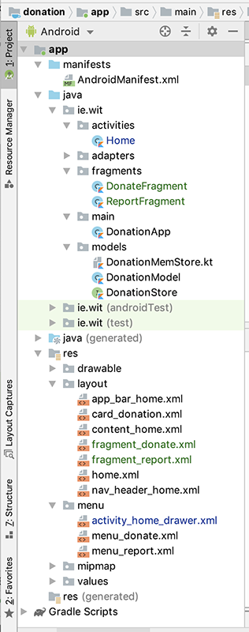

# Refactoring Report

Similar to the Donate refactoring, here we'll focus on the Report feature.

First, go ahead and create another Blank Fragment called **ReportFragment** with the same settings as **DonateFragment** and store in the fragments package.

Replace with the following before continuing:

~~~
class ReportFragment : Fragment() {

    override fun onCreate(savedInstanceState: Bundle?) {
        super.onCreate(savedInstanceState)
    }

    override fun onCreateView(
        inflater: LayoutInflater, container: ViewGroup?,
        savedInstanceState: Bundle?
    ): View? {
        // Inflate the layout for this fragment
        return inflater.inflate(R.layout.fragment_report, container, false)
    }

    companion object {
        @JvmStatic
        fun newInstance() =
            ReportFragment().apply {
                arguments = Bundle().apply { }
            }
    }
}
~~~

Next replace your **fragment_report.xml** layout with the following:

~~~xml
<?xml version="1.0" encoding="utf-8"?>
<androidx.constraintlayout.widget.ConstraintLayout
    xmlns:android="http://schemas.android.com/apk/res/android"
    xmlns:app="http://schemas.android.com/apk/res-auto"
    xmlns:tools="http://schemas.android.com/tools"
    android:layout_width="match_parent"
    android:layout_height="match_parent"
    tools:context=".activities.Report">

    <androidx.recyclerview.widget.RecyclerView
        android:id="@+id/recyclerView"
        android:layout_width="399dp"
        android:layout_height="601dp"
        android:layout_marginTop="116dp"
        app:layout_constraintBottom_toBottomOf="parent"
        app:layout_constraintEnd_toEndOf="parent"
        app:layout_constraintStart_toStartOf="parent"
        app:layout_constraintTop_toTopOf="parent"
        app:layout_constraintVertical_bias="0.0" />

    <TextView
        android:id="@+id/reportTitle"
        android:layout_width="wrap_content"
        android:layout_height="wrap_content"
        android:text="@string/action_report"
        android:textColor="#000000"
        android:textSize="36sp"
        app:layout_constraintBottom_toTopOf="@+id/recyclerView"
        app:layout_constraintEnd_toEndOf="parent"
        app:layout_constraintHorizontal_bias="0.052"
        app:layout_constraintStart_toStartOf="parent"
        app:layout_constraintTop_toTopOf="parent"
        app:layout_constraintVertical_bias="0.238" />
</androidx.constraintlayout.widget.ConstraintLayout>
~~~

Introduce an application object reference like you did in **DonateFragment**, instanciate it in the **onCreate()** and then replace your **onCreateView()** with the following:

~~~
override fun onCreateView(
     inflater: LayoutInflater, container: ViewGroup?,
     savedInstanceState: Bundle?
 ): View? {
     // Inflate the layout for this fragment
     var root = inflater.inflate(R.layout.fragment_report, container, false)

     root.recyclerView.setLayoutManager(LinearLayoutManager(activity))
     root.recyclerView.adapter = DonationAdapter(app.donationsStore.findAll())

     return root
 }
~~~

You won't get any compile errors but there is an error - we are still referencing the recyclerview from the activity whereas we should be referencing the one from the fragment.

To fix this make sure to remove the relevant import:

~~~
import kotlinx.android.synthetic.main.activity_report.view.*
~~~

and add the correct one:

~~~
import kotlinx.android.synthetic.main.fragment_report.view.*
~~~

we now need to 'wire it up' from our 'Home' activity so open your **Home.kt** and add the following 'helper' method:

~~~
private fun navigateTo(fragment: Fragment) {
       supportFragmentManager.beginTransaction()
           .replace(R.id.homeFrame, fragment)
           .addToBackStack(null)
           .commit()
   }
~~~

Next replace your **onNavigationItemSelected()** with this:

~~~
override fun onNavigationItemSelected(item: MenuItem): Boolean {

       when (item.itemId) {
           R.id.nav_donate -> navigateTo(DonateFragment.newInstance())
           R.id.nav_report -> navigateTo(ReportFragment.newInstance())

           else -> toast("You Selected Something Else")
       }
       drawerLayout.closeDrawer(GravityCompat.START)
       return true
   }
~~~

Run your app once again and test appropriately. You should now be able to make donations as before and see them on the report screen.

We can now remove our **Donate** and **Report** Activities, and any associated layouts - be sure not to delete your

**fragment_donate**

and

**fragment_report**

layouts!

Your Project will now look as follows:

