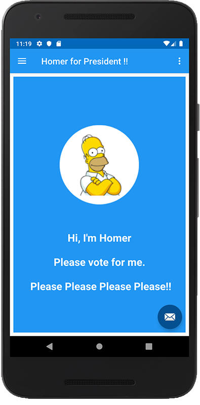

# EXERCISES

## EXERCISE 1

You may have noticed again that on returning to the Donate Screen from the Report Screen, the total and progress bar have been reset. Fix this with an **onResume()** and a very similar approach to the previous lab.

## EXERCISE 2

To get some practice at working with Fragments and adding a new option to the Nav Drawer, go ahead and implement the 'About Us' option to represent something like the following:

