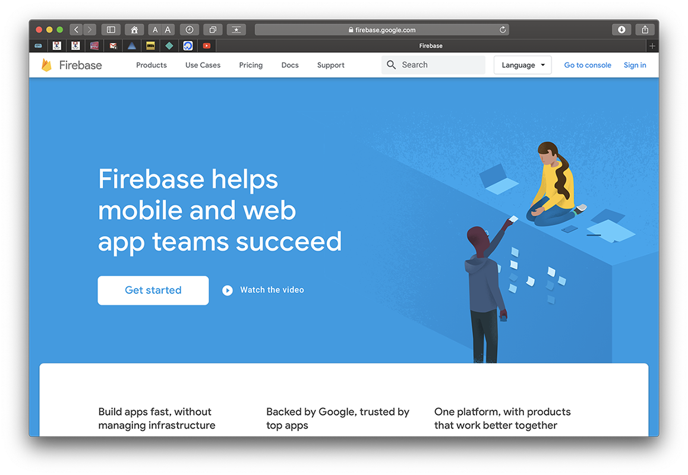
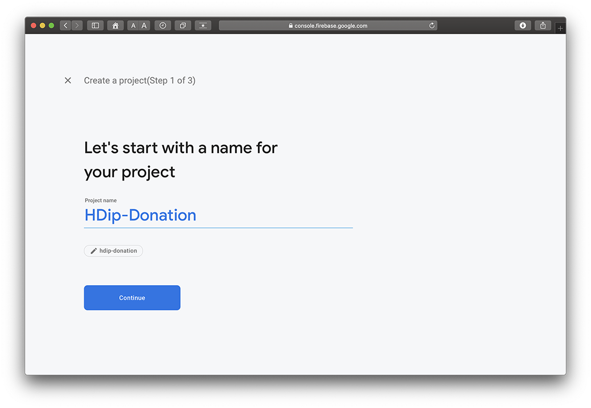
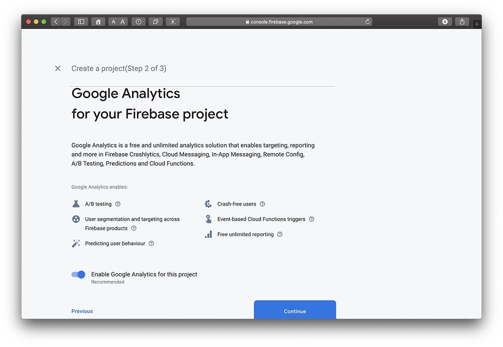
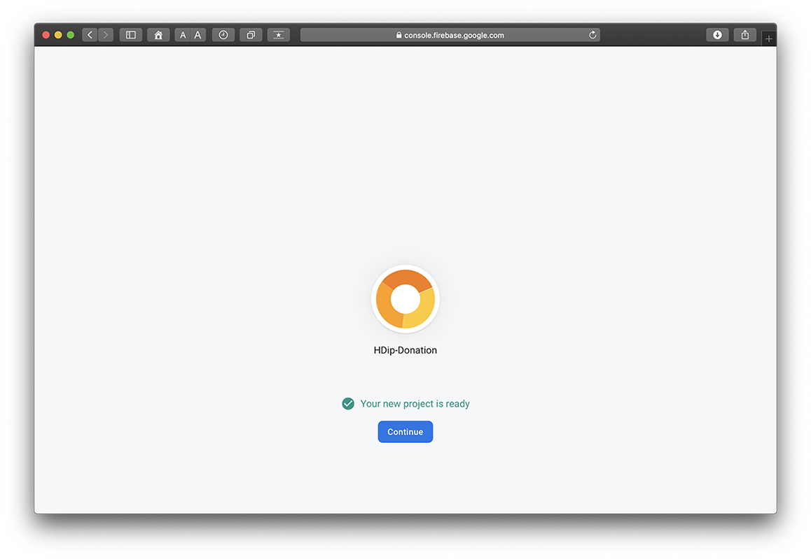
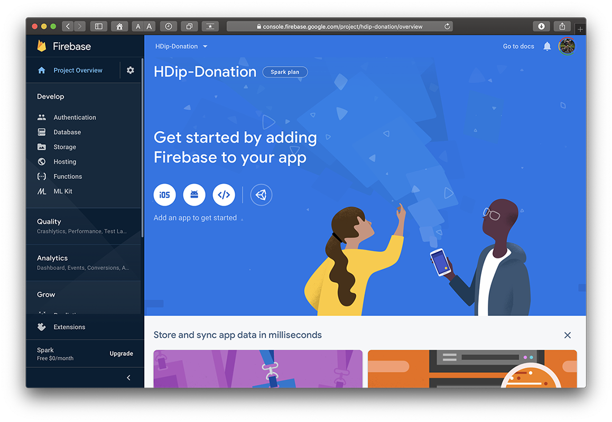
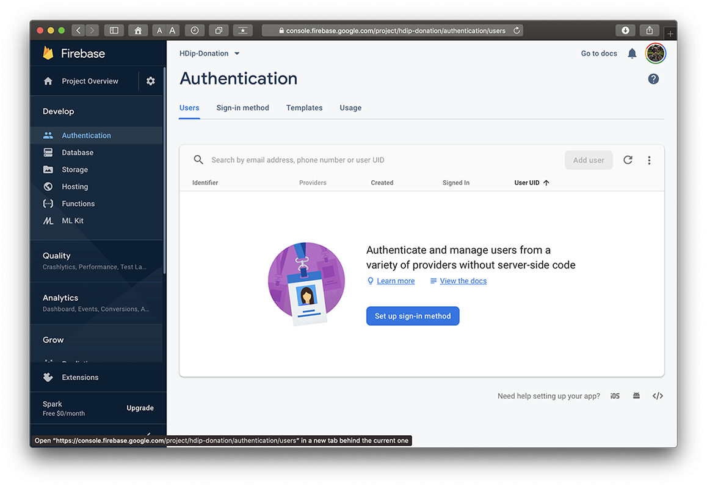
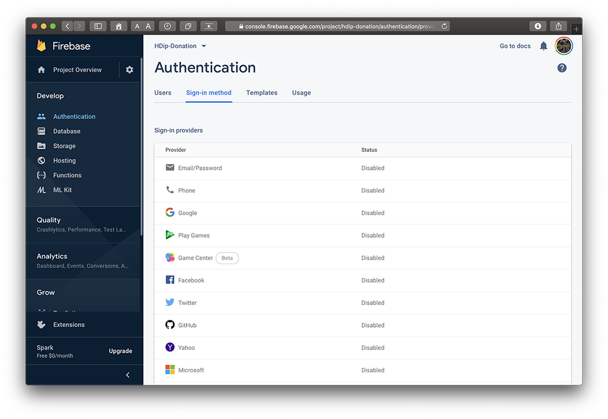
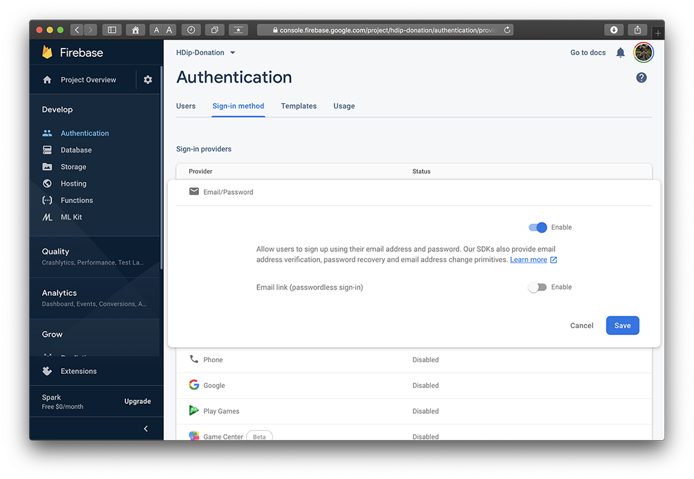
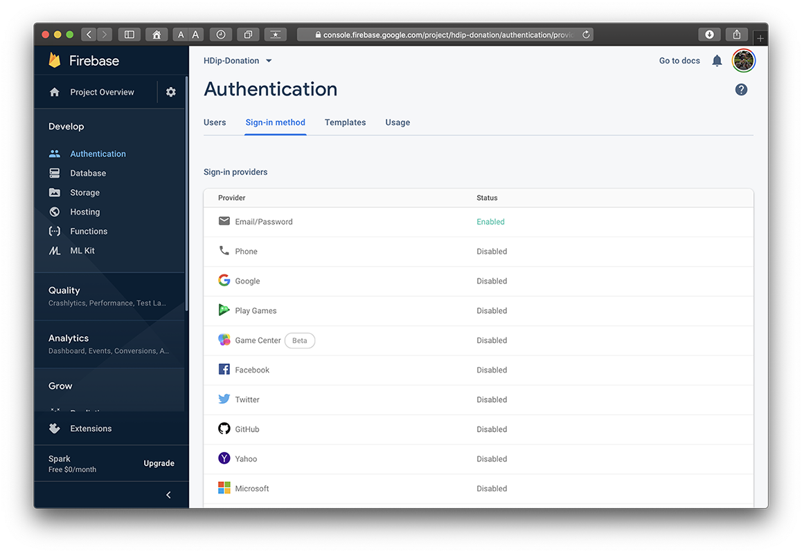

# Setup - Configuring your Firebase Console Project

We want to be able to Authenticate our users using Firebase Authentication before they can use our app, so the first thing we need to do is set up our Firebase Console and configure it correctly.

If you already have a Firebase Console Project set up and configured to Authenticate users against a Username and Password, you can skip this step.

It's worth noting you can do this through Android Studio directly, but I prefer to have it set up beforehand.

First, head over to [firebase.google.com](https://firebase.google.com) and sign in with your google/gmail account.

Visit your [firebase console](https://console.firebase.google.com/) and select `Add Project`.

I'm naming mine as below, but you can call it whatever you wish really.

Take the default settings...

and

and you end up with this

Next, choose the `Authentication` tab

and then the `Sign-In Method`

and `Enable` **Email/Password**

and then

We can now switch our attention to connecting our Donation App to our Firebase Console.
