# Connecting your App to your Firebase Console

Now that you have your Firebase Console Project set up you can proceed to connect an existing Android App.

The first thing to do is download a version of our Donation App which has the necessary starter code suggested by Google and Android Studio for Email and Password Authentication :

This is already in the starter Donation Android app (just to save you time) : [here](archives/donation-v4-start.zip)

There'll be a few errors, but they'll be fixed when you add Firebase Support.

Next, Select the Firebase Option from Tools

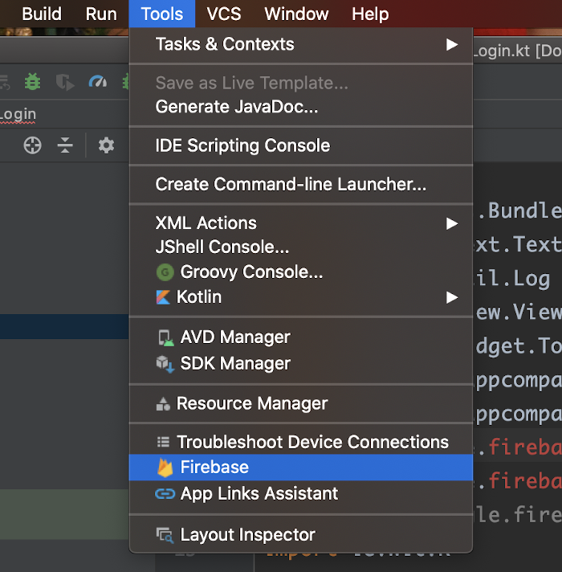

which gets you the Firebase Assistant Menu

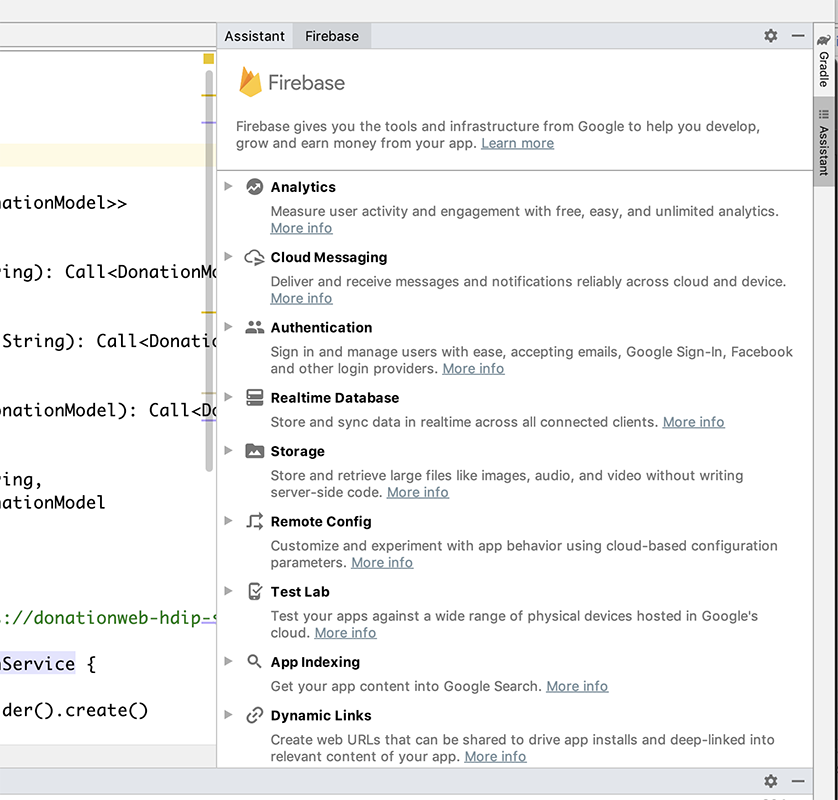

Choose Authentication->Email and Password

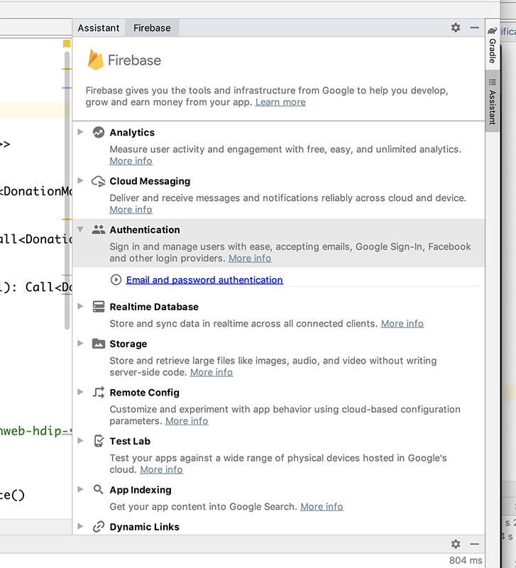

Then, `Connect to Firebase`

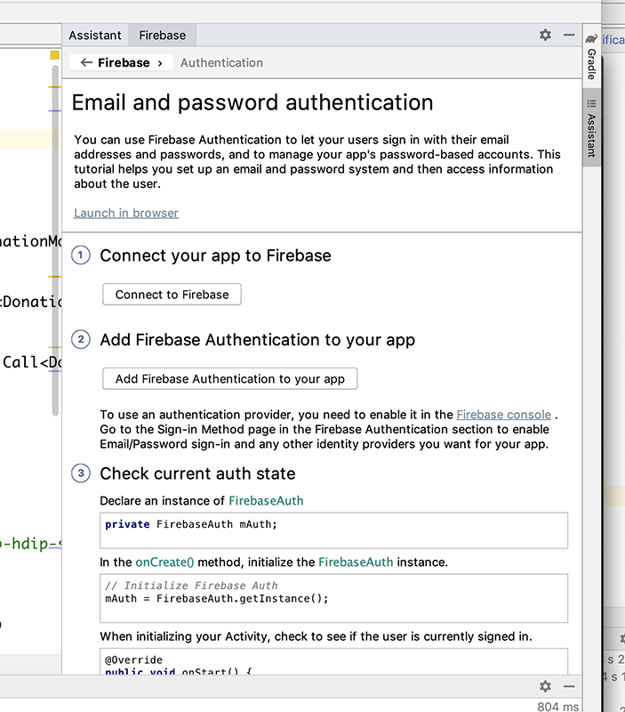

Choose the Project you created earlier

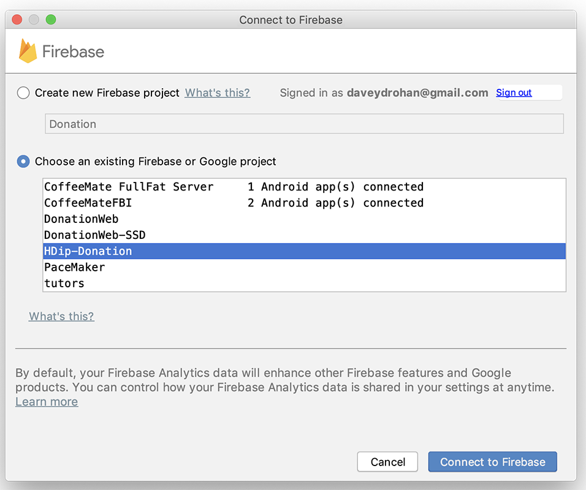

and you should get

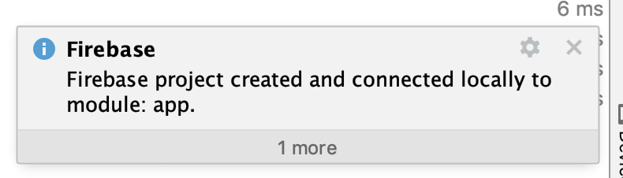

and

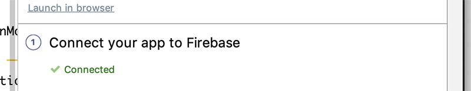

Next, Choose `Add Firebase Authentication`

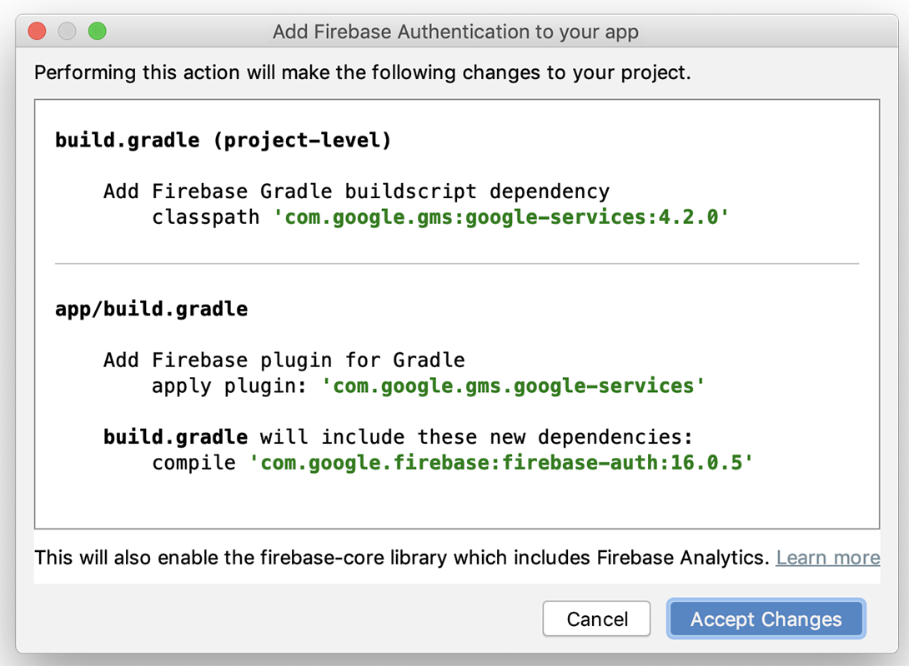

Version numbers may differ but `Accept Changes` and you should get

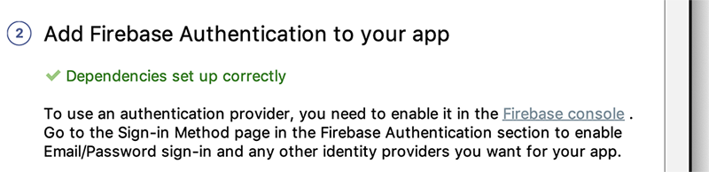

And any errors will be fixed.

Now, run the app and you should get this:

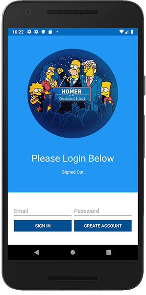

and if you `Create Account` with valid credentials (here I'm setting up dave@dave.com)

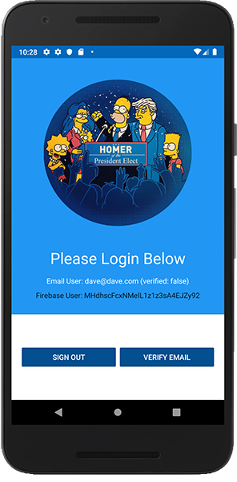

the user will be created on your console, like so:

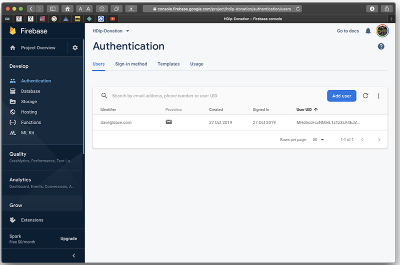

Experiment with signing out and back in again, to confirm this works as expected.

I would strongly recommend taking a closer look at the additional/updated files in our project before continuing, as highlighted below:

Also, if you open your `build.gradle` files (both app and project) you'll notice that there's a few dependencies can be updated with newer versions, so I'd again recommend just completing a quick update of the dependencies that can be upgraded to a newer version.

And don't forget to `Sync` :)
