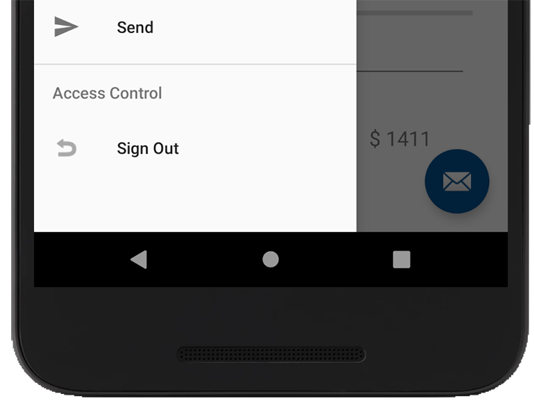
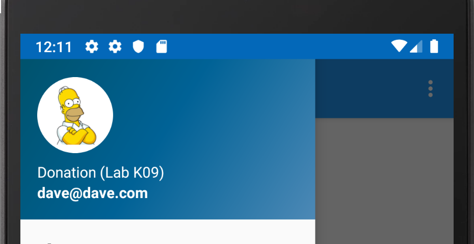

# Adding Multi-User Support - Part 1

The first thing we need to do is load up our `Home` Activity and Nav Drawer on a successful login, so open up your `Login.kt` and add the following to `UpdateUI()` on a successful login:

Note: make sure to import the **Anko** startActivity method.

~~~
startActivity<Home>()
~~~

Now, you'll notice with some rudimentary testing that we can't sign out, or return to the login screen so we'll fix that now.

First, create a new Menu Option on our Nav Drawer, like below, to allow the user to 'Sign Out' at any time

by adding the following to your nav drawer menu

~~~
<item android:title="Access Control">
        <menu>
            <item
                android:id="@+id/nav_sign_out"
                android:icon="@android:drawable/ic_menu_revert"
                android:title="@string/sign_out" />
        </menu>
    </item>
~~~

Next, we'll leverage our application object again and move the `auth` reference from your `Login` Activity to your `DonationApp`, like so:

~~~
class DonationApp : Application(), AnkoLogger {

    lateinit var donationService: DonationService
    var donations = ArrayList<DonationModel>()

    // [START declare_auth]
    lateinit var auth: FirebaseAuth
    // [END declare_auth]

    override fun onCreate() {
        super.onCreate()
        info("Donation App started")
        donationService = DonationService.create()
        info("Donation Service Created")
    }
}
~~~

You'll get a number of reference errors, so like in previous labs, reference the `auth` property through your application object to fix those before proceeding.

(Hint : Have a look at your `DonateFragment` to get you started)

Now, using the following:

~~~
private fun signOut()
   {
       app.auth.signOut()
       startActivity<Login>()
       finish()
   }
~~~

See can you refactor your `Home` Activity to handle the user choosing to 'Sign Out'.

We can also now personalise somewhat the 'Home Screen' by displaying the users email, so first open your `nav_header_home.xml` and update the id of the email textview to `nav_header_email`.

Then add the following to your `onCreate()`

~~~
navView.getHeaderView(0).nav_header_email.text = app.auth.currentUser?.email
~~~

Run your app again, and you should see the email displayed (don't worry about the lab number :) ) on the Nav Drawer set to the signed in users email, like so:

