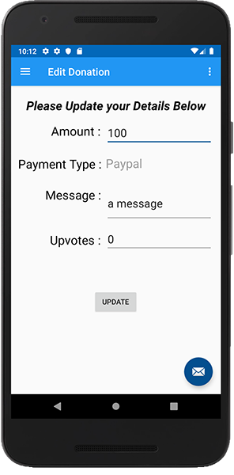

# Editing a Donation on the Server - Part 1

Being able to edit a donation will involve bringing in a new `EditFragment` so go ahead and add a new **Blank Fragment** like we have done in previous labs.

Add new **string resources**

~~~
<string name="action_edit">Edit Donation</string>
<string name="action_update">Update</string>
<string name="message_edit">Please Update your Details Below</string>
~~~

Replace your Fragment with this:

~~~
class EditFragment : Fragment() {

    lateinit var app: DonationApp
    lateinit var loader : AlertDialog
    lateinit var root: View
    var editDonation: DonationModel? = null

    override fun onCreate(savedInstanceState: Bundle?) {
        super.onCreate(savedInstanceState)
        app = activity?.application as DonationApp

        arguments?.let {
            editDonation = it.getParcelable("editdonation")
        }
    }

    override fun onCreateView(
        inflater: LayoutInflater, container: ViewGroup?,
        savedInstanceState: Bundle?
    ): View? {
        // Inflate the layout for this fragment
        root = inflater.inflate(R.layout.fragment_edit, container, false)
        activity?.title = getString(R.string.action_edit)
        loader = createLoader(activity!!)

        root.editAmount.setText(editDonation!!.amount.toString())
        root.editPaymenttype.setText(editDonation!!.paymenttype)
        root.editMessage.setText(editDonation!!.message)
        root.editUpvotes.setText(editDonation!!.upvotes.toString())

        return root
    }

    companion object {
        @JvmStatic
        fun newInstance(donation: DonationModel) =
            EditFragment().apply {
                arguments = Bundle().apply {
                    putParcelable("editdonation",donation)
                }
            }
    }
}
~~~

and your layout with this:

~~~
<?xml version="1.0" encoding="utf-8"?>
<androidx.constraintlayout.widget.ConstraintLayout xmlns:android="http://schemas.android.com/apk/res/android"
    xmlns:app="http://schemas.android.com/apk/res-auto"
    xmlns:tools="http://schemas.android.com/tools"
    android:id="@+id/frameLayout"
    android:layout_width="match_parent"
    android:layout_height="match_parent"
    tools:context=".fragments.EditFragment">

    <TextView
        android:id="@+id/textView4"
        android:layout_width="wrap_content"
        android:layout_height="wrap_content"
        android:layout_marginTop="28dp"
        android:layout_marginRight="5dp"
        android:text="Message :"
        android:textAlignment="viewEnd"
        android:textColor="@color/common_google_signin_btn_text_dark_focused"
        android:textSize="24sp"
        app:layout_constraintEnd_toStartOf="@+id/editMessage"
        app:layout_constraintHorizontal_bias="0.932"
        app:layout_constraintStart_toStartOf="parent"
        app:layout_constraintTop_toBottomOf="@+id/textView3" />

    <TextView
        android:id="@+id/textView5"
        android:layout_width="wrap_content"
        android:layout_height="wrap_content"
        android:layout_marginTop="56dp"
        android:layout_marginRight="5dp"
        android:text="Upvotes :"
        android:textAlignment="viewEnd"
        android:textColor="@color/common_google_signin_btn_text_dark_focused"
        android:textSize="24sp"
        app:layout_constraintEnd_toStartOf="@+id/editUpvotes"
        app:layout_constraintHorizontal_bias="0.932"
        app:layout_constraintStart_toStartOf="parent"
        app:layout_constraintTop_toBottomOf="@+id/textView4" />

    <EditText
        android:id="@+id/editMessage"
        android:layout_width="210dp"
        android:layout_height="73dp"
        android:layout_marginTop="6dp"
        android:layout_marginEnd="8dp"
        android:ems="10"
        android:inputType="textMultiLine"
        android:textAlignment="viewStart"
        android:textSize="22sp"
        app:layout_constraintEnd_toEndOf="parent"
        app:layout_constraintTop_toBottomOf="@+id/editPaymenttype" />

    <TextView
        android:id="@+id/editPaymenttype"
        android:layout_width="210dp"
        android:layout_height="52dp"
        android:layout_marginTop="18dp"
        android:layout_marginEnd="8dp"
        android:text="test"
        android:textAlignment="textStart"
        android:textColor="@color/grey_500"
        android:textSize="24sp"
        app:layout_constraintEnd_toEndOf="parent"
        app:layout_constraintTop_toBottomOf="@+id/editAmount" />

    <EditText
        android:id="@+id/editUpvotes"
        android:layout_width="210dp"
        android:layout_height="46dp"
        android:layout_marginTop="12dp"
        android:layout_marginEnd="8dp"
        android:ems="10"
        android:inputType="number"
        android:textSize="22sp"
        app:layout_constraintBottom_toBottomOf="parent"
        app:layout_constraintEnd_toEndOf="parent"
        app:layout_constraintTop_toBottomOf="@+id/editMessage"
        app:layout_constraintVertical_bias="0.002" />

    <EditText
        android:id="@+id/editAmount"
        android:layout_width="210dp"
        android:layout_height="49dp"
        android:layout_marginTop="60dp"
        android:layout_marginEnd="8dp"
        android:ems="10"
        android:inputType="number"
        android:textSize="22sp"
        app:layout_constraintEnd_toEndOf="parent"
        app:layout_constraintTop_toTopOf="parent" />

    <TextView
        android:id="@+id/textView2"
        android:layout_width="wrap_content"
        android:layout_height="wrap_content"
        android:layout_marginTop="64dp"
        android:layout_marginRight="5dp"
        android:text="Amount :"
        android:textAlignment="viewEnd"
        android:textColor="@color/common_google_signin_btn_text_dark_focused"
        android:textSize="24sp"
        app:layout_constraintEnd_toStartOf="@+id/editAmount"
        app:layout_constraintHorizontal_bias="0.932"
        app:layout_constraintStart_toStartOf="parent"
        app:layout_constraintTop_toTopOf="parent" />

    <TextView
        android:id="@+id/textView3"
        android:layout_width="wrap_content"
        android:layout_height="wrap_content"
        android:layout_marginTop="32dp"
        android:layout_marginRight="8dp"
        android:text="Payment Type :"
        android:textAlignment="viewStart"
        android:textColor="@color/common_google_signin_btn_text_dark_focused"
        android:textSize="24sp"
        app:layout_constraintEnd_toStartOf="@+id/editPaymenttype"
        app:layout_constraintHorizontal_bias="0.932"
        app:layout_constraintStart_toStartOf="parent"
        app:layout_constraintTop_toBottomOf="@+id/textView2" />

    <Button
        android:id="@+id/editUpdateButton"
        android:layout_width="wrap_content"
        android:layout_height="wrap_content"
        android:text="@string/action_update"
        app:layout_constraintBottom_toBottomOf="parent"
        app:layout_constraintEnd_toEndOf="parent"
        app:layout_constraintHorizontal_bias="0.498"
        app:layout_constraintStart_toStartOf="parent"
        app:layout_constraintTop_toBottomOf="@+id/editUpvotes"
        app:layout_constraintVertical_bias="0.329" />

    <TextView
        android:id="@+id/message_edit"
        android:layout_width="wrap_content"
        android:layout_height="wrap_content"
        android:text="@string/message_edit"
        android:textColor="@color/common_google_signin_btn_text_dark_focused"
        android:textSize="24sp"
        android:textStyle="bold|italic"
        app:layout_constraintBottom_toTopOf="@+id/editAmount"
        app:layout_constraintEnd_toEndOf="parent"
        app:layout_constraintStart_toStartOf="parent"
        app:layout_constraintTop_toTopOf="parent" />

</androidx.constraintlayout.widget.ConstraintLayout>
~~~

Next, introduce the following interface into your `DonationAdapter.kt` file

~~~
interface DonationListener {
    fun onDonationClick(donation: DonationModel)
}
~~~

And replace your `DonationAdapter` with the following:

~~~
class DonationAdapter constructor(var donations: ArrayList<DonationModel>,
                                  private val listener: DonationListener)
    : RecyclerView.Adapter<DonationAdapter.MainHolder>() {

    override fun onCreateViewHolder(parent: ViewGroup, viewType: Int): MainHolder {
        return MainHolder(
            LayoutInflater.from(parent?.context).inflate(
                R.layout.card_donation,
                parent,
                false
            )
        )
    }

    override fun onBindViewHolder(holder: MainHolder, position: Int) {
        val donation = donations[holder.adapterPosition]
        holder.bind(donation,listener)
    }

    override fun getItemCount(): Int = donations.size

    fun removeAt(position: Int) {
        donations.removeAt(position)
        notifyItemRemoved(position)
    }

    class MainHolder constructor(itemView: View) : RecyclerView.ViewHolder(itemView) {

        fun bind(donation: DonationModel, listener: DonationListener) {
            itemView.tag = donation._id
            itemView.paymentamount.text = donation.amount.toString()
            itemView.paymentmethod.text = donation.paymenttype
            itemView.imageIcon.setImageResource(R.mipmap.ic_launcher_round)
            itemView.setOnClickListener { listener.onDonationClick(donation) }
        }
    }
}
~~~

Make your `ReportFragment` implement the `DonationListener` interface and replace the implemented method with the following:

~~~
override fun onDonationClick(donation: DonationModel) {
       activity!!.supportFragmentManager.beginTransaction()
           .replace(R.id.homeFrame, EditFragment.newInstance(donation))
           .addToBackStack(null)
           .commit()
   }
~~~

If you now run your app and click on a row in the RecyclerView, you should be taken to the `EditFragment` and a screen similar to the following, displaying the details to edit:

