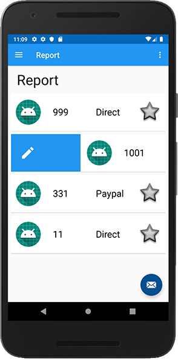

# Editing a Donation on the Server - Part 2

The last thing we need to do is actually update the Donation details back on the server, so first, make your `EditFragment` implement the relevant interface (you're looking to return a `DonationWrapper`) and replace the override methods with the following (including the update function):

~~~
override fun onFailure(call: Call<DonationWrapper>, t: Throwable) {
       info("Retrofit Error : $t.message")
       serviceUnavailableMessage(activity!!)
       hideLoader(loader)
   }

   override fun onResponse(call: Call<DonationWrapper>, response: Response<DonationWrapper>) {
       hideLoader(loader)
       activity!!.supportFragmentManager.beginTransaction()
           .replace(R.id.homeFrame, ReportFragment.newInstance())
           .addToBackStack(null)
           .commit()
   }

   fun updateDonationData() {
       editDonation!!.amount = root.editAmount.text.toString().toInt()
       editDonation!!.message = root.editMessage.text.toString()
       editDonation!!.upvotes = root.editUpvotes.text.toString().toInt()
   }
~~~

Next, add this code to where you think most appropriate:

~~~
root.editUpdateButton.setOnClickListener {
          showLoader(loader, "Updating Donation on Server...")
          updateDonationData()
          var callUpdate = app.donationService.put(app.auth.currentUser?.email,
              (editDonation as DonationModel)._id ,editDonation as DonationModel)
          callUpdate.enqueue(this)
      }
~~~

and test your edit functionality - which should work as expected.

As a final feature, and because we have a lot of the code already in place, we'll set up a swipe-right to also edit, like so:

You'll need to make one change in your `DonationAdapter`

~~~
itemView.tag = donation
~~~

and in your `ReportFragment` you'll need

~~~
val swipeEditHandler = object : SwipeToEditCallback(activity!!) {
           override fun onSwiped(viewHolder: RecyclerView.ViewHolder, direction: Int) {
               onDonationClick(viewHolder.itemView.tag as DonationModel)
           }
       }
       val itemTouchEditHelper = ItemTouchHelper(swipeEditHandler)
       itemTouchEditHelper.attachToRecyclerView(root.recyclerView)
~~~

for editing, and you'll need to make a small change to your `deleteDonation()` call, like so:

~~~
deleteDonation((viewHolder.itemView.tag as DonationModel)._id)
~~~

Have a go at the above, but if you get stuck the final solution in available on the next step.
