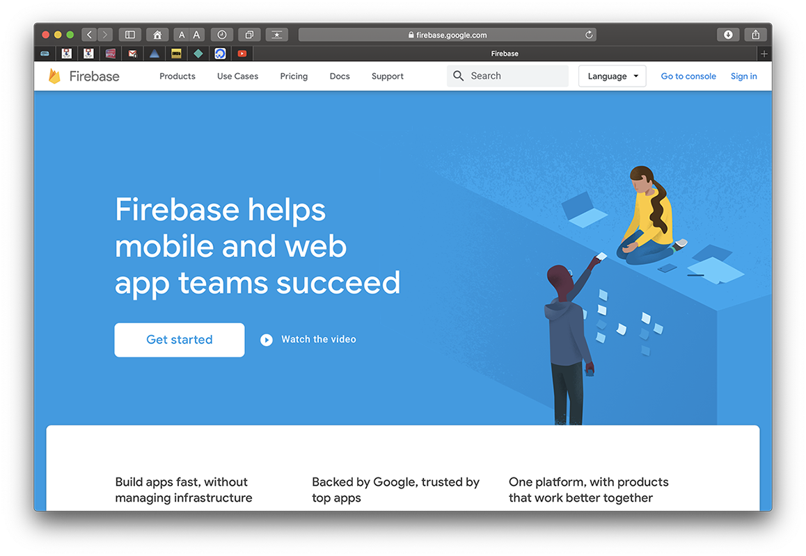
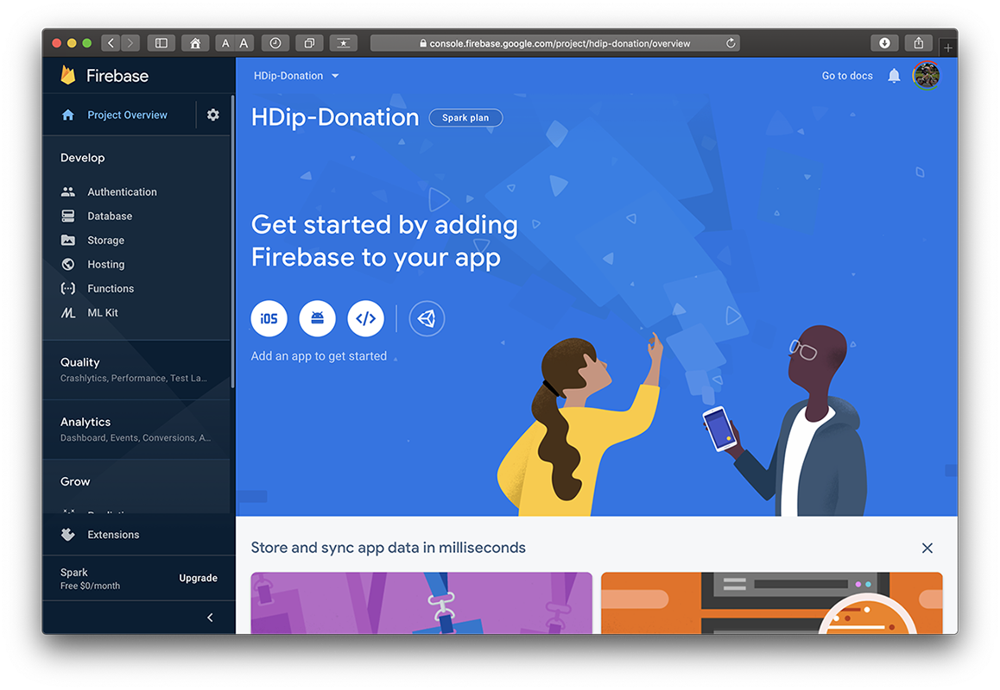
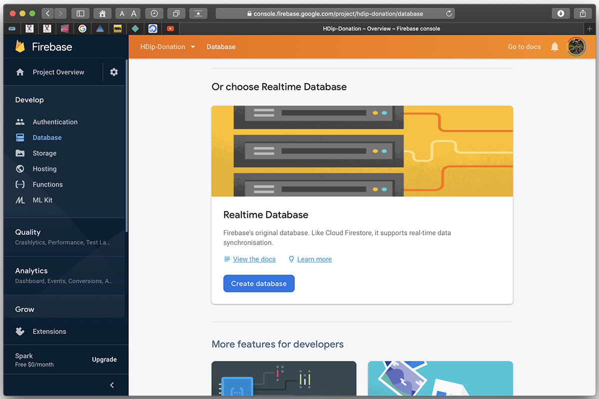
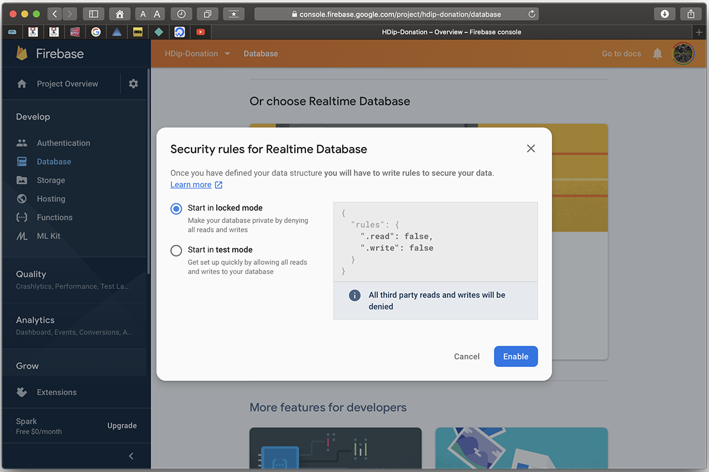
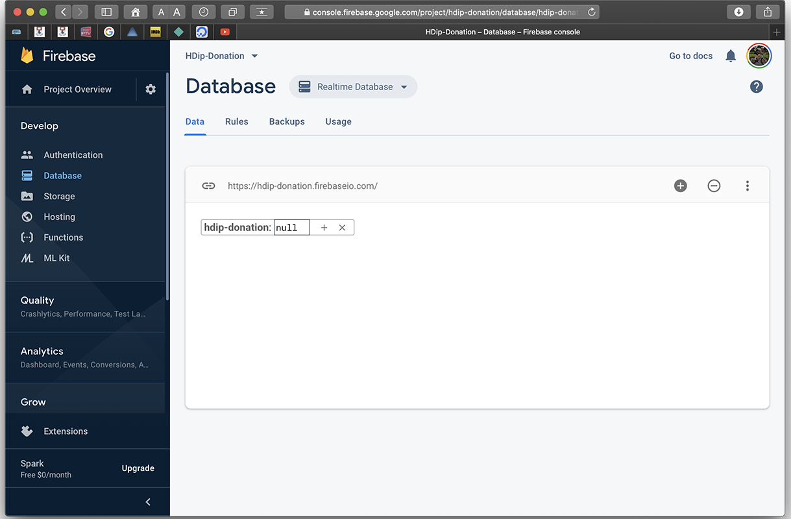
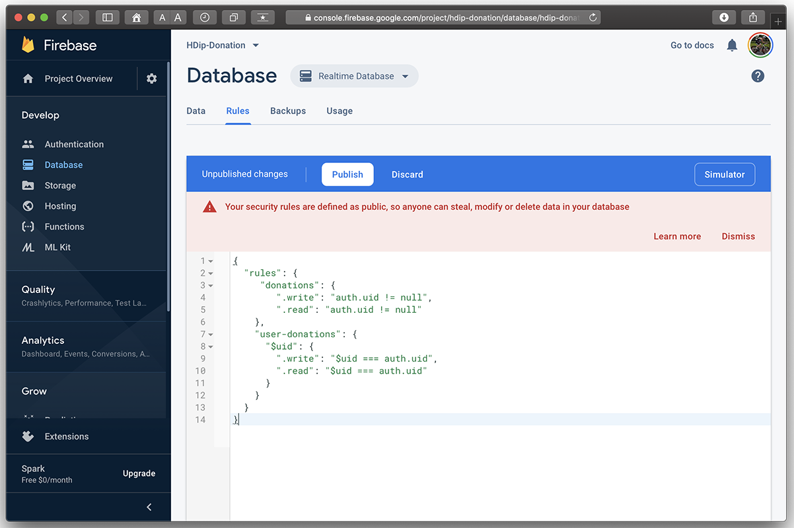
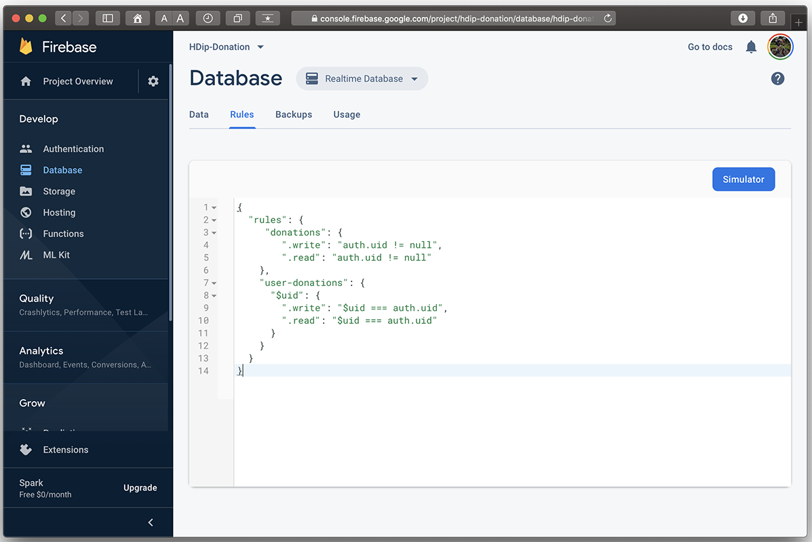

# Setup - Configuring your Firebase Console Project

This is the Donation Android app as it currently stands : [Donation Version 4](archives/donation-v4-complete.zip)

If you have completed the previous lab, then you can use your own project. If not, use the above archive, but **remember to connect to your own Firebase Console and add Firebase Auth support**.

First (and assuming you already have your project set up) we need to set up our Firebase Console and configure it correctly for Realtime Database Support.

If you already have a Firebase Console Project set up and configured to use the Realtime Database you can skip this step.

Again, it's worth noting you can do this through Android Studio directly, but I prefer to have it set up beforehand.

First, head over to [firebase.google.com](https://firebase.google.com) and sign in with your google/gmail account.

Visit your [firebase console](https://console.firebase.google.com/) and select your particular Project (HDip-Donation here)

Next, choose the `Database` tab

and then `Create Database` and choose 'Start in Locked Mode'

and we end up with this:

Now, select your `Rules` tab and replace **AND** `Publish` the following:

~~~
{
  "rules": {
     "donations": {    
        ".write": "auth.uid != null",
        ".read": "auth.uid != null"
    },
    "user-donations": {
      "$uid": {
        ".write": "$uid === auth.uid",
        ".read": "$uid === auth.uid"
      }
    }
  }
}
~~~

and (once published)

**NOTE : You'll need to download your `google-services.json` file again and rebuild your app for the changes to take affect**

We can now switch our attention to setting up Firebase Database in our Donation App.
