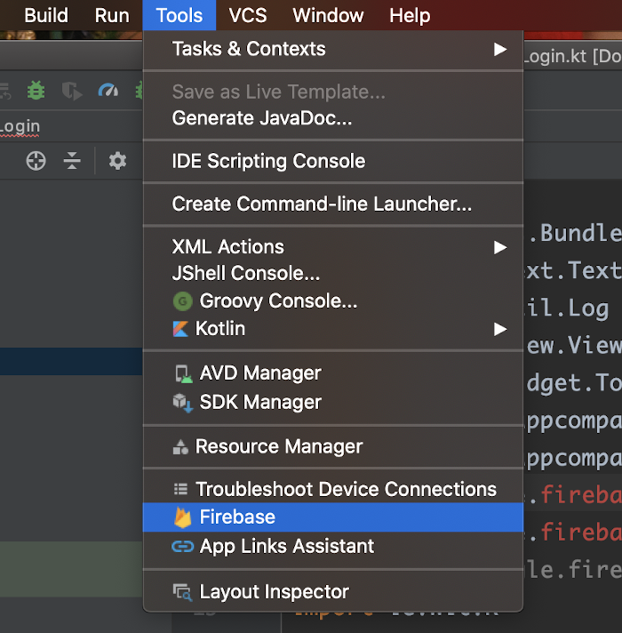
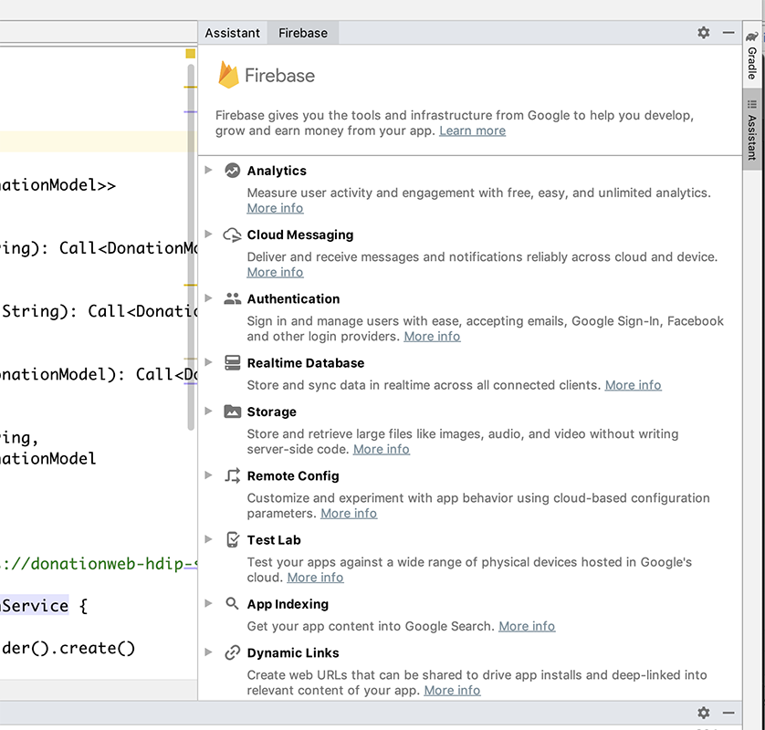
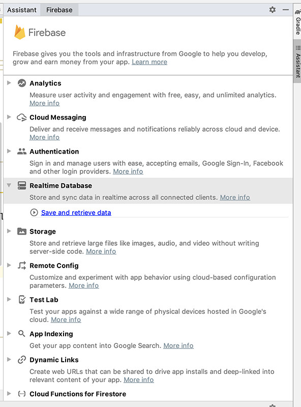
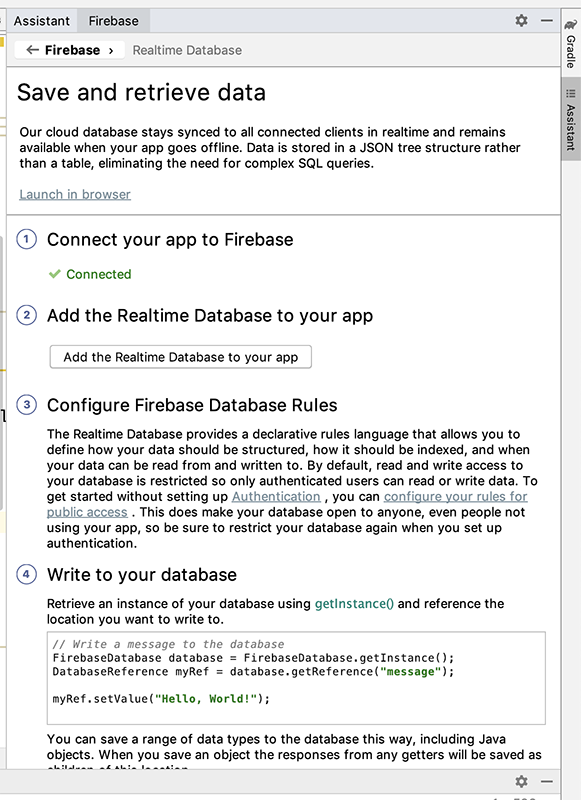
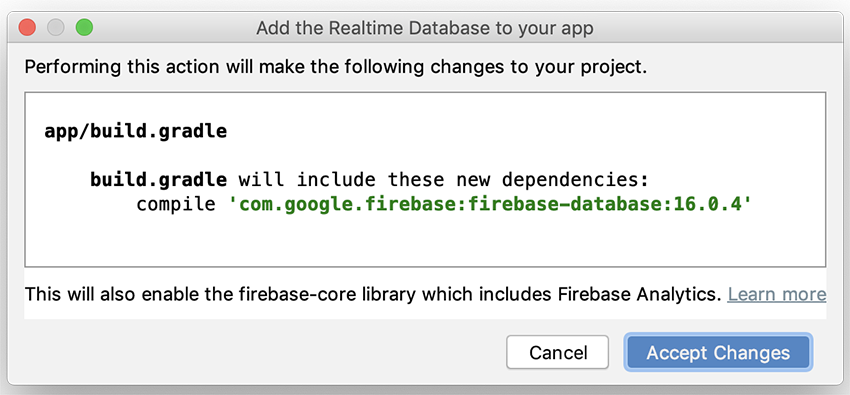
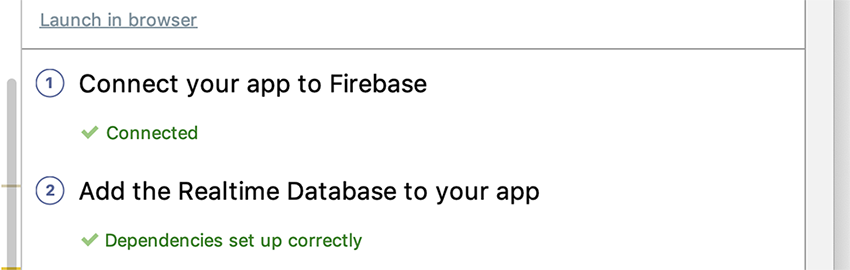

# Connecting your App to your Firebase Database

Now that you have your Firebase Console Database set up you can proceed to connect your existing Android App.

Select the Firebase Option from Tools

which gets you the Firebase Assistant Menu

Choose `Realtime Database`->`save and retrieve data`

Then, `Connect to Firebase` (if not already connected)

Next, Choose `Add Realtime Database` (again, version numbers may differ)

`Accept Changes` and you should get

We can now start interacting with our Firebase Database from our Android App.
