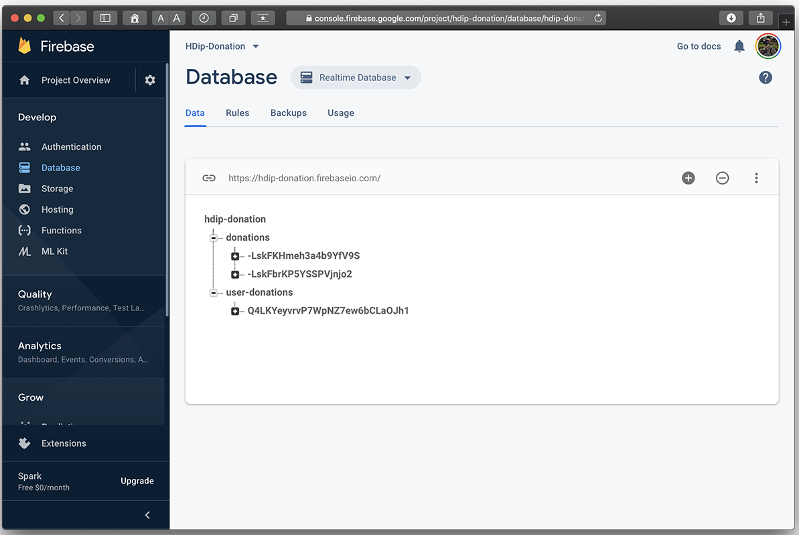
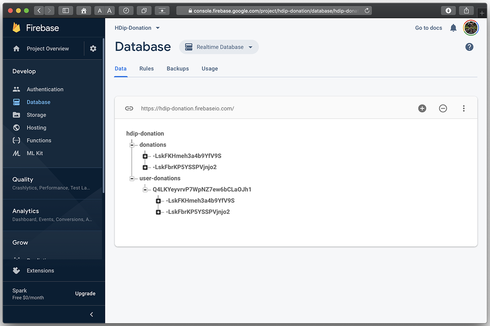
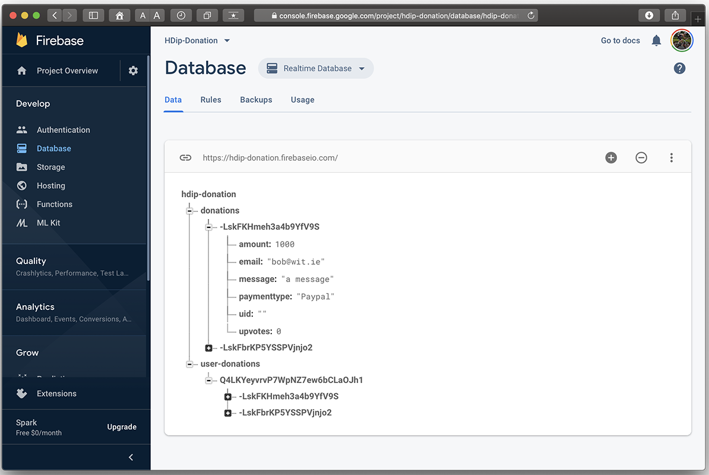
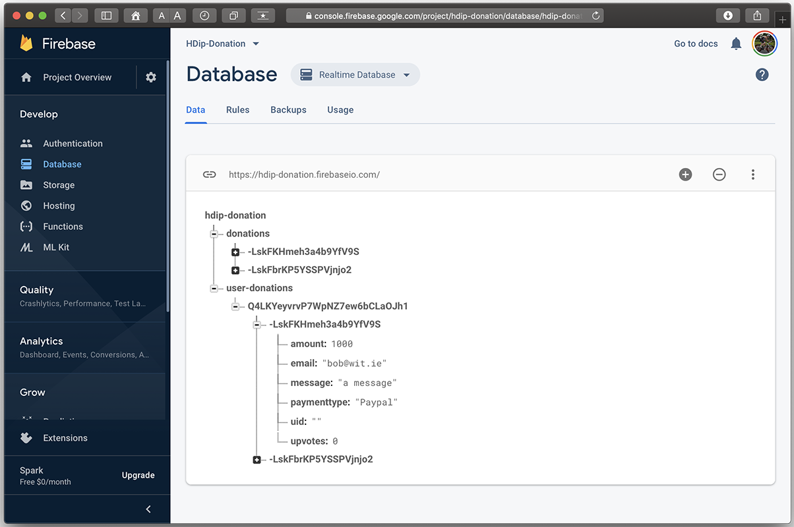
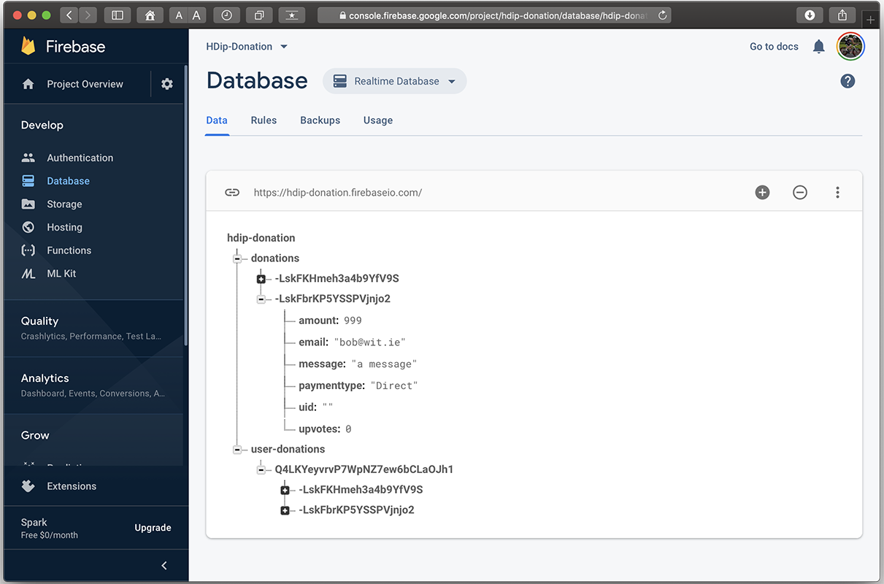
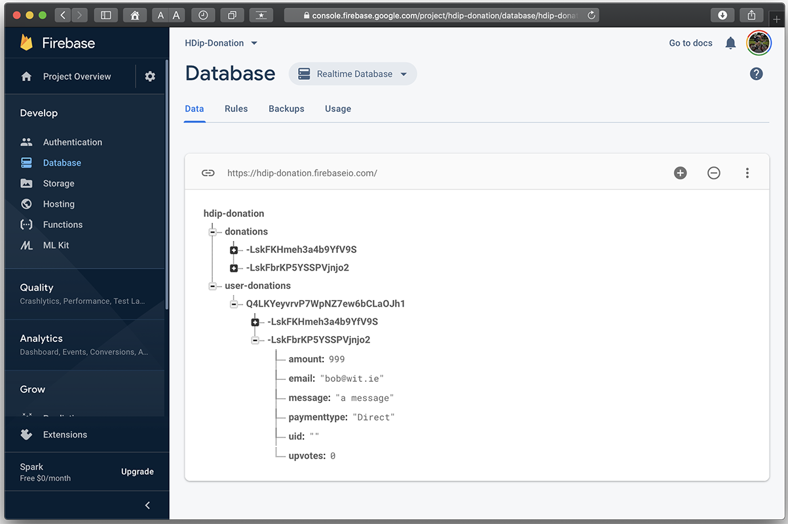

# Adding a Donation to our Firebase Database

Currently we're storing and retrieving all our donations to/from our Node Server (on heroku), so to phase out that server and migrate across to our Firebase Database the first thing we'll do is start adding donations to Firebase.

First, add your database reference to your `DonationApp` (below your firebase auth reference)

~~~
lateinit var database: DatabaseReference
~~~

and set it up in your `Login` Activity where you successfully authenticate a user:

~~~
 app.database = FirebaseDatabase.getInstance().reference
~~~

Next, update/replace your `DonationModel` like so:

~~~
@IgnoreExtraProperties
@Parcelize
data class DonationModel(
    var uid: String? = "",
    var paymenttype: String = "N/A",
    var amount: Int = 0,
    var message: String = "a message",
    var upvotes: Int = 0,
    var email: String? = "joe@bloggs.com")
                        : Parcelable
{
    @Exclude
    fun toMap(): Map<String, Any?> {
        return mapOf(
            "uid" to uid,
            "paymenttype" to paymenttype,
            "amount" to amount,
            "message" to message,
            "upvotes" to upvotes,
            "email" to email
        )
    }
}
~~~

In your `DonateFragment` bring in the following method:

~~~
fun writeNewDonation(donation: DonationModel) {
       // Create new donation at /donations & /donations/$uid
       showLoader(loader, "Adding Donation to Firebase")
       info("Firebase DB Reference : $app.database")
       val uid = app.auth.currentUser!!.uid
       val key = app.database.child("donations").push().key
       if (key == null) {
           info("Firebase Error : Key Empty")
           return
       }
       donation.uid = key
       val donationValues = donation.toMap()

       val childUpdates = HashMap<String, Any>()
       childUpdates["/donations/$key"] = donationValues
       childUpdates["/user-donations/$uid/$key"] = donationValues

       app.database.updateChildren(childUpdates)
       hideLoader(loader)
   }
~~~

and replace your `addDonation()` call inside your `setButtonListener` like so:

~~~
//addDonation(DonationModel(paymenttype = paymentmethod,amount = amount))
writeNewDonation(DonationModel(paymenttype = paymentmethod, amount = amount,
                                               email = app.auth.currentUser?.email))
~~~

We should probably now remove the **addDonation** method for adding a donation to our Node Server (via Retrofit), so go ahead and do that now.

Build your app and you'll get a few errors on a missing `id` in your `EditFragment` and `ReportFragment` so just comment those out for the moment - we'll fix them later.

~~~
//            var callUpdate = app.donationService.put(app.auth.currentUser?.email,
//                (editDonation as DonationModel)._id ,editDonation as DonationModel)
//            callUpdate.enqueue(this)
~~~

and

~~~
//            deleteDonation((viewHolder.itemView.tag as DonationModel)._id)
~~~

Now, run your app and try and make a few Donations.

To confirm the added Donations for the moment, you can always launch a browser window and access your firebase console to see any donations you've added:

[Launch Firebase Console](https://console.firebase.google.com)

Here, I've made 2 Donations of 1000 and 999. Note how we now have a 'collection' of all donations made AND just the particular users donations.

Next we'll look at retrieving the users donations from Firebase.
