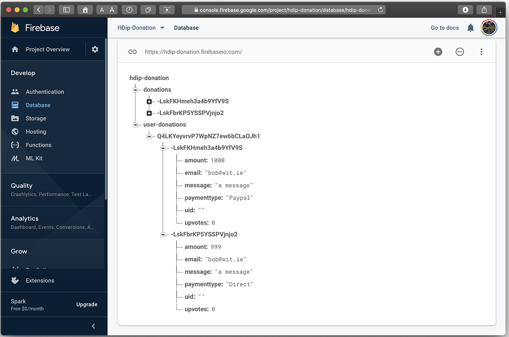
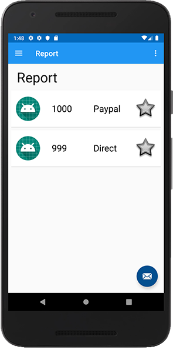
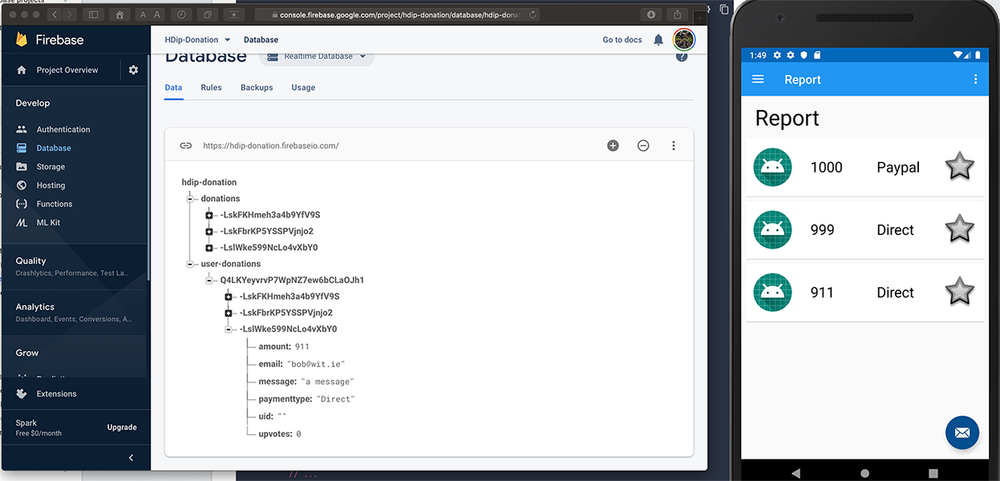

# Retrieving our Donations from Firebase

Before we go about displaying our donations on the report screen we still need to display the total on the donate screen, so first, bring in the following property into your `DonateFragment`:

~~~
lateinit var eventListener : ValueEventListener
~~~

and method

~~~
fun getTotalDonated(userId: String?) {

        eventListener = object : ValueEventListener {
            override fun onCancelled(error: DatabaseError) {
                info("Firebase Donation error : ${error.message}")
            }

            override fun onDataChange(snapshot: DataSnapshot) {
                totalDonated = 0
                val children = snapshot!!.children
                children.forEach {
                    val donation = it.getValue<DonationModel>(DonationModel::class.java!!)
                    totalDonated += donation!!.amount
                }
                progressBar.progress = totalDonated
                totalSoFar.text = format("$ $totalDonated")
            }
        }

        app.database.child("user-donations").child(userId!!)
            .addValueEventListener(eventListener)
    }
~~~

Next, update your `onResume()` like so:

~~~
override fun onResume() {
       super.onResume()
       getTotalDonated(app.auth.currentUser?.uid)
   }
~~~

To avoid `IllegalStateExceptions` we need to remove or `Detach` the listener when we leave this Fragment as ***ANY*** changes, even in a different fragment will trigger this listener. If we don't remove the listener, the progressBar will throw an exception as it'll be null, if triggered from some other change.

Add the following method

~~~
override fun onPause() {
    super.onPause()
      if(app.auth.uid != null)
       app.database.child("user-donations")
                   .child(app.auth.currentUser!!.uid)
                   .removeEventListener(eventListener)
   }
~~~

and run your app again.

You should now be seeing the total of your donations on the donate screen.

Also, when you make a new donation, this total will be automatically updated without any extra coding as it's part of the `onDataChange()` callback - we'll only remove the listener when the fragment pauses.

You should also remove any code/methods relating to our Retrofit calls, as we don't need them anymore - this includes removing the `Callback<List<DonationModel>>` interface.

For reference, here's the current `DonateFragment` class

~~~
package ie.wit.fragments

import android.os.Bundle
import androidx.fragment.app.Fragment
import android.view.LayoutInflater
import android.view.View
import android.view.ViewGroup
import androidx.appcompat.app.AlertDialog
import com.google.firebase.database.DataSnapshot
import com.google.firebase.database.DatabaseError
import com.google.firebase.database.ValueEventListener

import ie.wit.R
import ie.wit.main.DonationApp
import ie.wit.models.DonationModel
import ie.wit.utils.*
import kotlinx.android.synthetic.main.fragment_donate.*
import kotlinx.android.synthetic.main.fragment_donate.view.*
import org.jetbrains.anko.AnkoLogger
import org.jetbrains.anko.info
import org.jetbrains.anko.toast
import java.lang.String.format
import java.util.HashMap

class DonateFragment : Fragment(), AnkoLogger {

    lateinit var app: DonationApp
    var totalDonated = 0
    lateinit var loader : AlertDialog
    lateinit var eventListener : ValueEventListener

    override fun onCreate(savedInstanceState: Bundle?) {
        super.onCreate(savedInstanceState)
        app = activity?.application as DonationApp
    }

    override fun onCreateView(
        inflater: LayoutInflater, container: ViewGroup?,
        savedInstanceState: Bundle?
    ): View? {

        val root = inflater.inflate(R.layout.fragment_donate, container, false)
        loader = createLoader(activity!!)
        activity?.title = getString(R.string.action_donate)

        root.progressBar.max = 10000
        root.amountPicker.minValue = 1
        root.amountPicker.maxValue = 1000

        root.amountPicker.setOnValueChangedListener { picker, oldVal, newVal ->
            //Display the newly selected number to paymentAmount
            root.paymentAmount.setText("$newVal")
        }
        setButtonListener(root)
        return root;
    }

    companion object {
        @JvmStatic
        fun newInstance() =
            DonateFragment().apply {
                arguments = Bundle().apply {}
            }
    }

    fun setButtonListener( layout: View) {
        layout.donateButton.setOnClickListener {
            val amount = if (layout.paymentAmount.text.isNotEmpty())
                layout.paymentAmount.text.toString().toInt() else layout.amountPicker.value
            if(totalDonated >= layout.progressBar.max)
                activity?.toast("Donate Amount Exceeded!")
            else {
                val paymentmethod = if(layout.paymentMethod.checkedRadioButtonId == R.id.Direct) "Direct" else "Paypal"
                writeNewDonation(DonationModel(paymenttype = paymentmethod, amount = amount,
                                               email = app.auth.currentUser?.email))
            }
        }
    }

    override fun onResume() {
        super.onResume()
        getTotalDonated(app.auth.currentUser?.uid)
    }

    override fun onPause() {
        super.onPause()
          if(app.auth.uid != null)
           app.database.child("user-donations")
                       .child(app.auth.currentUser!!.uid)
                       .removeEventListener(eventListener)
       }

    fun writeNewDonation(donation: DonationModel) {
        // Create new donation at /donations & /donations/$uid
        showLoader(loader, "Adding Donation to Firebase")
        info("Firebase DB Reference : $app.database")
        val uid = app.auth.currentUser!!.uid
        val key = app.database.child("donations").push().key
        if (key == null) {
            info("Firebase Error : Key Empty")
            return
        }
        donation.uid = key
        val donationValues = donation.toMap()

        val childUpdates = HashMap<String, Any>()
        childUpdates["/donations/$key"] = donationValues
        childUpdates["/user-donations/$uid/$key"] = donationValues

        app.database.updateChildren(childUpdates)
        hideLoader(loader)
    }

    fun getTotalDonated(userId: String?) {

        eventListener = object : ValueEventListener {
            override fun onCancelled(error: DatabaseError) {
                info("Firebase Donation error : ${error.message}")
            }

            override fun onDataChange(snapshot: DataSnapshot) {
                totalDonated = 0
                val children = snapshot!!.children
                children.forEach {
                    val donation = it.getValue<DonationModel>(DonationModel::class.java!!)
                    totalDonated += donation!!.amount
                }
                progressBar.progress = totalDonated
                totalSoFar.text = format("$ $totalDonated")
            }
        }

        app.database.child("user-donations").child(userId!!)
            .addValueEventListener(eventListener)
    }
}
~~~

Next, in your `ReportFragment` introduce/replace the following method:

~~~
fun getAllDonations(userId: String?) {
        showLoader(loader, "Downloading Donations from Firebase")
        var donationsList = ArrayList<DonationModel>()
        app.database.child("user-donations").child(userId!!)
            .addValueEventListener(object : ValueEventListener {
                override fun onCancelled(error: DatabaseError) {
                    info("Firebase Donation error : ${error.message}")
                }

                override fun onDataChange(snapshot: DataSnapshot) {
                    val children = snapshot!!.children
                    children.forEach {
                        val donation = it.getValue<DonationModel>(DonationModel::class.java!!)

                        donationsList.add(donation!!)
                        app.donations = donationsList
                        root.recyclerView.adapter =
                            DonationAdapter(app.donations, this@ReportFragment)
                        root.recyclerView.adapter?.notifyDataSetChanged()
                        checkSwipeRefresh()
                        hideLoader(loader)
                        app.database.child("user-donations").child(userId!!).removeEventListener(this)
                    }
                }
            })
    }
~~~

Note that we remove/detach the listener here also for similar reasons.

Now update your `onResume()` with :

~~~
override fun onResume() {
        super.onResume()
        getAllDonations(app.auth.currentUser!!.uid)
    }
~~~

Your **Report** should now be displaying the Donations stored in your Firebase Database, like so:

and if you add another donation...

We'll rectify the deleting and editing issues in the next few steps.
