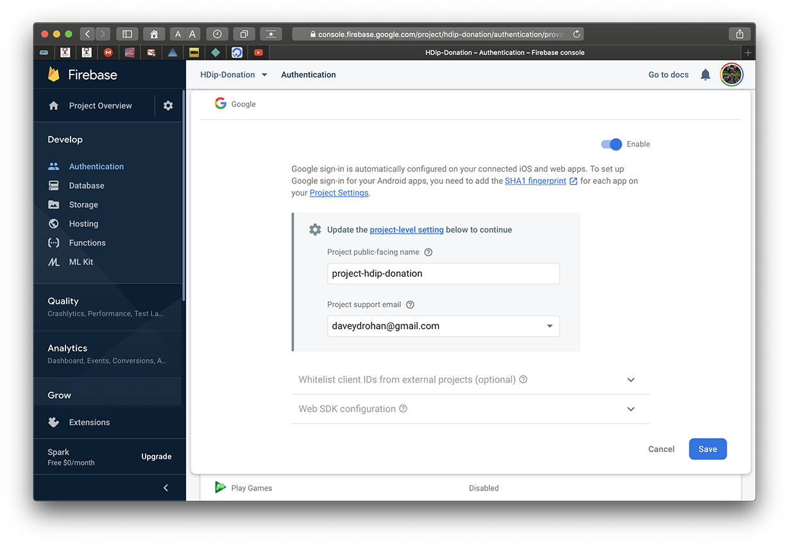

# Setup - Configuring your Firebase Console Project & App

You can find the starter code [here](archives/donation-v6-start.zip) which I strongly recommend you download as I've added/updated a lot of the resources we need to get our Google Sign In off the ground. <b>You will still need to connect to your own Firebase Console, so make sure you complete that (auth + database) before proceeding</b>.

We want to give the user the option to Authenticate using `Google Sign In` before they use our app, so the first thing we need to do is update our Firebase Console and configure it for Google Sign In Support.

If you already have a Firebase Console Project set up and configured to Authenticate users against their Google Account, you can skip this step.

It's worth noting you can do this through Android Studio directly, but I prefer to have it set up beforehand.

First, visit your [firebase console](https://console.firebase.google.com/) and select the `Authentication` tab and then the `Sign-In Method`

Select `Google`

and update the project settings appropriately

`Enable` and `Save` and you then have

We can now switch our attention to configuring our Donation App for Google Sign In.

First, add the following dependency to your project (version number may need to be updated :) )

~~~
implementation 'com.google.android.gms:play-services-auth:18.1.0'
~~~

Next, visit [Integrating Google Sign In](https://developers.google.com/identity/sign-in/android/start-integrating) and scroll down to select `Configure a Project`

Select your Project

and you application environment

we're choosing `Android` here. You'll need to supply your projects `package name` and `SHA-1` key.

There's a few ways to do this, but personally, I prefer the following. Select the `Gradle` tab on the far right of your project window

Expand the `root` and find your `signingReport`

and run it (double-click it or R-M-B & run) and you'll get the following with all the info you need.

<b>Don't forget to change back to the correct 'build' i.e. your `app` Project and NOT your `signingReport` you used to get your SHA1 key</b>.

Go back to the browser, enter the correct details and you'll then get this.

This is just a seperate 'credentials file' so What you then need to do is download your `google-services.json` file again which will contain the updated config settings for your project and signing in with Google.

It's worth noting you can do all this manually on your console, in your project settings (where you just got your google-services.json file) when you `Add app` and supply your package name and SHA1 key.

Now we can begin to add the Authentication Sign In process to our App.
