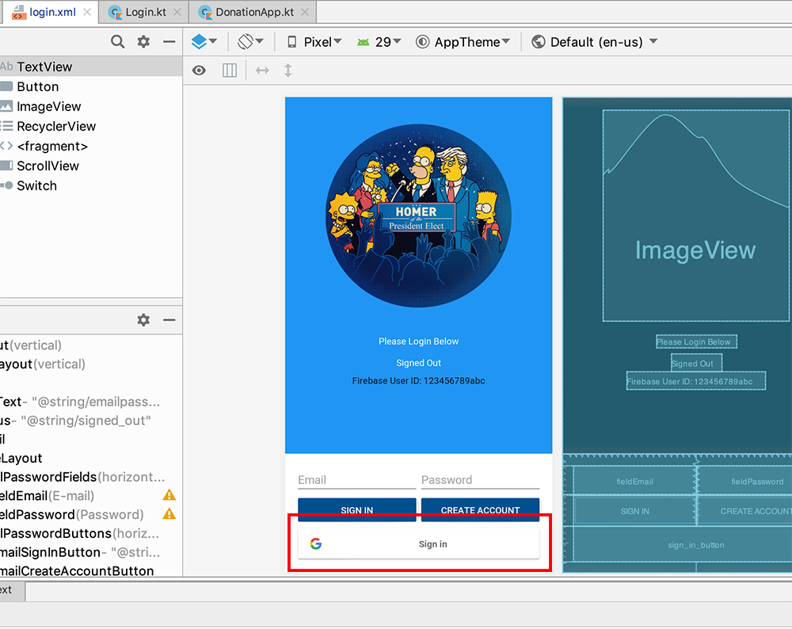
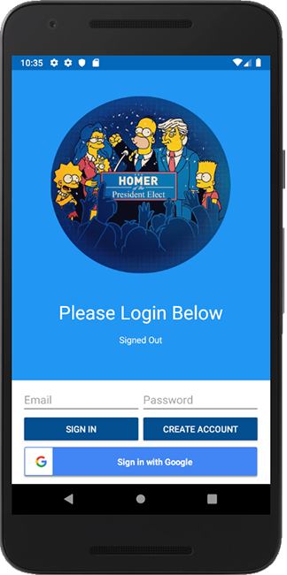
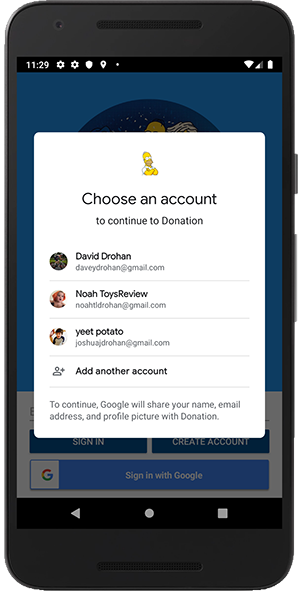
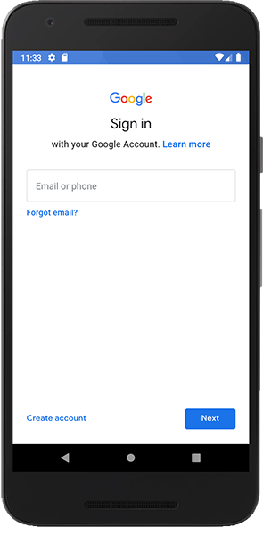
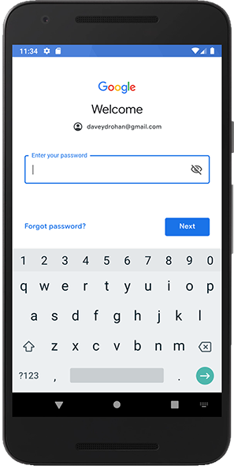
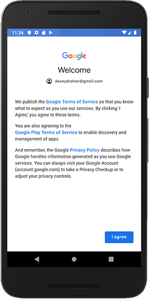
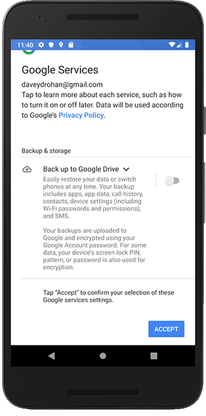
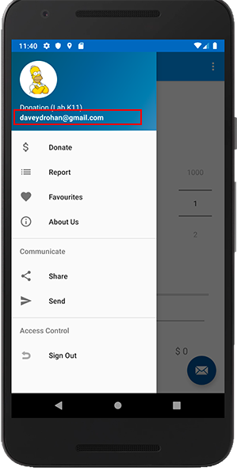
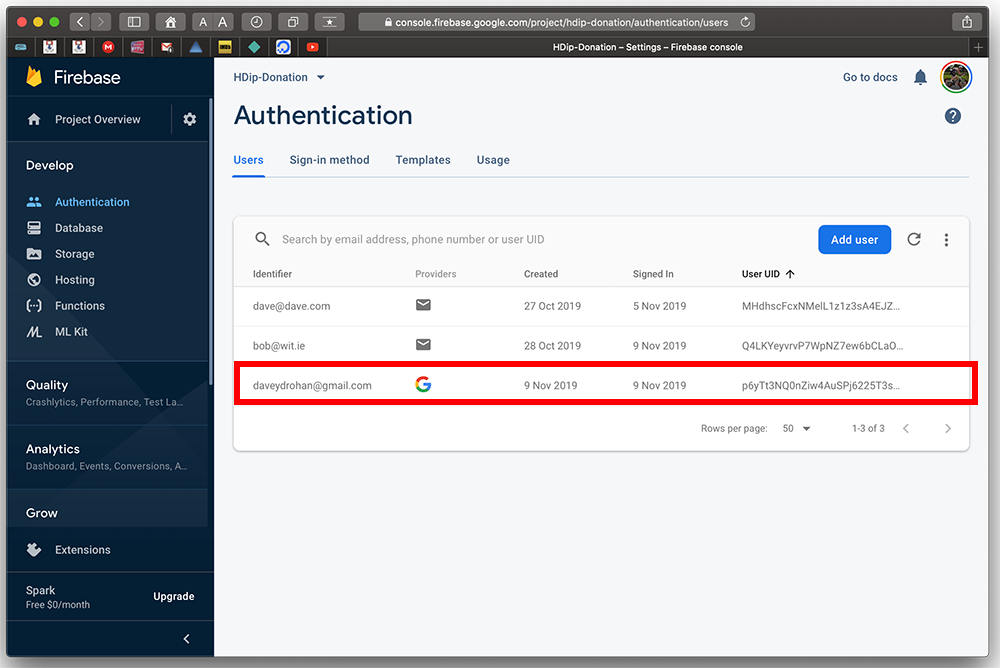

# Adding google Sign In to Donation

First, build and run the app to confirm we can still Authenticate via an Email and Password.

Next, Open your `login.xml` and replace it with the following:

~~~
<LinearLayout xmlns:android="http://schemas.android.com/apk/res/android"
    xmlns:tools="http://schemas.android.com/tools"
    android:id="@+id/main_layout"
    android:layout_width="match_parent"
    android:layout_height="match_parent"
    android:background="@color/grey_100"
    android:orientation="vertical"
    android:weightSum="4">

    <LinearLayout
        android:layout_width="match_parent"
        android:layout_height="0dp"
        android:layout_weight="3"
        android:gravity="center_horizontal"
        android:orientation="vertical">

        <ImageView
            android:id="@+id/icon"
            style="@style/ThemeOverlay.FirebaseIcon"
            android:layout_width="286dp"
            android:layout_height="325dp"
            android:contentDescription="@string/desc_firebase_lockup"
            android:src="@drawable/login_homer" />

        <TextView
            android:id="@+id/titleText"
            android:layout_width="wrap_content"
            android:layout_height="wrap_content"
            android:layout_marginBottom="@dimen/title_bottom_margin"
            android:text="@string/emailpassword_title_text"
            android:textColor="@color/colorWhite"
            android:theme="@style/ThemeOverlay.MyTitleText" />

        <TextView
            android:id="@+id/status"
            style="@style/ThemeOverlay.MyTextDetail"
            android:text="@string/signed_out"
            android:textColor="@color/colorWhite" />

        <TextView
            android:id="@+id/detail"
            style="@style/ThemeOverlay.MyTextDetail"
            tools:text="Firebase User ID: 123456789abc" />

    </LinearLayout>

    <RelativeLayout
        android:layout_width="match_parent"
        android:layout_height="0dp"
        android:layout_weight="1"
        android:background="@color/colorWhite"
        android:gravity="center_vertical">

        <LinearLayout
            android:id="@+id/emailPasswordFields"
            android:layout_width="match_parent"
            android:layout_height="wrap_content"
            android:orientation="horizontal"
            android:paddingLeft="16dp"
            android:paddingRight="16dp">

            <EditText
                android:id="@+id/fieldEmail"
                android:layout_width="0dp"
                android:layout_height="wrap_content"
                android:layout_weight="1"
                android:hint="@string/hint_email"
                android:inputType="textEmailAddress" />

            <EditText
                android:id="@+id/fieldPassword"
                android:layout_width="0dp"
                android:layout_height="wrap_content"
                android:layout_weight="1"
                android:hint="@string/hint_password"
                android:inputType="textPassword" />
        </LinearLayout>

        <LinearLayout
            android:id="@+id/emailPasswordButtons"
            android:layout_width="match_parent"
            android:layout_height="wrap_content"
            android:layout_below="@+id/emailPasswordFields"
            android:orientation="horizontal"
            android:paddingLeft="16dp"
            android:paddingRight="16dp">

            <Button
                android:id="@+id/emailSignInButton"
                style="@style/Widget.AppCompat.Button.Colored"
                android:layout_width="0dp"
                android:layout_height="wrap_content"
                android:layout_weight="1"
                android:text="@string/sign_in"
                android:theme="@style/ThemeOverlay.MyDarkButton" />

            <Button
                android:id="@+id/emailCreateAccountButton"
                style="@style/Widget.AppCompat.Button.Colored"
                android:layout_width="0dp"
                android:layout_height="wrap_content"
                android:layout_weight="1"
                android:text="@string/create_account"
                android:theme="@style/ThemeOverlay.MyDarkButton" />
        </LinearLayout>

        <LinearLayout
            android:id="@+id/googleSignInButton"
            android:layout_width="match_parent"
            android:layout_height="wrap_content"
            android:layout_below="@+id/emailPasswordButtons"
            android:orientation="horizontal"
            android:paddingLeft="16dp"
            android:paddingRight="16dp">

            <com.google.android.gms.common.SignInButton
                android:id="@+id/sign_in_button"
                android:layout_width="0dp"
                android:layout_height="wrap_content"
                android:layout_weight="1" />

        </LinearLayout>

        <LinearLayout
            android:id="@+id/signedInButtons"
            android:layout_width="match_parent"
            android:layout_height="wrap_content"
            android:layout_centerInParent="true"
            android:orientation="horizontal"
            android:paddingLeft="16dp"
            android:paddingRight="16dp"
            android:visibility="gone"
            android:weightSum="2.0">

            <Button
                android:id="@+id/signOutButton"
                style="@style/Widget.AppCompat.Button.Colored"
                android:layout_width="0dp"
                android:layout_height="wrap_content"
                android:layout_weight="1.0"
                android:text="@string/sign_out"
                android:theme="@style/ThemeOverlay.MyDarkButton" />

            <Button
                android:id="@+id/verifyEmailButton"
                style="@style/Widget.AppCompat.Button.Colored"
                android:layout_width="0dp"
                android:layout_height="wrap_content"
                android:layout_weight="1.0"
                android:text="@string/verify_email"
                android:theme="@style/ThemeOverlay.MyDarkButton" />

        </LinearLayout>

    </RelativeLayout>

</LinearLayout>
~~~

Notice our new `Google Sign In` button - have a look at the xml to review this

Now, open your `Login.kt` and add the following at the end of your `onCreate()`

~~~
sign_in_button.setSize(SignInButton.SIZE_WIDE)
sign_in_button.setColorScheme(0)
~~~

Run your app and you should now see a Google Sign In Button on the Login screen, now like so:

While you have your `Login.kt` open, I'd recommend reviewing the specific 'google code' for authenticating and signing in. It's taken from the same resources as the previous lab and definitely worth looking at.

Next, in your `Login.kt`, set your `sign_in_button` click listener

~~~
sign_in_button.setOnClickListener(this)
~~~

update your `onClick()` method

~~~
R.id.sign_in_button -> googleSignIn()
~~~

Run your app again, try and `Sign in with Google` and see what happens :)

If you've already some google accounts set up on the device you'll be asked to pick one

If not, you'll be asked to set one up, like so:

Enter your gmail email

Password

Agree to some stuff :)

And the app will launch and your users email will be displayed, as before

and added to the console

**BUT** we now have access to the users **Google details**, which we'll use in the next step.
