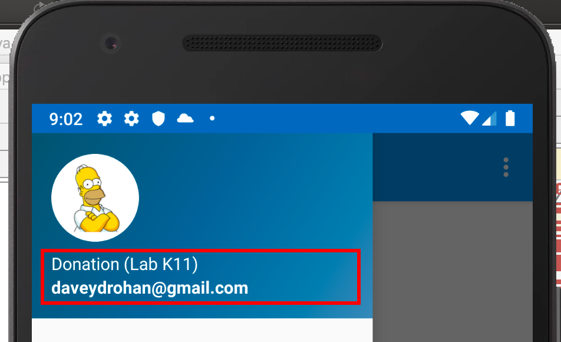
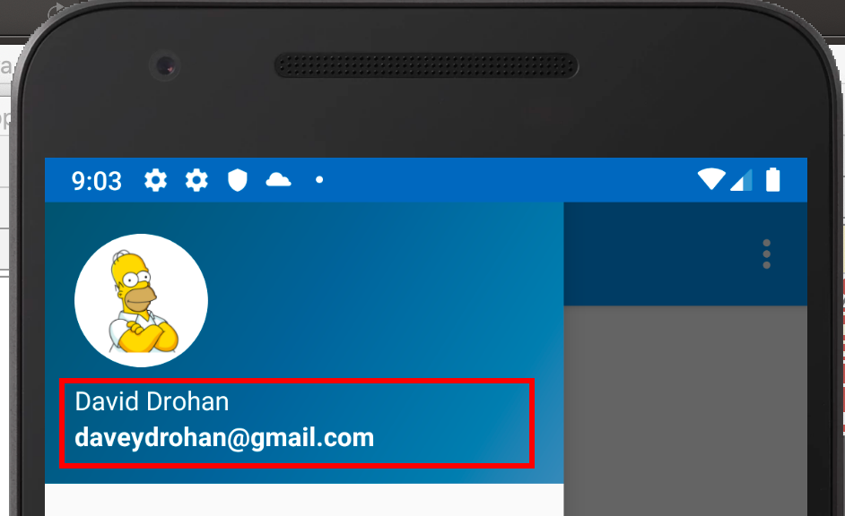
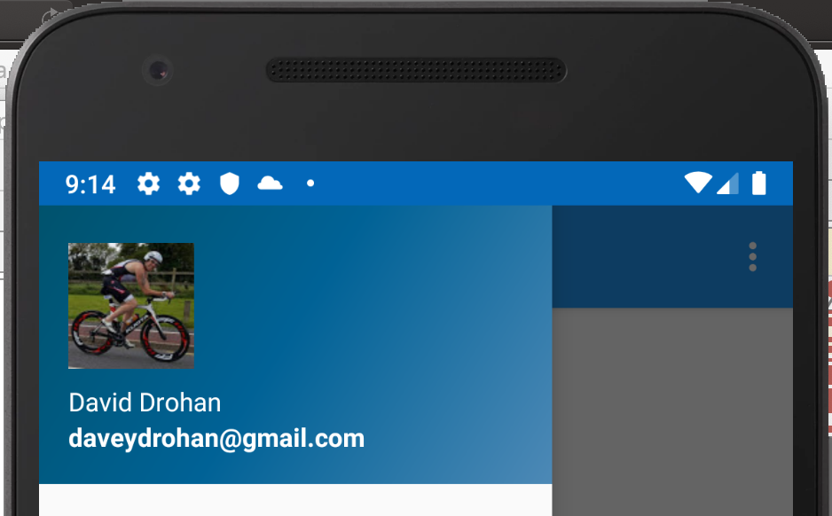
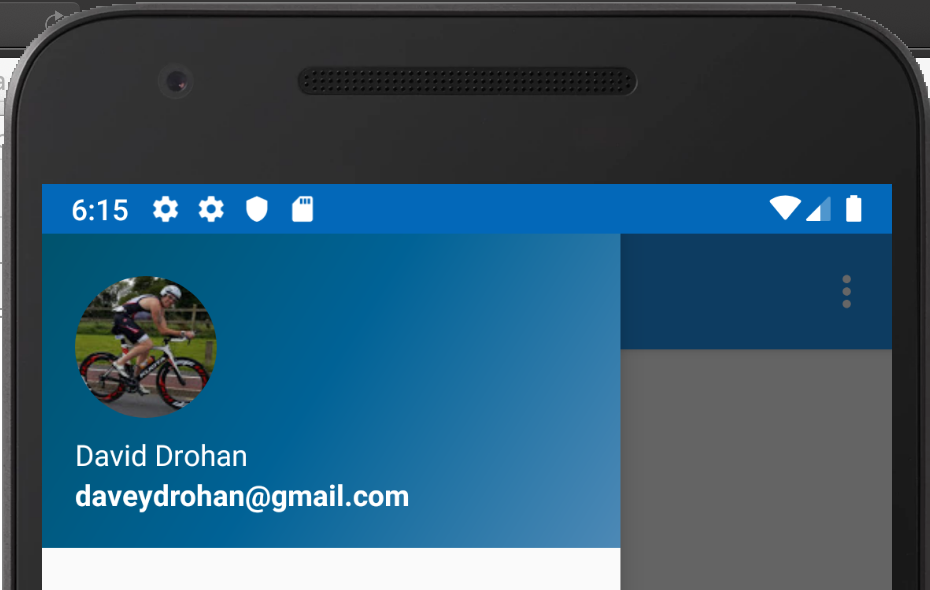
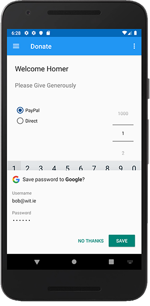
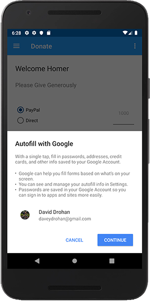
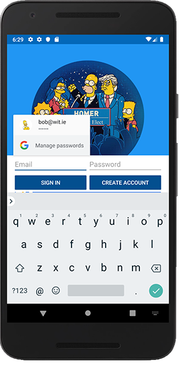
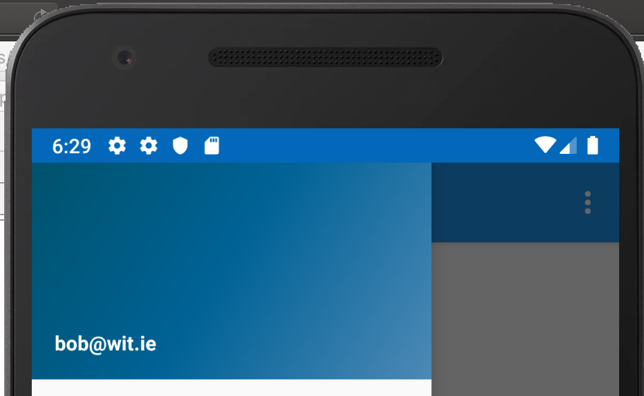

# Working with our Google Authenticated User

Now that the user has signed in with their Google account, we can give them a more personal UX.

At the moment the Nav Drawer just displays the users email, like so:

So the first thing we'll do is display their chosen Google Account Display Name on the Nav Drawer, something like this:

Go ahead and open your `Home.kt` and add the following to where you think would be most appropriate:

~~~
navView.getHeaderView(0).nav_header_name.text = app.auth.currentUser?.displayName
~~~

and run your app again to test.

As well as displaying the users name, we can also display their Google Photo, so go ahead and add the following, again, where most appropriate:

~~~
Picasso.get().load(app.auth.currentUser?.photoUrl)
            .resize(180, 180)
            .into(navView.getHeaderView(0).imageView)
~~~

and run, and test.

Notice, we're using `Picasso` to manage loading up the image.

If you get any 'unresolved' errors, make sure you have the correct dependencies added:

~~~
implementation 'com.google.android.gms:play-services-auth:18.1.0'
implementation 'com.squareup.picasso:picasso:2.71828'
~~~

What you should now see is something like this:

The user now sees their familiar Google details as they would expect in any Google Authenticated other app.

The square image didn't sit well with me, so I found a nice simple plugin for Picasso to round it off.

Add/Confirm the following dependency:

~~~
implementation 'jp.wasabeef:picasso-transformations:2.2.1'
~~~

and update your Picasso call like so:

~~~
Picasso.get().load(app.auth.currentUser?.photoUrl)
                .resize(190, 190)
                .transform(CropCircleTransformation())
                .into(navView.getHeaderView(0).imageView)
~~~

What you now get is something like this:

Now, if you sign out, and sign back in with basic Email/Password (I'm using bob here), you get this:

and

and with subsequent logins (if you've selected Googles options), this

We have a problem though - if you select the hamburger menu, and view the Nav Drawer, we've lost the default image and display name (because our basic user doesn't have one)

As a quick fix, on load up, we can replace our image and display name setting with the following:

~~~
if (app.auth.currentUser?.photoUrl != null) {
           navView.getHeaderView(0).nav_header_name.text = app.auth.currentUser?.displayName
           Picasso.get().load(app.auth.currentUser?.photoUrl)
               .resize(180, 180)
               .transform(CropCircleTransformation())
               .into(navView.getHeaderView(0).imageView)
       }
~~~

Test again to confirm.

Also, make a few donations with a Google Authenticated user and confirm everything works as expected, including monitoring your firebase console.

**In case you ran into any issues, here's the complete app [so far](archives/donation-v6-sofar.zip) - just make sure you download your most recent `google-services.json` file and add to the project, this should then allow the app to run and connect to your own firebase console**

We can now move on to bringing in some Firebase Storage to manage displaying ALL donations, AND the users profile pic in a new "AllDonations" Fragment.
