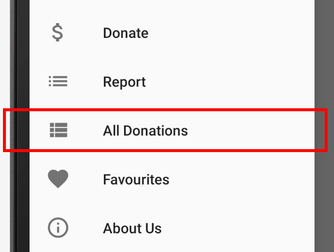
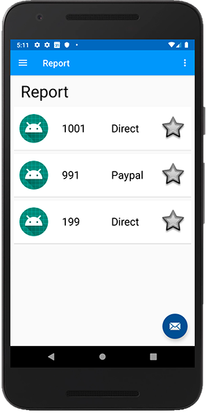

# Displaying All Donations

What we now want to offer the user is an option to see all and every donation made including the donators profile pic, so the first thing we'll do is set up the menu option, so go ahead and add in something like this:

Start with a new string resource, then the new menu option (and a new vector asset if you like?)

Here's my naming for the relevant resources

~~~
<item
    android:id="@+id/nav_report_all"
    android:icon="@drawable/ic_menu_report_all"
    android:title="@string/menu_report_all" />
~~~        

Next, in your `fragments` package, add a new class `ReportAllFragment`

and replace it with the following:

~~~
package ie.wit.fragments

import android.os.Bundle
import androidx.fragment.app.Fragment
import android.view.LayoutInflater
import android.view.View
import android.view.ViewGroup
import androidx.appcompat.app.AlertDialog
import androidx.recyclerview.widget.ItemTouchHelper
import androidx.recyclerview.widget.LinearLayoutManager
import androidx.recyclerview.widget.RecyclerView
import androidx.swiperefreshlayout.widget.SwipeRefreshLayout
import com.google.firebase.database.DataSnapshot
import com.google.firebase.database.DatabaseError
import com.google.firebase.database.ValueEventListener

import ie.wit.R
import ie.wit.adapters.DonationAdapter
import ie.wit.adapters.DonationListener
import ie.wit.main.DonationApp
import ie.wit.models.DonationModel
import ie.wit.utils.*
import kotlinx.android.synthetic.main.fragment_report.view.*
import org.jetbrains.anko.AnkoLogger
import org.jetbrains.anko.info

class ReportAllFragment : ReportFragment(),
    DonationListener {

    override fun onCreateView(
        inflater: LayoutInflater, container: ViewGroup?,
        savedInstanceState: Bundle?
    ): View? {
        // Inflate the layout for this fragment
        root = inflater.inflate(R.layout.fragment_report, container, false)
        activity?.title = getString(R.string.menu_report_all)

        root.recyclerView.setLayoutManager(LinearLayoutManager(activity))
        setSwipeRefresh()

        return root
    }

    companion object {
        @JvmStatic
        fun newInstance() =
            ReportAllFragment().apply {
                arguments = Bundle().apply { }
            }
    }

    override fun setSwipeRefresh() {
        root.swiperefresh.setOnRefreshListener(object : SwipeRefreshLayout.OnRefreshListener {
            override fun onRefresh() {
                root.swiperefresh.isRefreshing = true
                getAllUsersDonations()
            }
        })
    }

    override fun onResume() {
        super.onResume()
        getAllUsersDonations()
    }

    fun getAllUsersDonations() {
        loader = createLoader(activity!!)
        showLoader(loader, "Downloading All Users Donations from Firebase")
        val donationsList = ArrayList<DonationModel>()
        app.database.child("donations")
            .addValueEventListener(object : ValueEventListener {
                override fun onCancelled(error: DatabaseError) {
                    info("Firebase Donation error : ${error.message}")
                }

                override fun onDataChange(snapshot: DataSnapshot) {
                    hideLoader(loader)
                    val children = snapshot.children
                    children.forEach {
                        val donation = it.
                            getValue<DonationModel>(DonationModel::class.java)

                        donationsList.add(donation!!)
                        root.recyclerView.adapter =
                            DonationAdapter(donationsList, this@ReportAllFragment)
                        root.recyclerView.adapter?.notifyDataSetChanged()
                        checkSwipeRefresh()

                        app.database.child("donations").removeEventListener(this)
                    }
                }
            })
    }
}
~~~

Notice how this class inherits directly form our existing `ReportFragment`. You'll get some errors relating to the class being `final`, so go ahead and accept Android Studio's fix:

You'll need to do this in a few other places, so once that's complete, open your `Home` Activity and 'wire up' the new `ReportAllFragment` to the menu, using the following:

~~~
R.id.nav_report_all ->
               navigateTo(ReportAllFragment.newInstance())
~~~

To ensure we don't call the superclass `getAllDonations` we need to make one small change to `ReportFragment` so update it's `onResume()` like so:

~~~
override fun onResume() {
      super.onResume()
      if(this::class == ReportFragment::class)
      getAllDonations(app.auth.currentUser!!.uid)
  }
~~~

Here we're ensuring we only call `getAllDonations` in `ReportFragment` and nowhere else (i.e. the subclass `ReportAllFragment`).

Run your app and test to confirm you get **ALL** Donations from your Firebase Database.

You'll notice that any donation can be edited (even someone else's donation) which isn't ideal, so to rectify this, open your `DonationAdapter` and replace it with the following:

~~~
class DonationAdapter constructor(var donations: ArrayList<DonationModel>,
                                  private val listener: DonationListener, reportall : Boolean)
    : RecyclerView.Adapter<DonationAdapter.MainHolder>() {

    val reportAll = reportall

    override fun onCreateViewHolder(parent: ViewGroup, viewType: Int): MainHolder {
        return MainHolder(
            LayoutInflater.from(parent?.context).inflate(
                R.layout.card_donation,
                parent,
                false
            )
        )
    }

    override fun onBindViewHolder(holder: MainHolder, position: Int) {
        val donation = donations[holder.adapterPosition]
        holder.bind(donation,listener,reportAll)
    }

    override fun getItemCount(): Int = donations.size

    fun removeAt(position: Int) {
        donations.removeAt(position)
        notifyItemRemoved(position)
    }

    class MainHolder constructor(itemView: View) : RecyclerView.ViewHolder(itemView) {

        fun bind(donation: DonationModel, listener: DonationListener, reportAll: Boolean) {
            itemView.tag = donation
            itemView.paymentamount.text = donation.amount.toString()
            itemView.paymentmethod.text = donation.paymenttype

            if(!reportAll)
                itemView.setOnClickListener { listener.onDonationClick(donation) }
            else
                itemView.imageIcon.setImageResource(R.mipmap.ic_launcher_homer_round)
        }
    }
}
~~~

Note the new constructor parameter
~~~
reportall : Boolean
~~~

which controls the ClickListener being attached and setting the icon

~~~
if(!reportAll)
    itemView.setOnClickListener { listener.onDonationClick(donation) }
else
    itemView.imageIcon.setImageResource(R.mipmap.ic_launcher_homer_round)
~~~

Finally, update your `ReportFragment` and `ReportAllFragment` classes to pass in the correct value for `reportall` in the `DonationAdapter` constructor (ie true or false) to allow (or not) editing.

Run you app again and test both use cases. You should be seeing something like this on both report screens.

**Users Donations**

**All Donations**

We'll now set up our Firebase Storage to store the users profile photo **and** allow them to **change** it if the wish.
