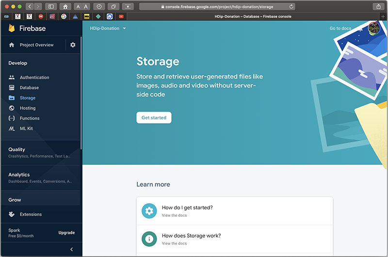
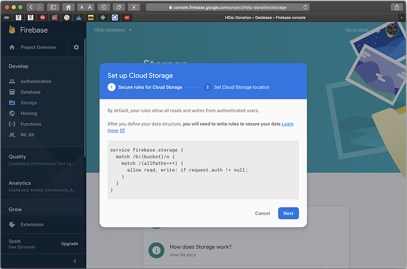
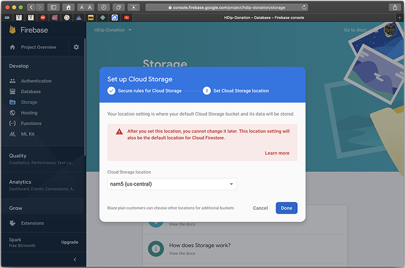
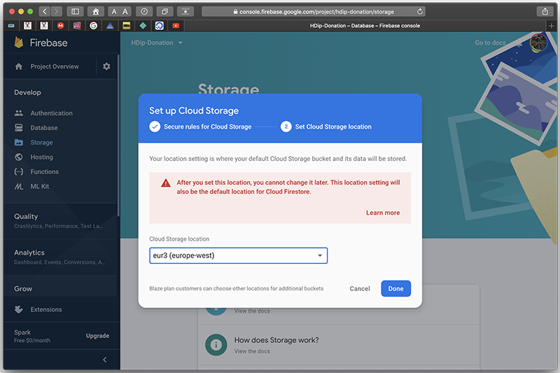
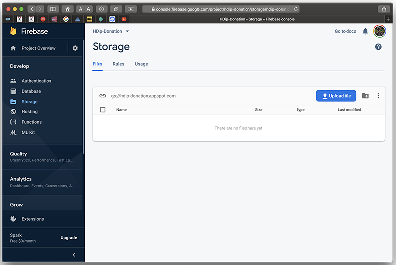
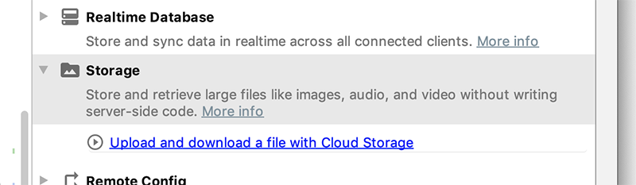
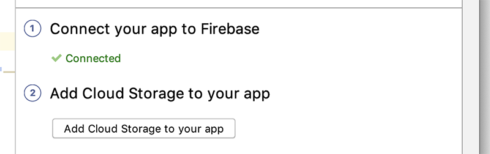
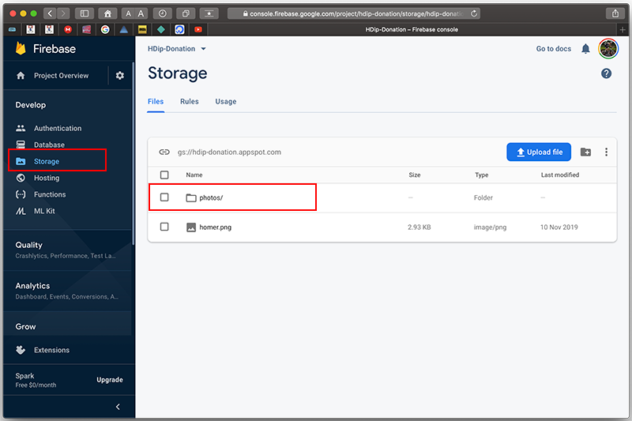
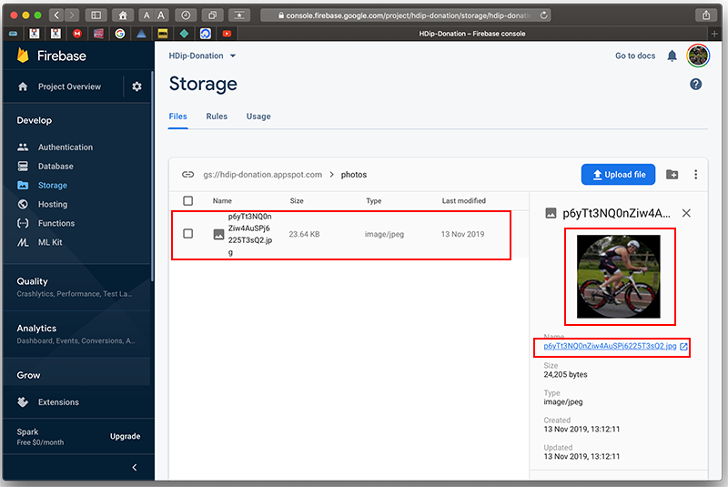
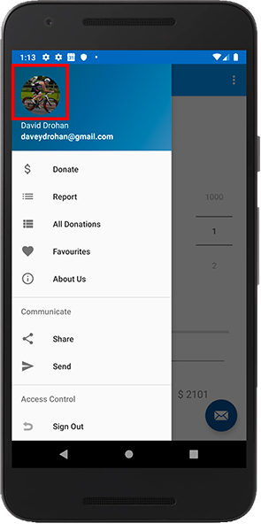

# Displaying & Storing Images - Part 1

The first thing to do is set up your Firebase Storage on your Console (similar to your database setup from the previous lab) so, on you console, select the `Storage` tab and `Get Started`

Accept the default Storage Rules

And select a location for your Storage Bucket

(I just went with the suggested europe-west one)

Your Firebase Storage Bucket is now available on the console

Next, in Android Studio, Choose Tools->Firebase->Storage & `Upload and downoload...`

`Add Cloud Storage to you app`

and the particular dependency

**NOTE : Make sure you have the latest version**

at the time of writing that is

~~~
implementation 'com.google.firebase:firebase-storage:19.2.0'
~~~

The next thing to do is store the **Google Users** profile pic to Firebase (if it's just a basic User, they won't have a profile photo initially) so go ahead and add the following to your `DonationApp`

~~~
lateinit var storage: StorageReference
~~~

and initialise it in your `updateUI()` in your `Login` Activity

~~~
app.storage = FirebaseStorage.getInstance().reference
~~~

and finally, add the following to your `Helpers` File:

~~~
fun uploadImageView(app: DonationApp, imageView: ImageView) {
    // Get the data from an ImageView as bytes
    val uid = app.auth.currentUser!!.uid
    val imageRef = app.storage.child("photos").child("${uid}.jpg")
    val bitmap = (imageView.drawable as BitmapDrawable).bitmap
    val baos = ByteArrayOutputStream()

    bitmap.compress(Bitmap.CompressFormat.JPEG, 100, baos)
    val data = baos.toByteArray()

    var uploadTask = imageRef.putBytes(data)
}
~~~

and replace your `Picasso` call in your `Home` Activity with this:

~~~
Picasso.get().load(app.auth.currentUser?.photoUrl)
                .resize(180, 180)
                .transform(CropCircleTransformation())
                .into(navView.getHeaderView(0).imageView, object : Callback {
                    override fun onSuccess() {
                        // Drawable is ready
                        uploadImageView(app,navView.getHeaderView(0).imageView)
                    }
                    override fun onError(e: Exception) {}
                })
~~~

Run your app again, sign in with a `Google` account and keep a close eye on your Firebase Storage Bucket.

If all goes to plan, you should see something like this:

