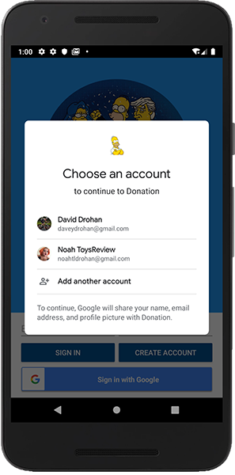
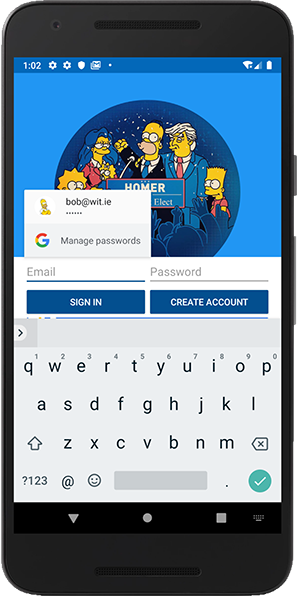
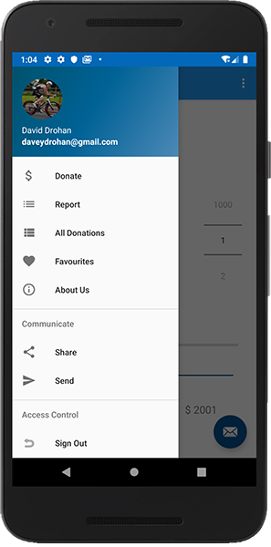
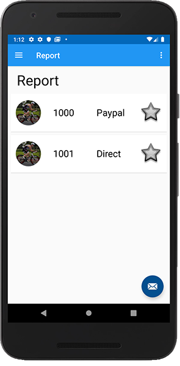
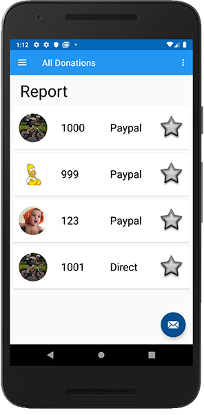

# Displaying & Storing Images - Part 2

We want to store the users profile photo with the donation they make, so we first need to refactor our `DonationModel` to hold a reference to the photo.

Go ahead and replace your class with the following:

~~~
@IgnoreExtraProperties
@Parcelize
data class DonationModel(
    var uid: String? = "",
    var paymenttype: String = "N/A",
    var amount: Int = 0,
    var message: String = "a message",
    var upvotes: Int = 0,
    var profilepic: String = "",
    var email: String? = "joe@bloggs.com")
                        : Parcelable
{
    @Exclude
    fun toMap(): Map<String, Any?> {
        return mapOf(
            "uid" to uid,
            "paymenttype" to paymenttype,
            "amount" to amount,
            "message" to message,
            "upvotes" to upvotes,
            "profilepic" to profilepic,
            "email" to email
        )
    }
}
~~~

Note the extra `profilepic` property.

Next,  add the following property to your `DonationApp` class

~~~
lateinit var userImage: Uri
~~~

Replace your `uploadImageView` in your `Helpers` File with the following methods:

~~~
fun convertImageToBytes(imageView: ImageView) : ByteArray {
    // Get the data from an ImageView as bytes
    lateinit var bitmap: Bitmap

    if(imageView is AdaptiveIconDrawable || imageView is AppCompatImageView)
        bitmap = imageView.drawable.toBitmap()
    else
        bitmap = (imageView.drawable as BitmapDrawable).toBitmap()

    val baos = ByteArrayOutputStream()
    bitmap.compress(Bitmap.CompressFormat.JPEG, 100, baos)
    return baos.toByteArray()
}

fun uploadImageView(app: DonationApp, imageView: ImageView) {
    val uid = app.auth.currentUser!!.uid
    val imageRef = app.storage.child("photos").child("${uid}.jpg")
    val uploadTask = imageRef.putBytes(convertImageToBytes(imageView))

    uploadTask.addOnFailureListener { object : OnFailureListener {
        override fun onFailure(error: Exception) {
            Log.v("Donation", "uploadTask.exception" + error)
        }
    }
    }.addOnSuccessListener {
        uploadTask.continueWithTask { task ->
            imageRef.downloadUrl
        }.addOnCompleteListener { task ->
            if (task.isSuccessful) {
                app.userImage = task.result!!.toString().toUri()
                Picasso.get().load(app.userImage)
                    .resize(180, 180)
                    .transform(CropCircleTransformation())
                    .into(imageView)
            }
        }
    }
}
~~~

And then in your `Home` Activity, replace google user check `if`

~~~
if (app.auth.currentUser?.photoUrl != null) {...}
~~~

with

~~~
//Checking if Google User, upload google profile pic
       if (app.auth.currentUser?.photoUrl != null) {
           navView.getHeaderView(0).nav_header_name.text = app.auth.currentUser?.displayName
           Picasso.get().load(app.auth.currentUser?.photoUrl)
               .resize(180, 180)
               .transform(CropCircleTransformation())
               .into(navView.getHeaderView(0).imageView, object : Callback {
                   override fun onSuccess() {
                       // Drawable is ready
                       uploadImageView(app,navView.getHeaderView(0).imageView)
                   }
                   override fun onError(e: Exception) {}
               })
       }
       else // Regular User, upload default pic of homer
           uploadImageView(app,navView.getHeaderView(0).imageView)
~~~

Next, update your `writeNewDonation()` in your `DonateFragment` like so:

~~~
writeNewDonation(DonationModel(paymenttype = paymentmethod, amount = amount,
                                            profilepic = app.userImage.toString(),
                                            email = app.auth.currentUser?.email))
~~~

and finally, update your `DonationAdapter.MainHolder` like so:

~~~
class MainHolder constructor(itemView: View) : RecyclerView.ViewHolder(itemView) {

      fun bind(donation: DonationModel, listener: DonationListener, reportAll: Boolean) {
          itemView.tag = donation
          itemView.paymentamount.text = donation.amount.toString()
          itemView.paymentmethod.text = donation.paymenttype

          if(!reportAll)
              itemView.setOnClickListener { listener.onDonationClick(donation) }

          if(!donation.profilepic.isEmpty()) {
                  Picasso.get().load(donation.profilepic.toUri())
                      //.resize(180, 180)
                      .transform(CropCircleTransformation())
                      .into(itemView.imageIcon)
                  }
              else
                  itemView.imageIcon.setImageResource(R.mipmap.ic_launcher_homer_round)
      }
  }
~~~

<b>NOTE: If you get any JVM errors add the following to your `app/build.gradle`<b>

~~~
kotlinOptions {
           jvmTarget = "1.8"
       }
~~~

As we've changed our `DonationModel` you'll need to delete all your donations from your database, and start making new donations - sorry!

Once you run your app you should test with various different users (Google users, basic email/password users) to confirm everything works as expected.

Below, I've tested with 3 different users (2 Google, 1 Basic)

**2 Google Users (David & Noah)**

**1 Basic User (bob)**

**"David Drohan has made 2 donations, 1 from Noah and 1 from bob"**

**Users Report**

**Full Report**

The last thing we'll do is allow to user to change their profile pic ***for the app*** (**NOT** their google profile pic, if they have one?) to demonstrate updating Firebase Storage and using the Camera Gallery.
