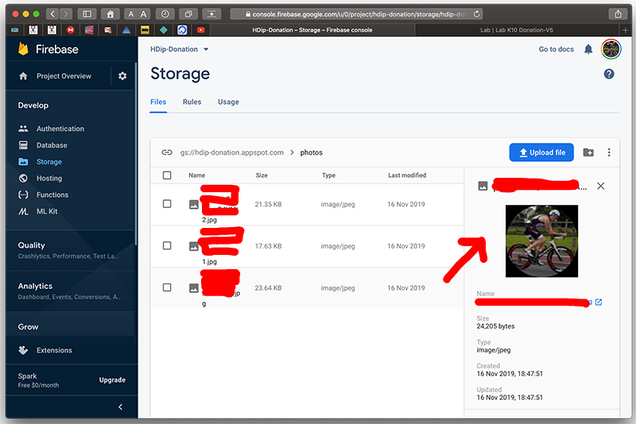
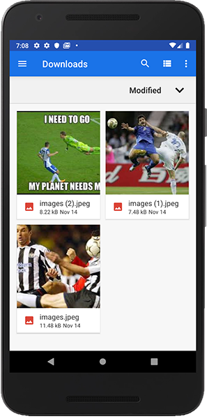
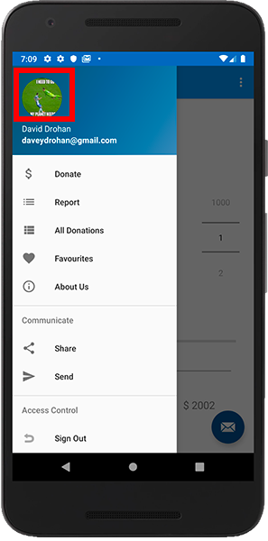
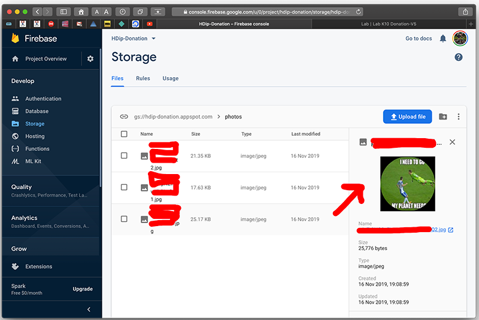

# Updating a Users App Profile photo

We want to offer the user the option of changing their App Profile Photo, so to do this we'll first add an `OnClickListener` to the image on the Nav Drawer like so (in your `Home` Activity's `onCreate()`)

~~~
navView.getHeaderView(0).imageView.setOnClickListener {
           toast("Updating App Profile Photo")
       }
~~~

We'll allow the user to select a photo from the Gallery, so first, add the following resources and methods to your `strings.xml` and `Helpers` class respectively. This is a very similar approach to the `Placemark` Case Study, so I won't go into too much detail on how this works here.

NOTE : You may need to download a few images to store in the devices gallery.

~~~
<string name="select_profile_image">Select Profile Image</string>
~~~

~~~
fun showImagePicker(parent: Activity, id: Int) {
    val intent = Intent()
    intent.type = "image/*"
    intent.action = Intent.ACTION_OPEN_DOCUMENT
    intent.addCategory(Intent.CATEGORY_OPENABLE)
    val chooser = Intent.createChooser(intent, R.string.select_profile_image.toString())
    parent.startActivityForResult(chooser, id)
}

fun readImageUri(resultCode: Int, data: Intent?): Uri? {
    var uri: Uri? = null
    if (resultCode == Activity.RESULT_OK && data != null && data.data != null) {
        try { uri = data.data }
        catch (e: IOException) {
            e.printStackTrace()
        }
    }
    return uri
}
~~~

and then add the following to your `Home` Activity:

~~~
override fun onActivityResult(requestCode: Int, resultCode: Int, data: Intent?) {
      super.onActivityResult(requestCode, resultCode, data)
      when (requestCode) {
          1 -> {
              if (data != null) {
                  Picasso.get().load(readImageUri(resultCode, data).toString())
                      .resize(180, 180)
                      .transform(CropCircleTransformation())
                      .into(navView.getHeaderView(0).imageView, object : Callback {
                          override fun onSuccess() {
                              // Drawable is ready
                              uploadImageView(app,navView.getHeaderView(0).imageView)
                          }
                          override fun onError(e: Exception) {}
                      })
              }
          }
      }
  }
~~~

Finally, replace your `OnClickListener` call with the following:

~~~
navView.getHeaderView(0).imageView
         .setOnClickListener { showImagePicker(this,1) }
~~~

Run your App again to test this new functionality, and confirm the users profile photo is updated in the firebase storage bucket, like so:

**BEFORE**

**AFTER**

You'll notice if you sign out, and sign back in again with the same user, the image is 'reset', and if you check any previous donations, the profile pic is missing - this is because every image uploaded is given a unique token by Firebase which is appended to the URI, so we'll need to modify how we load the users profile photo, and more importantly, update any donations `profilepic` property with the newly uploaded photo.

First, add the following new 'Model' to represent our users photo reference:

~~~
@IgnoreExtraProperties
@Parcelize
data class UserPhotoModel(
    var uid: String? = "",
    var profilepic: String = "")
    : Parcelable
{
    @Exclude
    fun toMap(): Map<String, Any?> {
        return mapOf(
            "uid" to uid,
            "profilepic" to profilepic
        )
    }
}
~~~

Next, add the following methods to your `Helpers`:

~~~
fun writeImageRef(app: DonationApp, imageRef: String) {
    val userId = app.auth.currentUser!!.uid
    val values = UserPhotoModel(userId,imageRef).toMap()
    val childUpdates = HashMap<String, Any>()

    childUpdates["/user-photos/$userId"] = values
    app.database.updateChildren(childUpdates)
}
~~~

~~~
fun updateAllDonations(app: DonationApp) {
    val userId = app.auth.currentUser!!.uid
    val userEmail = app.auth.currentUser!!.email
    var donationRef = app.database.ref.child("donations")
                                  .orderByChild("email")
    val userdonationRef = app.database.ref.child("user-donations")
                                  .child(userId).orderByChild("uid")

    donationRef.equalTo(userEmail).addListenerForSingleValueEvent(
        object : ValueEventListener {
        override fun onCancelled(error: DatabaseError) {}
        override fun onDataChange(snapshot: DataSnapshot) {
            snapshot.children.forEach {
                it.ref.child("profilepic")
                    .setValue(app.userImage.toString())
            }
        }
    })

    userdonationRef.addListenerForSingleValueEvent(
        object : ValueEventListener {
        override fun onCancelled(error: DatabaseError) {}
        override fun onDataChange(snapshot: DataSnapshot) {
            snapshot.children.forEach {
                it.ref.child("profilepic")
                    .setValue(app.userImage.toString())
            }
        }
    })

    writeImageRef(app, app.userImage.toString())
}
~~~

~~~
fun validatePhoto(app: DonationApp, activity: Activity) {

    var imageUri: Uri? = null
    val imageExists = app.userImage.toString().length > 0
    val googlePhotoExists = app.auth.currentUser?.photoUrl != null

    if(imageExists)
        imageUri = app.userImage
    else
        if (googlePhotoExists)
            imageUri = app.auth.currentUser?.photoUrl!!

    if (googlePhotoExists || imageExists) {
        if(!app.auth.currentUser?.displayName.isNullOrEmpty())
        activity.navView.getHeaderView(0)
            .nav_header_name.text = app.auth.currentUser?.displayName
        else
            activity.navView.getHeaderView(0)
                .nav_header_name.text = activity.getText(R.string.nav_header_title)

        Picasso.get().load(imageUri)
            .resize(180, 180)
            .transform(CropCircleTransformation())
            .into(activity.navView.getHeaderView(0).imageView, object : Callback {
                override fun onSuccess() {
                    // Drawable is ready
                    uploadImageView(app,activity.navView.getHeaderView(0).imageView)
                }
                override fun onError(e: Exception) {}
            })
    }
    else    // New Regular User, upload default pic of homer
    {
        activity.navView.getHeaderView(0).imageView.setImageResource(R.mipmap.ic_launcher_homer_round)
        uploadImageView(app, activity.navView.getHeaderView(0).imageView)
    }
}

~~~

and

~~~
fun checkExistingPhoto(app: DonationApp,activity: Activity) {

    app.userImage = "".toUri()

    app.database.child("user-photos").orderByChild("uid")
        .equalTo(app.auth.currentUser!!.uid)
        .addListenerForSingleValueEvent(object : ValueEventListener {

        override fun onDataChange(snapshot: DataSnapshot ) {
            snapshot.children.forEach {
                val usermodel = it.getValue<UserPhotoModel>(UserPhotoModel::class.java)
                app.userImage = usermodel!!.profilepic.toUri()
            }
            validatePhoto(app,activity)
        }
       override fun onCancelled(databaseError: DatabaseError ) {}
    })
}
~~~

Finally, replace the 'check' in your `Home` activity, which is currently this:

~~~
//Checking if Google User, upload google profile pic
if (app.auth.currentUser?.photoUrl != null) {
           navView.getHeaderView(0).nav_header_name.text = app.auth.currentUser?.displayName
           Picasso.get().load(app.auth.currentUser?.photoUrl)
               .resize(180, 180)
               .transform(CropCircleTransformation())
               .into(navView.getHeaderView(0).imageView, object : Callback {
                   override fun onSuccess() {
                       // Drawable is ready
                       uploadImageView(app,navView.getHeaderView(0).imageView)
                   }
                   override fun onError(e: Exception) {}
               })
       }
       else // Regular User, upload default pic of homer
           uploadImageView(app,navView.getHeaderView(0).imageView)
~~~

with this

~~~
//Checking if Google User, upload google profile pic
checkExistingPhoto(app,this)
~~~

and replace your `uploadImageView` with this:

~~~
fun uploadImageView(app: DonationApp, imageView: ImageView) {
    val uid = app.auth.currentUser!!.uid
    val imageRef = app.storage.child("photos").child("${uid}.jpg")
    val uploadTask = imageRef.putBytes(convertImageToBytes(imageView))

    uploadTask.addOnFailureListener { object : OnFailureListener {
        override fun onFailure(error: Exception) {
            Log.v("Donation", "uploadTask.exception" + error)
        }
    }
    }.addOnSuccessListener {
        uploadTask.continueWithTask { task ->
            imageRef.downloadUrl
        }.addOnCompleteListener { task ->
            if (task.isSuccessful) {
                app.userImage = task.result!!.toString().toUri()
                updateAllDonations(app)
                writeImageRef(app,app.userImage.toString())
                Picasso.get().load(app.userImage)
                    .resize(180, 180)
                    .transform(CropCircleTransformation())
                    .into(imageView)
            }
        }
    }
}
~~~

and add this line to your `Home` Activity's `onActivityResult()` (just before your `Picasso` call, inside the `if` statement)

~~~
writeImageRef(app,readImageUri(resultCode, data).toString())
~~~

You'll need to update your **Database** Rules, so republish with the following:

~~~
{
  "rules": {
     "donations": {    
        ".write": "auth.uid != null",
        ".read": "auth.uid != null"
    },
    "user-photos": {    
        ".write": "auth.uid != null",
        ".read": "auth.uid != null"
    },
    "user-donations": {
      "$uid": {
        ".write": "$uid === auth.uid",
        ".read": "$uid === auth.uid"
      }
    }
  }
}
~~~

Run your app and you should see a new collection being created, and updated, every time the user changes their profile photo.

There's quite a lot going on here (and in the code!), so I'd recommend keeping your Firebase Console open while testing your App and take a closer look at the above Helper methods to get a better understanding of the implemented functionality.

(There are probably (most certainly!) better ways to implement this functionality, so hopefully, when I get time, I'll revisit this Lab and try and improve it :).

**Well Done!!** 
